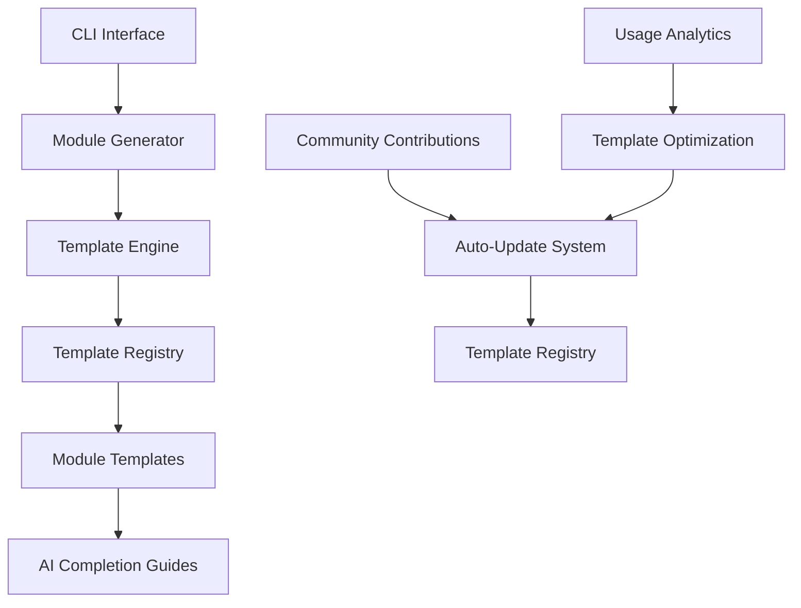

# Contributing to Standardized Modules Framework

🎉 Thank you for considering contributing to the Standardized Modules Framework! This project aims to revolutionize AI-assisted development through intelligent scaffolding.

## 🌟 Vision & Mission

**Vision**: Create the definitive framework for AI-optimized module development that enables rapid, consistent, and high-quality software creation.

**Mission**: Build a collaborative ecosystem where developers and AI work together seamlessly, with templates that continuously improve through community contributions and automated learning.

## 🚀 How to Contribute

### 1. **Template Improvements**
- Enhance existing module templates (CORE, INTEGRATION, SUPPORTING, TECHNICAL)
- Add new module types (API, CLI, Worker, Database, etc.)
- Improve AI completion instructions based on real usage

### 2. **Framework Extensions**
- Add support for new frameworks (Django, FastAPI, Flask, etc.)
- Create language bindings (TypeScript, Go, Java, etc.)
- Build integrations with popular tools and services

### 3. **AI Optimization**
- Improve token efficiency in templates
- Enhance AI prompts based on testing and feedback
- Create domain-specific template variations

### 4. **Infrastructure & Tooling**
- Improve CLI interface and user experience
- Add auto-update mechanisms
- Create testing and validation tools

## 🛠️ Development Setup

### Prerequisites
- Python 3.8+
- Git
- Virtual environment tool (venv, conda, etc.)

### Setup Steps

```bash
# 1. Fork and clone the repository
git clone https://github.com/your-username/standardized-modules-framework.git
cd standardized-modules-framework

# 2. Create virtual environment
python -m venv venv
source venv/bin/activate  # On Windows: venv\Scripts\activate

# 3. Install development dependencies
pip install -e .[dev]

# 4. Install pre-commit hooks
pre-commit install

# 5. Run tests to verify setup
pytest tests/

# 6. Generate a test module to verify functionality
python module_scaffolding_system.py create-module test-contrib --type=CORE --domain=testing
```

## 📝 Contribution Guidelines

### Template Development

#### Adding New Module Types

1. **Create template method** in `ModuleTemplates` class:
```python
def _generate_api_module(self, context: Dict[str, Any]) -> str:
    """Generate REST API module template"""
    template = Template('''
    # Your template content here
    # Include AI_TODO markers for AI completion
    # Follow established patterns
    ''')
    return template.render(**context)
```

2. **Add to module type routing**:
```python
def generate_core_module(self, module_type: str, context: Dict[str, Any]) -> str:
    if module_type == 'API':
        return self._generate_api_module(context)
    # ... existing types
```

3. **Create AI completion guide**:
```python
def _generate_api_ai_completion(self, context: Dict[str, Any]) -> str:
    """Generate AI completion instructions for API modules"""
    # Detailed instructions specific to API development
```

4. **Add comprehensive tests**:
```python
def test_api_module_generation():
    """Test API module template generation"""
    # Test all aspects of the new template
```

#### Template Best Practices

1. **Token Efficiency**: Keep framework code minimal, maximize AI implementation space
2. **Clear Boundaries**: Clearly mark what framework provides vs what AI implements
3. **Consistent Patterns**: Follow established naming and structure conventions
4. **AI Guidance**: Provide detailed, actionable AI completion instructions
5. **Quality Assurance**: Include comprehensive test templates

### Code Quality Standards

#### Code Style
- **Black** for code formatting: `black .`
- **flake8** for linting: `flake8 .`
- **mypy** for type checking: `mypy .`
- **isort** for import sorting: `isort .`

#### Testing Requirements
- All new features must include tests
- Aim for >90% test coverage
- Include both unit and integration tests
- Test generated modules for completeness

#### Documentation Standards
- Update README.md for user-facing changes
- Update SUPPORT_DOCUMENTATION.md for comprehensive guides
- Include docstrings for all public methods
- Add examples for new features

### Pull Request Process

1. **Branch Naming**:
   ```bash
   # Feature branches
   git checkout -b feature/api-module-template
   
   # Bug fixes
   git checkout -b fix/template-rendering-issue
   
   # Documentation
   git checkout -b docs/contributing-guide-update
   ```

2. **Commit Messages**:
   ```bash
   # Format: type(scope): description
   git commit -m "feat(templates): add REST API module template"
   git commit -m "fix(cli): resolve module name validation issue"
   git commit -m "docs(readme): update installation instructions"
   ```

3. **Pull Request Template**:
   ```markdown
   ## Description
   Brief description of changes
   
   ## Type of Change
   - [ ] Bug fix
   - [ ] New feature
   - [ ] Documentation update
   - [ ] Template improvement
   
   ## Testing
   - [ ] Tests pass locally
   - [ ] Generated modules work correctly
   - [ ] AI completion guides tested
   
   ## Checklist
   - [ ] Code follows style guidelines
   - [ ] Self-review completed
   - [ ] Documentation updated
   - [ ] Tests added/updated
   ```

## 🏗️ Architecture & Design Principles

### Core Architecture



### Design Principles

1. **AI-First Design**: Every template optimized for AI collaboration
2. **Token Efficiency**: Minimize framework tokens, maximize business logic space
3. **Extensibility**: Easy to add new templates and module types
4. **Consistency**: Uniform patterns across all generated modules
5. **Quality Assurance**: Built-in testing and validation
6. **Community-Driven**: Templates improve through collective contributions

### Template Evolution Strategy

```python
# Version-aware template system
class TemplateRegistry:
    def __init__(self):
        self.templates = {}
        self.versions = {}
    
    def register_template(self, name: str, template: Template, version: str):
        """Register versioned template"""
        
    def get_latest_template(self, name: str) -> Template:
        """Get the latest version of a template"""
        
    def migrate_template(self, old_version: str, new_version: str):
        """Migrate existing templates to new versions"""
```

## 🔄 Auto-Update System Design

### Template Update Mechanism

1. **Template Versioning**:
```python
class TemplateVersion:
    def __init__(self, version: str, template: str, metadata: dict):
        self.version = version  # semantic versioning
        self.template = template
        self.metadata = metadata  # author, date, changelog
        self.ai_improvements = metadata.get('ai_improvements', [])
```

2. **Update Detection**:
```python
class UpdateChecker:
    async def check_for_updates(self) -> List[TemplateUpdate]:
        """Check for template updates from registry"""
        
    async def download_updates(self, updates: List[TemplateUpdate]):
        """Download and validate updates"""
        
    def apply_updates(self, updates: List[TemplateUpdate]):
        """Apply updates with rollback capability"""
```

3. **Community Feedback Loop**:
```python
class FeedbackCollector:
    def collect_usage_metrics(self, module_type: str, success: bool):
        """Collect anonymous usage data"""
        
    def submit_template_improvement(self, suggestion: dict):
        """Submit template improvement suggestions"""
        
    def rate_ai_completion_quality(self, rating: int, feedback: str):
        """Rate AI completion guide effectiveness"""
```

## 🎯 Priority Contribution Areas

### High Priority
1. **Framework Integrations**:
   - Django app template
   - FastAPI service template
   - Flask application template
   - SQLAlchemy database layer template

2. **Language Support**:
   - TypeScript module templates
   - Go service templates
   - Java/Spring Boot templates

3. **Specialized Modules**:
   - CLI application template
   - Background worker template
   - GraphQL API template
   - WebSocket service template

### Medium Priority
1. **Development Tools**:
   - Docker containerization templates
   - CI/CD pipeline generation
   - Monitoring and observability templates

2. **AI Enhancements**:
   - Domain-specific AI prompts
   - Industry-specific templates (fintech, healthcare, etc.)
   - Performance optimization suggestions

### Long Term
1. **Advanced Features**:
   - Visual template designer
   - AI-powered template optimization
   - Multi-language project generation
   - Enterprise governance features

## 🤝 Community & Collaboration

### Communication Channels
- **GitHub Discussions**: Feature requests, questions, general discussion
- **GitHub Issues**: Bug reports, specific feature requests
- **Discord/Slack**: Real-time collaboration (to be set up)
- **Monthly Contributors Call**: Video call for major contributors

### Recognition & Rewards
- **Contributor Hall of Fame**: Recognition for significant contributions
- **Template Author Credits**: Attribution in generated modules
- **Community Badges**: GitHub profile badges for contributors
- **Early Access**: Preview access to new features

### Code of Conduct
We are committed to providing a welcoming and inclusive environment for all contributors. Please read our [Code of Conduct](CODE_OF_CONDUCT.md) before participating.

## 📊 Contribution Impact Metrics

We track the following metrics to understand contribution impact:

- **Template Usage**: How often templates are used
- **AI Success Rate**: How successfully AI completes generated modules
- **Community Growth**: Number of active contributors
- **Quality Metrics**: Test coverage, documentation completeness
- **Performance**: Generation speed, token efficiency

## 🚀 Getting Started Checklist

- [ ] Read this contributing guide
- [ ] Set up development environment
- [ ] Generate a test module to understand the system
- [ ] Browse existing issues for contribution opportunities
- [ ] Join community discussions
- [ ] Make your first contribution (documentation, tests, or small feature)
- [ ] Share feedback and suggestions

## 📞 Need Help?

- **Questions about contributing**: Open a GitHub Discussion
- **Bug reports**: Create a GitHub Issue
- **Feature ideas**: Start a GitHub Discussion
- **Documentation issues**: Create a GitHub Issue
- **General support**: Check SUPPORT_DOCUMENTATION.md

Thank you for helping make AI-assisted development more accessible and effective for everyone! 🎉
