# How the AI Work Classification Engine Learns from User Feedback

## 🧠 **Multi-Level Learning Architecture**

The AI Work Classification Engine uses a sophisticated multi-prompt learning system that operates at three levels:

1. **🔄 Real-Time Learning** (Per Classification)
2. **📊 Pattern Recognition** (Every 10 Feedback Items)
3. **🧠 Deep Learning** (Every 50 Feedback Items)

---

## 🔄 **LEVEL 1: REAL-TIME LEARNING (Immediate)**

### **When User Provides Feedback:**

#### **Accept Feedback** (`feedback_type: "accept"`)
```json
{
  "classification_id": "uuid-123",
  "feedback_type": "accept",
  "user_id": "product-manager"
}
```

**What Happens:**
1. **✅ Positive Reinforcement**: Classification stored as successful pattern
2. **📚 Scenario Strengthening**: If matched to scenario, increases scenario confidence
3. **🎯 Context Validation**: Current context marked as effective for this work type
4. **📈 Success Metrics**: Contributes to accuracy tracking and confidence calibration

#### **Edit Feedback** (`feedback_type: "edit"`)
```json
{
  "classification_id": "uuid-123", 
  "feedback_type": "edit",
  "corrections": {
    "complexity": {
      "value": "High",
      "reasoning": "OAuth with enterprise SSO involves extensive security testing and compliance"
    }
  },
  "user_id": "tech-lead"
}
```

**What Happens:**
1. **🔍 Immediate Analysis**: AI analyzes why the correction was needed
2. **🧠 Pattern Detection**: Looks for similar work that might need the same correction
3. **🎯 Context Enhancement**: Adds missing context that would have led to correct classification
4. **📚 Scenario Refinement**: Updates scenario expectations if pattern is consistent

#### **Reject Feedback** (`feedback_type: "reject"`)
```json
{
  "classification_id": "uuid-123",
  "feedback_type": "reject", 
  "additional_context": "This work involves custom protocol implementation, not standard OAuth",
  "user_id": "architect"
}
```

**What Happens:**
1. **❌ Pattern Invalidation**: Classification marked as completely wrong
2. **🔍 Root Cause Analysis**: AI analyzes what went wrong in the classification
3. **📚 Scenario Gap Detection**: Identifies if new scenario is needed
4. **🎯 Context Gap Analysis**: Determines what context was missing

---

## 📊 **LEVEL 2: PATTERN RECOGNITION (Every 10 Feedback Items)**

### **Automatic Pattern Analysis Trigger:**

When the system accumulates 10 feedback items, it automatically triggers pattern analysis using a specialized Claude Sonnet 4 prompt:

```python
async def analyze_feedback_patterns(self, feedback_batch: List[dict]):
    pattern_analysis_prompt = f"""
    You are a Pattern Recognition Expert for AI classification systems.
    
    Analyze these {len(feedback_batch)} feedback items for learning opportunities:
    
    Feedback Data: {json.dumps(feedback_batch, indent=2)}
    
    Identify:
    
    1. **Systematic Correction Patterns**:
       - Work types that consistently get corrected in the same way
       - Missing context that would prevent these corrections
       - Classification rules that need adjustment
    
    2. **Context Enhancement Opportunities**:
       - Context additions that would improve accuracy
       - Dynamic rules that should be created
       - Project-specific patterns to recognize
    
    3. **Scenario Library Updates**:
       - New scenarios needed for unmatched work patterns
       - Existing scenarios that need refinement
       - Examples to add to improve scenario matching
    
    4. **Prompt Optimization**:
       - Prompt adjustments that would reduce correction frequency
       - System message improvements for better accuracy
       - Output format changes for clearer reasoning
    
    Provide specific, actionable improvements with confidence scores.
    """
    
    return await claude_analyze(pattern_analysis_prompt)
```

### **Learning Actions Applied:**

#### **🤖 Automatic Safe Improvements** (Applied Immediately)
- **Context Rule Creation**: Add dynamic context rules for detected patterns
- **Scenario Example Addition**: Add successful examples to existing scenarios
- **Confidence Calibration**: Adjust confidence thresholds based on feedback accuracy

#### **📋 Manual Review Queue** (Requires Approval)
- **Scenario Definition Changes**: Major updates to scenario classifications
- **Prompt Modifications**: Changes to system messages or templates
- **Classification Standard Updates**: Adjustments to size/complexity/type criteria

---

## 🧠 **LEVEL 3: DEEP LEARNING (Every 50 Feedback Items)**

### **Comprehensive System Optimization:**

#### **1. Cross-Scenario Consistency Analysis**
```python
async def analyze_cross_scenario_consistency(self, all_feedback: List[dict]):
    consistency_prompt = f"""
    Analyze feedback across all scenarios for consistency improvements:
    
    All Feedback: {all_feedback}
    Current Scenarios: {self.master_scenarios}
    
    Identify:
    1. Similar work getting different classifications
    2. Inconsistent complexity progressions across scenarios
    3. Size/effort misalignments between related work types
    4. Type classification inconsistencies
    
    Recommend scenario standardization and classification rule improvements.
    """
    
    return await claude_analyze(consistency_prompt)
```

#### **2. Scenario Library Evolution**
```python
async def evolve_scenario_library(self, feedback_patterns: dict):
    evolution_prompt = f"""
    Evolve the scenario library based on feedback patterns:
    
    Feedback Patterns: {feedback_patterns}
    Current Library: {self.current_scenarios}
    
    Recommend:
    1. New scenarios for frequently corrected work types
    2. Scenario mergers for overlapping patterns
    3. Scenario splits for overly broad categories
    4. Context standardization across similar scenarios
    
    Goal: Minimize future corrections by improving scenario coverage and accuracy.
    """
    
    return await claude_analyze(evolution_prompt)
```

#### **3. Prompt Engineering Optimization**
```python
async def optimize_prompts_from_feedback(self, feedback_analysis: dict):
    prompt_optimization_prompt = f"""
    Optimize prompts based on feedback analysis:
    
    Feedback Analysis: {feedback_analysis}
    Current Prompts: {self.current_prompts}
    
    Recommend prompt improvements that would:
    1. Reduce the most common correction patterns
    2. Improve confidence calibration
    3. Enhance reasoning quality
    4. Increase classification consistency
    
    Provide specific prompt modifications with expected impact.
    """
    
    return await claude_analyze(prompt_optimization_prompt)
```

---

## 🎯 **CONCRETE LEARNING EXAMPLES**

### **Example 1: OAuth Complexity Learning**

#### **Feedback Pattern Detected:**
```
Pattern: OAuth work consistently corrected from "Medium" to "High" complexity
Frequency: 8 out of 10 OAuth classifications corrected
Correction Reasoning: "OAuth involves security compliance, extensive testing, enterprise integration"
```

#### **AI Learning Response:**
1. **🎯 Context Rule Created**:
   ```python
   {
     "rule_name": "oauth_complexity_boost",
     "triggers": ["oauth", "authentication", "sso"],
     "context_additions": {
       "security_compliance_required": True,
       "testing_requirements": ["security_audit", "integration_tests"],
       "complexity_modifier": "+1"
     }
   }
   ```

2. **📚 Scenario Updated**:
   ```python
   # AS-002: OAuth Integration updated
   "expected_complexity": "High",  # Changed from Medium
   "context_requirements": {
     "security_review_required": True,
     "compliance_considerations": ["security_audit", "OWASP"]
   }
   ```

3. **🎭 Prompt Enhanced**:
   ```
   System Message Addition: "Pay special attention to security and compliance requirements for authentication work. OAuth integrations typically require security audits and extensive testing."
   ```

### **Example 2: Payment Processing Learning**

#### **Feedback Pattern Detected:**
```
Pattern: Payment work consistently corrected from "L" to "XL" size
Frequency: 6 out of 8 payment classifications corrected
Correction Reasoning: "Payment processing involves PCI compliance, fraud detection, extensive testing"
```

#### **AI Learning Response:**
1. **🎯 Dynamic Context Rule**:
   ```python
   {
     "rule_name": "payment_complexity_boost",
     "triggers": ["payment", "billing", "stripe", "paypal"],
     "context_additions": {
       "pci_compliance_required": True,
       "fraud_detection_needed": True,
       "size_modifier": "+1",
       "complexity_modifier": "+1"
     }
   }
   ```

2. **📚 New Scenario Generated**:
   ```python
   {
     "id": "PB-002-enhanced",
     "title": "Payment Processing with Compliance",
     "expected_classification": {"size": "XL", "complexity": "Critical", "type": "Feature"},
     "context_requirements": {
       "pci_compliance": True,
       "fraud_detection": True,
       "extensive_testing": True
     }
   }
   ```

---

## 🔄 **FEEDBACK PROCESSING WORKFLOW**

### **Step 1: Feedback Collection**
```python
@app.post("/api/feedback")
async def record_feedback(feedback: FeedbackRequest):
    # Store feedback with classification context
    feedback_record = {
        "feedback": feedback,
        "original_classification": get_classification(feedback.classification_id),
        "work_description": get_work_description(feedback.classification_id),
        "context": get_classification_context(feedback.classification_id),
        "timestamp": datetime.utcnow()
    }
    
    # Add to feedback store
    engine.feedback_store.append(feedback_record)
    
    # Check if learning threshold reached
    if len(engine.feedback_store) >= engine.config.learning_trigger_threshold:
        await trigger_learning_analysis()
```

### **Step 2: Pattern Recognition**
```python
async def trigger_learning_analysis(self):
    # Analyze recent feedback for patterns
    recent_feedback = self.feedback_store[-self.config.learning_trigger_threshold:]
    
    # Use Claude Sonnet 4 to identify patterns
    patterns = await self.pattern_analyzer.analyze_classification_patterns(recent_feedback)
    
    # Apply learning based on pattern confidence
    for pattern in patterns["high_confidence_patterns"]:
        if pattern["confidence"] > 0.8:
            await self.apply_learning_pattern(pattern)
```

### **Step 3: Learning Application**
```python
async def apply_learning_pattern(self, pattern: dict):
    if pattern["type"] == "context_enhancement":
        # Add new context rule
        await self.add_dynamic_context_rule(pattern["rule"])
        
    elif pattern["type"] == "scenario_refinement":
        # Update existing scenario
        await self.update_scenario_definition(pattern["scenario_id"], pattern["updates"])
        
    elif pattern["type"] == "new_scenario_needed":
        # Generate new scenario
        new_scenario = await self.generate_scenario_from_pattern(pattern)
        await self.add_scenario_to_library(new_scenario)
        
    elif pattern["type"] == "prompt_optimization":
        # Queue prompt changes for manual review
        await self.queue_prompt_optimization(pattern["recommendations"])
```

---

## 📈 **LEARNING EFFECTIVENESS MEASUREMENT**

### **Before Learning (Baseline)**
```
OAuth Work Classifications:
- 60% classified as M/Medium/Feature  
- 40% classified as L/Medium/Feature
- User corrections: 80% need complexity increase to "High"
```

### **After Learning (Improved)**
```
OAuth Work Classifications:
- 90% classified as L/High/Feature
- 10% classified as XL/High/Feature (enterprise cases)
- User corrections: 15% need minor adjustments
```

### **Learning Impact Metrics**
```python
{
  "accuracy_improvement": "+25% (from 70% to 95%)",
  "consistency_improvement": "+30% (from 60% to 90%)", 
  "correction_frequency_reduction": "-65% (from 80% to 15%)",
  "confidence_calibration": "+18% (from 70% to 88%)"
}
```

---

## 🎛️ **FEEDBACK-DRIVEN CONFIGURATION UPDATES**

### **Context Rules Generated from Feedback**

#### **Security Work Context Rule** (From OAuth feedback)
```python
{
  "rule_id": "security_work_enhancement",
  "trigger_keywords": ["oauth", "authentication", "security", "sso"],
  "context_additions": {
    "security_review_required": True,
    "compliance_considerations": ["OWASP", "security_audit"],
    "testing_requirements": ["security_tests", "penetration_tests"],
    "complexity_modifier": "+0.5"
  },
  "confidence": 0.92,
  "source": "feedback_pattern_analysis",
  "feedback_count": 12
}
```

#### **Payment Processing Context Rule** (From payment feedback)
```python
{
  "rule_id": "payment_complexity_boost",
  "trigger_keywords": ["payment", "billing", "stripe", "paypal", "transaction"],
  "context_additions": {
    "pci_compliance_required": True,
    "fraud_detection_considerations": True,
    "size_modifier": "+1",
    "complexity_modifier": "+1",
    "testing_requirements": ["pci_compliance_tests", "fraud_detection_tests"]
  },
  "confidence": 0.89,
  "source": "feedback_pattern_analysis", 
  "feedback_count": 8
}
```

### **Scenario Updates from Feedback**

#### **Before Feedback:**
```python
# AS-002: OAuth Integration
{
  "expected_classification": {"size": "L", "complexity": "Medium", "type": "Feature"},
  "context_requirements": {
    "basic_oauth_integration": True
  }
}
```

#### **After Learning from Feedback:**
```python
# AS-002: OAuth Integration (Updated)
{
  "expected_classification": {"size": "L", "complexity": "High", "type": "Feature"},
  "context_requirements": {
    "security_review_required": True,
    "compliance_considerations": ["security_audit", "OWASP"],
    "testing_requirements": ["security_tests", "integration_tests"],
    "enterprise_considerations": True
  },
  "learned_from_feedback": {
    "correction_count": 12,
    "primary_corrections": ["complexity: Medium → High"],
    "common_reasons": ["security compliance", "extensive testing", "enterprise requirements"]
  }
}
```

---

## 🧠 **INTELLIGENT FEEDBACK ANALYSIS**

### **Pattern Recognition Prompt** (Used by AI to analyze feedback)

```
You are a Learning Analysis Expert for AI classification systems.

Analyze these feedback corrections to identify learning opportunities:

Recent Feedback: {feedback_data}
Current Scenarios: {scenario_library}
Current Context Rules: {context_rules}

For each pattern of corrections, determine:

1. **Root Cause Analysis**:
   - Why did the AI make this classification error?
   - What context was missing that would have led to correct classification?
   - Is this a systematic issue or edge case?

2. **Learning Opportunity Assessment**:
   - Can this be fixed with better context rules?
   - Does the scenario definition need updating?
   - Would prompt modifications help?
   - Is a new scenario needed?

3. **Implementation Recommendations**:
   - Specific context rules to add
   - Scenario updates to make
   - Prompt modifications to consider
   - Confidence level for each recommendation

4. **Impact Prediction**:
   - How many similar future classifications would this improve?
   - What accuracy improvement is expected?
   - Are there any risks with the proposed changes?

Provide actionable learning recommendations with implementation priorities.
```

### **Context Enhancement from Feedback**

#### **Missing Context Detection Prompt:**
```
Analyze why this classification needed correction:

Original Work: "{work_description}"
Original Classification: {original_classification}
User Correction: {user_correction}
Correction Reasoning: "{correction_reasoning}"

What context was missing that would have led to the correct classification?

Consider:
- Team experience and velocity factors
- Technology complexity and familiarity
- Business requirements and constraints
- Quality and testing standards
- Risk and compliance factors

Recommend specific context additions that would prevent this correction in the future.
```

---

## 🎯 **LEARNING EFFECTIVENESS VALIDATION**

### **Before/After Comparison System**

#### **Pre-Learning Performance:**
```python
# OAuth work classification before learning
{
  "work_type": "OAuth Integration",
  "samples": 20,
  "accuracy": {
    "size": 55,      # 11/20 correct
    "complexity": 40, # 8/20 correct  
    "type": 95       # 19/20 correct
  },
  "user_corrections": {
    "size": ["M→L", "M→L", "S→L"],           # Size too small
    "complexity": ["Medium→High"] * 12,      # Complexity too low
    "type": []                               # Type mostly correct
  }
}
```

#### **Post-Learning Performance:**
```python
# OAuth work classification after learning
{
  "work_type": "OAuth Integration",
  "samples": 20,
  "accuracy": {
    "size": 85,      # 17/20 correct
    "complexity": 90, # 18/20 correct
    "type": 100      # 20/20 correct
  },
  "user_corrections": {
    "size": ["L→XL"],                       # Occasional enterprise cases
    "complexity": ["High→Critical"],         # Rare critical cases
    "type": []                               # Type perfect
  },
  "learning_applied": {
    "context_rules_added": 2,
    "scenario_updates": 1,
    "prompt_enhancements": 1
  }
}
```

### **Learning Impact Measurement:**
- **📈 Accuracy Improvement**: +30% overall (55%→85% size, 40%→90% complexity)
- **📉 Correction Frequency**: -75% reduction in user corrections needed
- **🎯 Confidence Alignment**: Confidence scores now correlate with actual accuracy
- **⚡ Consistency**: Similar OAuth work now gets consistent classifications

---

## 🔄 **CONTINUOUS LEARNING CYCLE**

### **The Complete Learning Loop:**

```mermaid
graph TD
    A[User Provides Feedback] --> B[Store with Context]
    B --> C{Feedback Count ≥ 10?}
    C -->|No| D[Continue Collecting]
    C -->|Yes| E[Trigger Pattern Analysis]
    E --> F[Claude Analyzes Patterns]
    F --> G[Generate Learning Recommendations]
    G --> H{Safe to Auto-Apply?}
    H -->|Yes| I[Apply Context Rules]
    H -->|No| J[Queue Manual Review]
    I --> K[Update Scenarios]
    J --> K
    K --> L[Test Improvements]
    L --> M[Measure Impact]
    M --> N[Continue Learning]
```



### **Learning Validation Process:**

#### **1. Test Learning Impact**
```python
async def validate_learning_impact(self, before_metrics: dict, after_metrics: dict):
    """Validate that learning actually improved performance"""
    
    improvements = {
        "accuracy_delta": after_metrics["accuracy"] - before_metrics["accuracy"],
        "consistency_delta": after_metrics["consistency"] - before_metrics["consistency"],
        "confidence_delta": after_metrics["confidence"] - before_metrics["confidence"]
    }
    
    # If learning didn't improve performance, rollback changes
    if improvements["accuracy_delta"] < 0:
        await self.rollback_learning_changes()
        logger.warning("Learning changes rolled back due to performance degradation")
    else:
        logger.info(f"Learning successful: +{improvements['accuracy_delta']:.1%} accuracy")
```

#### **2. Continuous Monitoring**
```python
async def monitor_learning_effectiveness(self):
    """Continuously monitor if learned patterns are working"""
    
    # Check if recent classifications match learned patterns
    recent_classifications = self.get_recent_classifications(50)
    
    pattern_adherence = await claude_analyze(f"""
    Check if recent classifications follow learned patterns:
    
    Recent Classifications: {recent_classifications}
    Learned Patterns: {self.learned_patterns}
    
    Are the learned patterns being applied consistently?
    Are there new patterns emerging that need attention?
    """)
    
    if pattern_adherence["consistency_score"] < 0.8:
        await self.trigger_pattern_reinforcement()
```

---

## 🎯 **API ENDPOINTS FOR FEEDBACK LEARNING**

### **Feedback Collection**
```bash
# Provide feedback on classification
curl -X POST http://localhost:8000/api/feedback \
  -H "Content-Type: application/json" \
  -d '{
    "classification_id": "uuid-123",
    "feedback_type": "edit",
    "corrections": {
      "complexity": {
        "value": "High", 
        "reasoning": "OAuth involves security compliance and extensive testing"
      }
    },
    "user_id": "tech-lead"
  }'
```

### **Learning Analysis**
```bash
# Trigger pattern analysis from feedback
curl -X POST http://localhost:8000/api/analyze/patterns

# Get learning recommendations
curl -X POST http://localhost:8000/api/optimize/prompts

# Apply comprehensive learning improvements
curl -X POST http://localhost:8000/api/self-improve
```

### **Learning Validation**
```bash
# Check learning effectiveness
curl http://localhost:8000/api/analytics/detailed

# Validate scenario improvements
curl -X POST http://localhost:8000/api/scenarios/validate

# Monitor configuration health
curl http://localhost:8000/api/configuration-levers
```

---

## 🚀 **THE LEARNING ADVANTAGE**

### **What Makes This Learning System Special:**

1. **🧠 Multi-Prompt Intelligence**: Uses specialized Claude Sonnet 4 prompts for different types of analysis
2. **🎯 Targeted Learning**: Focuses on high-impact improvements with measurable results
3. **⚡ Real-Time Application**: Safe improvements applied immediately, complex changes reviewed
4. **📊 Validation-Driven**: All learning validated through performance measurement
5. **🔄 Continuous Evolution**: System gets smarter with every piece of feedback

### **Learning Outcomes:**
- **📈 Accuracy**: Continuous improvement toward 95%+ accuracy
- **⚖️ Consistency**: Elimination of classification variance through learned patterns
- **🎯 Domain Expertise**: Deep understanding of your specific product development context
- **🤖 Autonomous Operation**: Reduced need for manual configuration and oversight

**Your AI Work Classification Engine doesn't just use feedback - it intelligently analyzes patterns, generates improvements, and autonomously optimizes itself to become the definitive classification system for your organization.** 🎯
