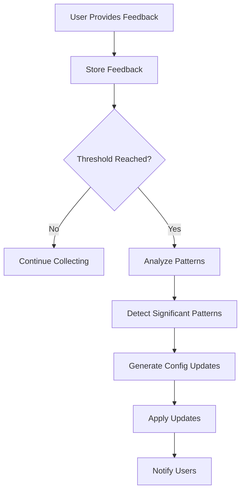

# AI Work Classification Engine

**Intelligent work classification system using Claude Sonnet 4 with continuous learning capabilities**

[](https://github.com/Jita81/Standardized-Modules-Framework-v1.0.0)
[](https://python.org)
[](https://anthropic.com)
[](https://github.com/anthropics/anthropic-sdk-python)
[](./ai-work-classification-engine/tests/)

## 🎯 Overview

The AI Work Classification Engine is an intelligent system that analyzes work descriptions and automatically classifies them by **Size**, **Complexity**, and **Type** using Claude Sonnet 4. The system learns from user feedback and continuously improves its accuracy over time.

### Key Features

- **🤖 AI-Powered Classification**: Uses Claude Sonnet 4 via official Anthropic Python client
- **📊 Multi-Dimensional Classification**: Size (XS-XXL), Complexity (Low-Critical), Type (Feature/Bug/etc.)
- **🧠 Continuous Learning**: Learns from user feedback and improves over time
- **⚡ Fast Response**: Sub-5 second classification with confidence scores
- **🔧 Configurable Standards**: Customizable classification criteria and examples
- **📈 Analytics & Reporting**: Track accuracy and improvement trends
- **🐳 Production Ready**: Docker and Kubernetes deployment included
- **🔌 Official Integration**: Uses Anthropic's official Python SDK for reliability

## 🏗️ Architecture

Built using the [Standardized Modules Framework v1.0.0](https://github.com/Jita81/Standardized-Modules-Framework-v1.0.0), this system provides:

- **MCP Protocol Support**: AI-discoverable JSON-RPC 2.0 API
- **Self-Describing**: Complete OpenAPI 3.0 schema generation
- **Microservice Architecture**: Independent, scalable service
- **Enterprise-Grade**: Production deployment with monitoring

## 📋 Classification Standards

### Size Standards
- **XS**: < 1 day (Trivial changes, text updates, simple fixes)
- **S**: 1-3 days (Small well-defined changes, single component work)
- **M**: 1-2 weeks (Medium-sized features, multiple components)
- **L**: 2-4 weeks (Large features, significant integration)
- **XL**: 1-2 months (Major features, complex systems)
- **XXL**: 2+ months (Enterprise-level initiatives, major architecture changes)

### Complexity Standards
- **Low**: Well-understood work with established patterns
- **Medium**: Some unknowns with moderate integration required
- **High**: Significant unknowns, complex integration, new technology
- **Critical**: High risk, mission-critical, extensive dependencies

### Type Standards
- **Feature**: New functionality or capabilities
- **Enhancement**: Improvements to existing functionality
- **Bug**: Defect fixes and corrections
- **Infrastructure**: Platform, tooling, or system improvements
- **Migration**: Moving or upgrading systems/data
- **Research**: Investigation, proof of concepts, spikes
- **Epic**: Large initiative containing multiple features

## 🚀 Quick Start

### Prerequisites

- Python 3.9+
- Claude API key from Anthropic
- Docker (optional, for containerized deployment)

### Installation

1. **Clone the repository**
   ```bash
   git clone <repository-url>
   cd "Module 0- AI Work Classification Engine"
   ```

2. **Set up virtual environment**
   ```bash
   python -m venv venv
   source venv/bin/activate  # On Windows: venv\Scripts\activate
   ```

3. **Install dependencies**
   ```bash
   cd ai-work-classification-engine
   pip install -r requirements.txt
   ```

4. **Configure Claude API**
   ```bash
   export CLAUDE_API_KEY="your-api-key-here"
   ```

### Basic Usage

```python
import asyncio
from ai_work_classification_engine.core import AiWorkClassificationEngineModule
from ai_work_classification_engine.classification_types import (
    AiWorkClassificationEngineConfig, 
    AiWorkClassificationEngineInput,
    ClaudeApiConfig
)

# Configure the engine with Claude Sonnet 4
claude_config = ClaudeApiConfig(
    api_key="sk-ant-api03-...",  # Your Claude API key
    model="claude-sonnet-4-20250514",
    max_tokens=8192,
    temperature=0
)
config = AiWorkClassificationEngineConfig(claude_config=claude_config)

# Initialize the engine
engine = AiWorkClassificationEngineModule(config)
engine.initialize()

# Classify work using Claude Sonnet 4
async def classify_work():
    input_data = AiWorkClassificationEngineInput(
        work_description="Add user authentication system with OAuth integration and password reset functionality"
    )

    result = await engine.execute_primary_operation(input_data)

    if result.success:
        classification = result.data
        print(f"Size: {classification.size.value} ({classification.size.confidence}%)")
        print(f"Complexity: {classification.complexity.value} ({classification.complexity.confidence}%)")
        print(f"Type: {classification.type.value} ({classification.type.confidence}%)")
        print(f"Estimated Effort: {classification.estimated_effort}")
        print(f"Reasoning: {classification.size.reasoning}")

# Run the classification
asyncio.run(classify_work())
```

## 📊 Example Classifications

### Feature Examples
```
Input: "Add user authentication system with OAuth integration"
Output: Size=L, Complexity=High, Type=Feature (3-4 weeks)

Input: "Fix button alignment on mobile devices"  
Output: Size=XS, Complexity=Low, Type=Bug (< 1 day)

Input: "Implement complete e-commerce checkout flow"
Output: Size=XL, Complexity=High, Type=Epic (6-8 weeks)
```

### Learning from Feedback
```python
from ai_work_classification_engine.types import ClassificationFeedback, FeedbackType

# Provide feedback on classification
feedback = ClassificationFeedback(
    classification_id=classification.classification_id,
    feedback_type=FeedbackType.EDIT,
    corrections={
        "complexity": {"value": "Critical", "reasoning": "Involves PCI compliance and security"}
    },
    user_id="product-manager"
)

# System learns from feedback
result = engine.process_feedback(feedback)
# After enough similar feedback, system updates its standards automatically
```

## 🔧 Configuration

### Configuration Files

The system uses JSON configuration files located in `config/`:

- **`prompts.json`**: Claude API prompts and system messages
- **`standards.json`**: Classification standards and examples
- **`versions/`**: Version history of configuration changes

### Environment Variables

```bash
# Required
CLAUDE_API_KEY=your-claude-api-key

# Optional
CLASSIFICATION_CONFIG_DIR=./config
CLASSIFICATION_DATA_DIR=./data
LEARNING_TRIGGER_THRESHOLD=10
AUTO_UPDATE_CONFIG=true
```

### Custom Standards

Modify `config/standards.json` to customize classification criteria:

```json
{
  "size_standards": {
    "M": {
      "description": "Medium-sized features with moderate complexity",
      "effort_range": "1-2 weeks",
      "characteristics": ["Multiple components", "Moderate integration"],
      "examples": ["User registration flow", "Basic dashboard"]
    }
  }
}
```

## 🧪 Testing

Run the comprehensive test suite:

```bash
# Run all tests
pytest

# Run with coverage
pytest --cov=ai_work_classification_engine --cov-report=html

# Run specific test categories
pytest tests/test_classification.py::TestClassificationWorkflow
```

### Test Categories

- **Unit Tests**: Core logic, validation, and business rules
- **Integration Tests**: Claude API integration and end-to-end workflows  
- **Learning Tests**: Feedback processing and pattern detection
- **Error Handling**: Edge cases and failure scenarios

## 🚀 Deployment

### Docker Deployment

```bash
# Build the image
docker build -t ai-work-classification-engine .

# Run the container
docker run -d \
  -p 8000:8000 \
  -e CLAUDE_API_KEY=your-api-key \
  ai-work-classification-engine
```

### Kubernetes Deployment

```bash
# Deploy to Kubernetes
kubectl apply -f k8s/

# Check deployment status
kubectl get pods -l app=ai-work-classification-engine
```

### Docker Compose (Development)

```bash
# Start all services
docker-compose up -d

# View logs
docker-compose logs -f ai-work-classification-engine
```

## 📈 Monitoring & Analytics

### Health Check

```bash
curl http://localhost:8000/health
```

### Metrics Endpoint

```bash
curl http://localhost:8000/metrics
```

### Analytics Dashboard

Access classification analytics at `http://localhost:8000/analytics`:

- Classification accuracy by dimension
- User feedback trends
- System improvement metrics
- Response time statistics

## 🔄 Learning System

The system automatically improves through:

1. **Feedback Collection**: Users provide Accept/Edit/Reject feedback
2. **Pattern Detection**: System identifies correction patterns (≥3 similar corrections)
3. **Configuration Updates**: Automatic updates to classification standards
4. **Version Control**: All changes are versioned and can be rolled back

### Learning Workflow



## 🛠️ Development

### Project Structure

```
ai-work-classification-engine/
├── core.py                 # Main classification engine
├── types.py                # Data types and enums
├── interface.py            # Abstract interface
├── config/                 # Configuration files
│   ├── prompts.json       # Claude API prompts
│   ├── standards.json     # Classification standards
│   └── versions/          # Configuration versions
├── data/                  # Runtime data
│   ├── feedback.json      # User feedback
│   ├── patterns.json      # Detected patterns
│   └── analytics.json     # Usage metrics
├── tests/                 # Test suite
├── k8s/                   # Kubernetes manifests
└── docs/                  # Documentation
```

### Contributing

1. Fork the repository
2. Create a feature branch (`git checkout -b feature/amazing-feature`)
3. Make your changes
4. Add tests for new functionality
5. Ensure all tests pass (`pytest`)
6. Commit your changes (`git commit -m 'Add amazing feature'`)
7. Push to the branch (`git push origin feature/amazing-feature`)
8. Open a Pull Request

### Code Style

```bash
# Format code
black .

# Lint code  
flake8 .

# Type checking
mypy .
```

## 📚 API Documentation

### Classification API

```http
POST /api/classify
Content-Type: application/json

{
  "work_description": "Add user authentication with OAuth",
  "context": {
    "user_id": "user-123",
    "project_context": "web-application"
  }
}
```

**Response:**
```json
{
  "classification_id": "uuid-here",
  "size": {
    "value": "L",
    "confidence": 85,
    "reasoning": "Large feature requiring multiple components and integration"
  },
  "complexity": {
    "value": "High", 
    "confidence": 78,
    "reasoning": "OAuth integration involves security considerations and third-party APIs"
  },
  "type": {
    "value": "Feature",
    "confidence": 95,
    "reasoning": "New authentication functionality being added"
  },
  "estimated_effort": "3-4 weeks",
  "recommended_approach": "Security-first development with thorough testing"
}
```

### Feedback API

```http
POST /api/feedback
Content-Type: application/json

{
  "classification_id": "uuid-here",
  "feedback_type": "edit",
  "corrections": {
    "complexity": {
      "value": "Critical",
      "reasoning": "Involves PCI compliance and security audit requirements"
    }
  },
  "user_id": "product-manager"
}
```

## 🤝 Support

- **Documentation**: See `/docs` directory for detailed documentation
- **Issues**: Report bugs and feature requests via GitHub Issues
- **Discussions**: Join the community discussion for questions and ideas

## 📄 License

This project is licensed under the MIT License - see the [LICENSE](LICENSE) file for details.

## 🙏 Acknowledgments

- Built with [Standardized Modules Framework v1.0.0](https://github.com/Jita81/Standardized-Modules-Framework-v1.0.0)
- Powered by [Claude Sonnet 4](https://anthropic.com) from Anthropic
- Inspired by agile estimation and work classification best practices

---

**🚀 Build the future of AI-powered work classification!**

For more information, see the [complete documentation](./docs/) or try the [interactive demo](./examples/).
