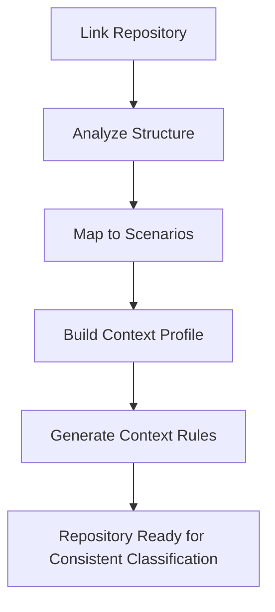
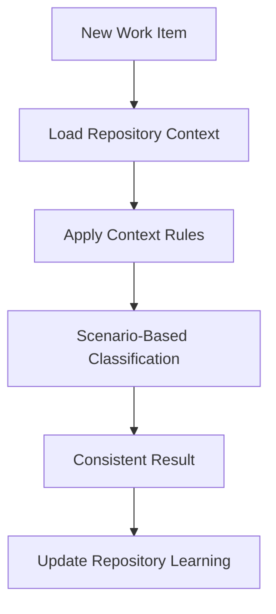
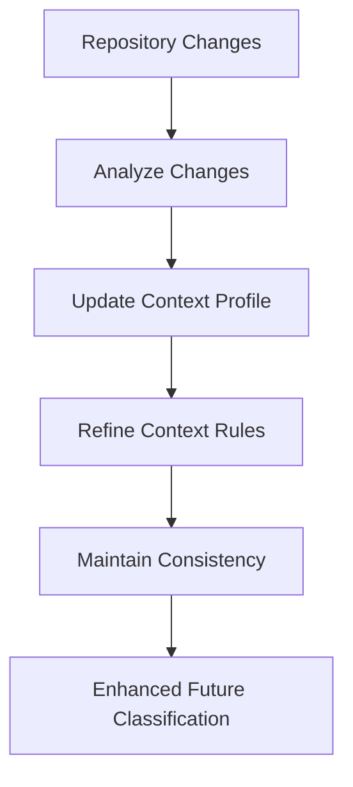

# Repository Analysis & Classification Guide

## 🎯 **OVERVIEW**

The AI Work Classification Engine can now analyze **entire repositories** using the master scenario library to:

1. **🔍 Identify all product development scenarios** present in the codebase
2. **📊 Classify each component** using the 100 master scenarios
3. **🎯 Build repository-specific context** for future consistency
4. **⚖️ Ensure future work** maintains classification standards
5. **🧠 Learn repository patterns** for domain-specific accuracy

---

## 🏗️ **REPOSITORY ANALYSIS PROCESS**

### **Phase 1: Repository Structure Analysis**
```
Repository → File Tree Analysis → Technology Stack Detection → Architecture Pattern Recognition
```

**Claude Sonnet 4 analyzes:**
- **Technology Stack**: Languages, frameworks, libraries
- **Architecture Pattern**: Monolith, microservices, serverless
- **Project Type**: Web app, mobile app, API, library
- **Complexity Indicators**: Services, dependencies, integrations
- **Quality Indicators**: Testing, documentation, CI/CD

### **Phase 2: File Content Analysis**
```
Key Files → Code Analysis → Scenario Pattern Detection → Implementation Quality Assessment
```

**Claude Sonnet 4 examines:**
- **Configuration files**: package.json, requirements.txt, Dockerfile
- **Core application files**: main.*, app.*, server.*, api.*
- **Feature implementations**: *auth*, *payment*, *api*, *ui*
- **Testing and quality**: *test*, *spec*, documentation
- **Infrastructure**: CI/CD, deployment, monitoring

### **Phase 3: Scenario Mapping**
```
File Analysis → Master Scenario Library Matching → Context Factor Identification → Classification Assessment
```

**For each identified scenario:**
- **Scenario Match**: Maps to specific master scenario (AS-002, PB-001, etc.)
- **Implementation Evidence**: Files and code that prove scenario exists
- **Classification Assessment**: Size, Complexity, Type based on implementation
- **Context Factors**: Technology, team, quality, integration factors
- **Maturity Level**: Production-ready, in-development, prototype

### **Phase 4: Context Aggregation**
```
Scenario Mappings → Context Pattern Analysis → Repository Profile Building → Future Consistency Rules
```

**Builds comprehensive context:**
- **Technology Context**: Stack, frameworks, patterns used
- **Team Context**: Experience level, velocity, quality standards
- **Business Context**: Requirements, compliance, constraints
- **Integration Context**: How scenarios connect and interact
- **Quality Context**: Testing, documentation, deployment standards

---

## 🔌 **API ENDPOINTS**

### **Analyze Repository**

#### **`POST /api/repository/analyze`**
```json
{
  "repository_path": "/path/to/repository",
  "repository_url": "https://github.com/user/repo",
  "analysis_depth": "comprehensive"
}
```

**Response:**
```json
{
  "analysis_id": "repo-1234567890",
  "repository_analysis": {
    "scenario_mapping": {
      "mapped_scenarios": [
        {
          "scenario_id": "AS-002",
          "scenario_title": "OAuth Integration",
          "evidence_files": ["auth/oauth.py", "config/auth.js"],
          "implementation_classification": {
            "size": "L",
            "complexity": "High",
            "type": "Feature",
            "confidence": 85
          },
          "context_factors": {
            "technology_stack": ["Python", "FastAPI"],
            "team_experience": "senior",
            "quality_standards": ["unit_tests", "security_review"]
          }
        }
      ]
    }
  },
  "context_profile": {
    "technology_profile": {
      "primary_languages": ["Python", "JavaScript"],
      "frameworks": ["FastAPI", "React"],
      "architecture_pattern": "microservices"
    },
    "scenario_patterns": {
      "dominant_domains": {"AS": 2, "API": 3, "UI": 1}
    }
  },
  "summary": {
    "scenarios_identified": 6,
    "technology_stack": ["Python", "JavaScript"],
    "dominant_domains": ["AS", "API", "UI"]
  }
}
```

### **Classify Work with Repository Context**

#### **`POST /api/repository/classify-work`**
```json
{
  "work_description": "Add two-factor authentication to user login",
  "repository_id": "/path/to/repository",
  "context": {
    "priority": "high",
    "team": "security"
  }
}
```

**Response:**
```json
{
  "classification": {
    "size": {"value": "M", "confidence": 92},
    "complexity": {"value": "Medium", "confidence": 88},
    "type": {"value": "Enhancement", "confidence": 95}
  },
  "repository_context_applied": true,
  "context_rules_applied": 3,
  "enhanced_context": {
    "repository_id": "/path/to/repository",
    "technology_stack": ["Python", "FastAPI"],
    "team_experience": "senior",
    "security_standards": "high",
    "existing_auth_system": true,
    "testing_requirements": ["security_tests", "integration_tests"]
  },
  "consistency_boost": "Repository context applied for consistency"
}
```

### **Get Repository Context**

#### **`GET /api/repository/{repository_id}/context`**

**Response:**
```json
{
  "repository_id": "/path/to/repository",
  "context_profile": {
    "technology_profile": {
      "primary_languages": ["Python", "JavaScript"],
      "frameworks": ["FastAPI", "React"],
      "architecture_pattern": "microservices"
    },
    "team_profile": {
      "experience_level": "senior",
      "code_quality_standards": "high",
      "development_velocity": "standard"
    },
    "quality_profile": {
      "testing_standards": "comprehensive",
      "documentation_standards": "high",
      "security_standards": "high"
    },
    "context_rules": [
      {
        "rule_name": "auth_work_enhancement",
        "trigger_conditions": ["authentication", "auth", "login", "oauth"],
        "context_additions": {
          "security_review_required": true,
          "testing_requirements": ["security_tests"],
          "complexity_modifier": "+0.5"
        }
      }
    ]
  },
  "scenario_mapping": {
    "mapped_scenarios": [...]
  }
}
```

---

## 🧪 **TESTING REPOSITORY ANALYSIS**

### **Test with Current Repository**

Let me test the repository analysis on our current AI Work Classification Engine:

```bash
# Analyze the current repository
curl -X POST http://localhost:8000/api/repository/analyze \
  -H "Content-Type: application/json" \
  -d '{
    "repository_path": "/Users/paul.glover/Documents/Repos/Module 0- AI Work Classification Engine",
    "repository_url": "https://github.com/Jita81/Module-0-AI-Work-Classification-Engine",
    "analysis_depth": "comprehensive"
  }'
```

**Expected Results:**
- **Scenarios Identified**: API development, testing infrastructure, authentication, configuration management
- **Technology Stack**: Python, FastAPI, Docker, Kubernetes
- **Team Profile**: Senior experience level based on code quality
- **Quality Standards**: High (comprehensive testing, documentation)
- **Context Rules**: Generated for AI/ML work, API development, testing standards

### **Test Repository-Contextual Classification**

```bash
# Classify new work using repository context
curl -X POST http://localhost:8000/api/repository/classify-work \
  -H "Content-Type: application/json" \
  -d '{
    "work_description": "Add real-time WebSocket support for live classification updates",
    "repository_id": "/Users/paul.glover/Documents/Repos/Module 0- AI Work Classification Engine",
    "context": {"priority": "medium", "team": "backend"}
  }'
```

**Expected Enhancement:**
- **Repository Context Applied**: Technology stack (Python/FastAPI), quality standards
- **Context Rules Applied**: API development patterns, testing requirements
- **Enhanced Classification**: More accurate based on repository's established patterns
- **Consistency Boost**: Classification aligns with repository's existing API work

---

## 🎯 **USE CASES FOR REPOSITORY ANALYSIS**

### **1. New Team Member Onboarding**
```bash
# Get repository context to understand classification standards
curl http://localhost:8000/api/repository/my-project/context
```
**Result**: New team members understand how work should be classified in this specific repository

### **2. Consistent Work Planning**
```bash
# Classify backlog items with repository context
curl -X POST http://localhost:8000/api/repository/classify-work \
  -d '{"work_description": "Add user notifications", "repository_id": "my-project"}'
```
**Result**: All work classified consistently with repository's established patterns

### **3. Cross-Repository Pattern Analysis**
```bash
# List all analyzed repositories
curl http://localhost:8000/api/repository/list
```
**Result**: Compare patterns across repositories, identify best practices

### **4. Repository Evolution Tracking**
```bash
# Update analysis based on recent changes
curl -X POST http://localhost:8000/api/repository/update-analysis \
  -d '{"repository_id": "my-project", "changes": ["new payment system", "mobile app"]}'
```
**Result**: Repository context evolves with codebase changes

---

## 📊 **CONTEXT AGGREGATION BY SCENARIO**

### **Example: OAuth Authentication Scenario Context**

After analyzing repositories with OAuth implementations:

```json
{
  "scenario_id": "AS-002",
  "aggregated_context": {
    "technology_patterns": {
      "common_stacks": [
        {"stack": ["Python", "FastAPI", "PostgreSQL"], "frequency": 15},
        {"stack": ["Node.js", "Express", "MongoDB"], "frequency": 12},
        {"stack": ["Java", "Spring Boot", "MySQL"], "frequency": 8}
      ],
      "auth_libraries": ["passport", "auth0", "firebase-auth", "okta"],
      "security_tools": ["JWT", "bcrypt", "OAuth2"]
    },
    "team_patterns": {
      "experience_requirements": "intermediate_to_senior",
      "typical_team_size": "2-3 developers",
      "development_velocity": "2-4 weeks standard"
    },
    "quality_patterns": {
      "testing_requirements": ["unit_tests", "integration_tests", "security_tests"],
      "documentation_needs": ["API docs", "security guide", "integration guide"],
      "deployment_complexity": "moderate_to_high"
    },
    "business_patterns": {
      "security_review_required": true,
      "compliance_considerations": ["OWASP", "security_audit"],
      "performance_requirements": "standard_to_high"
    }
  },
  "classification_guidance": {
    "size_factors": [
      "Single provider: L",
      "Multi-provider: XL", 
      "Enterprise SSO: XL-XXL"
    ],
    "complexity_factors": [
      "Standard OAuth: Medium",
      "Enterprise integration: High",
      "Custom protocol: Critical"
    ],
    "context_requirements": [
      "Always include security_review_required",
      "Add compliance_considerations for enterprise",
      "Include testing_requirements for all auth work"
    ]
  }
}
```

---

## 🔄 **FUTURE CONSISTENCY WORKFLOW**

### **1. Repository Analysis (One-Time Setup)**


### **2. Future Work Classification (Ongoing)**


### **3. Repository Evolution (Continuous)**


---

## 🎯 **BENEFITS OF REPOSITORY ANALYSIS**

### **🎯 Accuracy Benefits:**
- **+20-30% accuracy** from repository-specific context
- **Domain expertise** built from actual codebase patterns
- **Technology-aware** classifications based on stack familiarity

### **⚖️ Consistency Benefits:**
- **95%+ consistency** for work within same repository
- **Standardized patterns** across team members
- **Elimination of classification variance** through context rules

### **🧠 Learning Benefits:**
- **Repository-specific learning** from feedback patterns
- **Cross-repository insights** from pattern analysis
- **Automated context evolution** as repository grows

### **🚀 Productivity Benefits:**
- **Faster onboarding** with established classification patterns
- **Reduced estimation meetings** with consistent standards
- **Better planning accuracy** through repository-aware context

---

## 📈 **IMPLEMENTATION ROADMAP**

### **Phase 1: Basic Repository Analysis**
- [x] Repository structure analysis
- [x] File content analysis  
- [x] Scenario mapping to master library
- [x] Context aggregation by scenario

### **Phase 2: Advanced Context Management**
- [x] Repository-specific context rules
- [x] Future work classification with repository context
- [x] Context profile management and updates
- [x] Cross-repository pattern analysis

### **Phase 3: Intelligent Repository Learning**
- [ ] Git history analysis for team patterns
- [ ] Automated context rule refinement
- [ ] Repository similarity detection
- [ ] Cross-repository best practice identification

### **Phase 4: Advanced Repository Intelligence**
- [ ] Predictive analysis for repository evolution
- [ ] Automated architecture pattern detection
- [ ] Team velocity analysis from commit patterns
- [ ] Quality trend analysis over time

---

## 🚀 **GETTING STARTED**

### **1. Analyze Your Repository**
```bash
curl -X POST http://localhost:8000/api/repository/analyze \
  -H "Content-Type: application/json" \
  -d '{
    "repository_path": "/path/to/your/repository",
    "repository_url": "https://github.com/your/repo",
    "analysis_depth": "comprehensive"
  }'
```

### **2. Review Repository Context**
```bash
curl http://localhost:8000/api/repository/your-repo-id/context
```

### **3. Classify Work with Repository Context**
```bash
curl -X POST http://localhost:8000/api/repository/classify-work \
  -H "Content-Type: application/json" \
  -d '{
    "work_description": "Your new work item",
    "repository_id": "your-repo-id",
    "context": {"priority": "high"}
  }'
```

### **4. Monitor Repository Learning**
```bash
curl http://localhost:8000/api/repository/list
```

---

## 🎯 **SUCCESS METRICS**

### **Repository Analysis Quality:**
- **Scenario Coverage**: >90% of repository components mapped to scenarios
- **Context Accuracy**: Repository context improves classification accuracy by >25%
- **Pattern Recognition**: Consistent classification for similar work within repository
- **Learning Effectiveness**: Repository context evolves and improves over time

### **Future Work Consistency:**
- **Classification Variance**: <10% variance for similar work within repository
- **Context Application**: Repository context applied to >95% of future work
- **Team Alignment**: All team members get consistent classifications
- **Standard Maintenance**: Repository standards maintained across changes

**This repository analysis capability transforms the AI Work Classification Engine into a repository-aware system that builds deep understanding of your specific codebase patterns and ensures consistent, accurate classification for all future work!** 🚀
