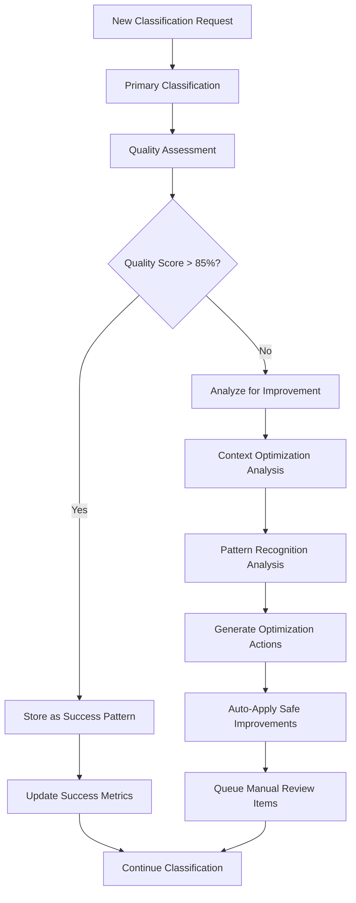
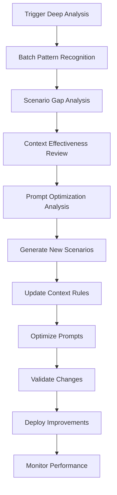

# AI Work Classification Engine - Self-Improvement Process Plan

## 🎯 **VISION: AUTONOMOUS AI OPTIMIZATION**

Create a self-improving AI system that uses multiple Claude Sonnet 4 prompts to analyze its own performance, identify optimization opportunities, and automatically improve classification accuracy, consistency, and context understanding.

---

## 🧠 **MULTI-PROMPT ARCHITECTURE FOR SELF-IMPROVEMENT**

### **Phase 1: Multi-Prompt Classification System**

#### **Primary Classification Prompt** (Current)
```
Role: Expert Work Classifier
Task: Analyze work description and classify by Size, Complexity, Type
Output: Structured JSON with confidence scores and reasoning
```

#### **Quality Assessment Prompt** (New)
```
Role: Classification Quality Auditor
Task: Analyze classification quality, identify inconsistencies, flag low-confidence areas
Input: Original work description + classification result
Output: Quality score, confidence analysis, improvement suggestions
```

#### **Pattern Recognition Prompt** (New)
```
Role: Pattern Detection Specialist  
Task: Analyze multiple classifications to identify consistent patterns and outliers
Input: Batch of classifications with feedback
Output: Pattern insights, consistency metrics, optimization recommendations
```

#### **Context Optimization Prompt** (New)
```
Role: Context Engineering Expert
Task: Analyze work descriptions to identify missing context that would improve accuracy
Input: Work description + current context + classification uncertainty
Output: Recommended context additions, dynamic rules suggestions
```

#### **Scenario Generation Prompt** (New)
```
Role: Product Development Scenario Expert
Task: Generate new scenarios based on classification patterns and gaps
Input: Current scenario library + recent classifications + feedback patterns
Output: New scenario recommendations, coverage gap analysis
```

---

## 🔄 **SELF-IMPROVEMENT PROCESS WORKFLOW**

### **Continuous Improvement Cycle (Every 10 Classifications)**



### **Deep Analysis Cycle (Every 50 Classifications)**



---

## 🎛️ **IMPLEMENTATION: ENHANCED API ENDPOINTS**

### **1. Multi-Prompt Classification Pipeline**

#### **`POST /api/classify/enhanced`** (New)
Enhanced classification using multiple prompts:

```python
async def enhanced_classify(work_description: str, context: dict):
    # Step 1: Primary classification
    primary_result = await classify_with_claude(work_description, context)
    
    # Step 2: Quality assessment
    quality_assessment = await assess_classification_quality(
        work_description, primary_result, context
    )
    
    # Step 3: Context optimization (if quality < 85%)
    if quality_assessment.quality_score < 85:
        context_suggestions = await optimize_context(
            work_description, primary_result, quality_assessment
        )
        
        # Re-classify with enhanced context
        enhanced_context = merge_context(context, context_suggestions)
        primary_result = await classify_with_claude(work_description, enhanced_context)
    
    return {
        "classification": primary_result,
        "quality_assessment": quality_assessment,
        "context_enhancements": context_suggestions,
        "confidence_level": calculate_overall_confidence(primary_result)
    }
```

### **2. Pattern Recognition & Analysis**

#### **`POST /api/analyze/patterns`** (New)
Analyze classification patterns for improvements:

```python
async def analyze_patterns(classification_batch: List[dict]):
    pattern_prompt = """
    Analyze these {count} work classifications for patterns:
    
    {classifications_data}
    
    Identify:
    1. Consistency patterns (similar work → similar classifications)
    2. Inconsistency outliers (similar work → different classifications)  
    3. Low confidence patterns (what types of work cause uncertainty)
    4. Context gaps (missing information that would improve accuracy)
    5. New scenario opportunities (work types not well represented)
    
    Respond with structured analysis and specific improvement recommendations.
    """
    
    return await claude_analyze(pattern_prompt, classification_batch)
```

### **3. Automatic Context Enhancement**

#### **`POST /api/context/auto-enhance`** (New)
Automatically enhance context based on work analysis:

```python
async def auto_enhance_context(work_description: str, current_context: dict):
    context_prompt = """
    Analyze this work description for missing context that would improve classification accuracy:
    
    Work: "{work_description}"
    Current Context: {current_context}
    
    What additional context would help classify this work more accurately?
    Consider: team factors, technology complexity, business requirements, quality standards, risk factors.
    
    Provide specific context additions with reasoning.
    """
    
    suggestions = await claude_analyze(context_prompt, {
        "work_description": work_description,
        "current_context": current_context
    })
    
    return suggestions
```

### **4. Scenario Library Auto-Expansion**

#### **`POST /api/scenarios/auto-generate`** (New)
Generate new scenarios based on classification gaps:

```python
async def auto_generate_scenarios(current_library: List[dict], recent_classifications: List[dict]):
    scenario_prompt = """
    Analyze the current scenario library and recent classifications to identify gaps:
    
    Current Scenarios: {current_library}
    Recent Classifications: {recent_classifications}
    
    Generate 5-10 new product development scenarios that would improve classification coverage.
    Focus on:
    1. Underrepresented work types
    2. Edge cases causing low confidence
    3. Domain-specific patterns
    4. Size/complexity boundary cases
    
    For each scenario, provide: title, description, expected classification, examples, success patterns.
    """
    
    return await claude_analyze(scenario_prompt, {
        "current_library": current_library,
        "recent_classifications": recent_classifications
    })
```

---

## 📈 **PERFORMANCE OPTIMIZATION STRATEGY**

### **Accuracy Optimization (Target: 95%+)**

#### **1. Confidence-Based Routing**
```python
async def confidence_based_classification(work_description: str, context: dict):
    # Initial classification
    result = await classify_with_claude(work_description, context)
    
    avg_confidence = (result.size.confidence + result.complexity.confidence + result.type.confidence) / 3
    
    if avg_confidence < 75:
        # Low confidence → Enhanced analysis
        enhanced_result = await multi_prompt_analysis(work_description, context, result)
        return enhanced_result
    
    return result
```

#### **2. Ensemble Classification for Complex Work**
```python
async def ensemble_classify(work_description: str, context: dict):
    # Multiple prompt variations
    prompts = [
        "technical_analysis_prompt",    # Focus on technical complexity
        "business_value_prompt",        # Focus on business impact
        "risk_assessment_prompt",       # Focus on risk and unknowns
        "effort_estimation_prompt"      # Focus on effort and timeline
    ]
    
    results = await asyncio.gather(*[
        claude_classify(work_description, context, prompt) 
        for prompt in prompts
    ])
    
    # Aggregate results with confidence weighting
    return aggregate_classifications(results)
```

### **Consistency Optimization (Target: 90%+ identical classifications for similar work)**

#### **1. Similarity-Based Context Injection**
```python
async def similarity_based_context(work_description: str, base_context: dict):
    # Find similar past classifications
    similar_work = find_similar_classifications(work_description)
    
    if similar_work:
        # Extract successful context patterns
        successful_contexts = [w.context for w in similar_work if w.feedback_type == 'accept']
        
        # Generate context recommendations
        context_enhancement = await claude_analyze("""
        Based on these successful similar classifications, what context should be added?
        
        Current Work: {work_description}
        Similar Successful Classifications: {successful_contexts}
        
        Recommend context additions for consistency.
        """, {
            "work_description": work_description,
            "successful_contexts": successful_contexts
        })
        
        return merge_context(base_context, context_enhancement)
    
    return base_context
```

#### **2. Classification Validation**
```python
async def validate_classification_consistency(classification: dict, work_description: str):
    validation_prompt = """
    Validate this classification for consistency with similar work:
    
    Work: "{work_description}"
    Classification: {classification}
    
    Similar Past Classifications: {similar_classifications}
    
    Is this classification consistent? If not, what should be adjusted and why?
    """
    
    validation = await claude_analyze(validation_prompt, {
        "work_description": work_description,
        "classification": classification,
        "similar_classifications": get_similar_classifications(work_description)
    })
    
    return validation
```

---

## 🎯 **CONTEXT IDENTIFICATION & STANDARDIZATION**

### **Use Case Pattern Recognition**

#### **1. Automatic Use Case Detection**
```python
async def detect_use_cases(classification_history: List[dict]):
    use_case_prompt = """
    Analyze these work classifications to identify distinct use case patterns:
    
    Classifications: {classification_history}
    
    Group similar work into use cases and identify:
    1. Common characteristics for each use case
    2. Consistent context requirements  
    3. Typical size/complexity patterns
    4. Success factors and approaches
    
    Goal: Create standardized use case templates that eliminate classification variance.
    """
    
    use_cases = await claude_analyze(use_case_prompt, classification_history)
    
    # Auto-generate context templates for each use case
    for use_case in use_cases:
        await create_context_template(use_case)
    
    return use_cases
```

#### **2. Context Standardization**
```python
async def standardize_context_for_use_case(use_case: dict, examples: List[dict]):
    standardization_prompt = """
    Create a standardized context template for this use case:
    
    Use Case: {use_case}
    Examples: {examples}
    
    Define:
    1. Required context fields for this use case type
    2. Default values based on typical patterns
    3. Dynamic rules for automatic context injection
    4. Quality gates for classification confidence
    
    Goal: Ensure identical work gets identical classifications.
    """
    
    template = await claude_analyze(standardization_prompt, {
        "use_case": use_case,
        "examples": examples
    })
    
    return template
```

---

## 🚀 **IMPLEMENTATION ROADMAP**

### **Week 1: Multi-Prompt Foundation**
- [ ] Implement quality assessment prompt
- [ ] Add confidence-based routing
- [ ] Create pattern recognition prompt
- [ ] Build auto-context enhancement

### **Week 2: Use Case Detection**
- [ ] Implement use case pattern recognition
- [ ] Create automatic context standardization
- [ ] Build similarity-based context injection
- [ ] Add classification validation

### **Week 3: Scenario Auto-Generation**
- [ ] Implement scenario gap analysis
- [ ] Create auto-scenario generation
- [ ] Build deduplication intelligence
- [ ] Add coverage optimization

### **Week 4: Advanced Optimization**
- [ ] Implement ensemble classification
- [ ] Add prompt A/B testing
- [ ] Create performance benchmarking
- [ ] Build automated optimization cycles

---

## 📊 **SUCCESS METRICS & MONITORING**

### **Primary KPIs**
- **Accuracy**: 95%+ correct classifications (measured by user acceptance)
- **Consistency**: 90%+ identical classifications for similar work
- **Confidence**: 85%+ average confidence scores
- **Coverage**: 100+ standardized use case scenarios

### **Secondary KPIs**  
- **Context Effectiveness**: Improved accuracy when context is applied
- **Learning Velocity**: Time to reach target accuracy with new domains
- **Pattern Recognition**: Ability to identify new use case patterns
- **Optimization Impact**: Measurable improvements from auto-optimization

### **Monitoring Dashboard APIs**

#### **`GET /api/metrics/self-improvement`**
```json
{
  "accuracy_trend": [85, 87, 89, 92, 94],
  "consistency_score": 0.89,
  "context_effectiveness": 0.76,
  "scenario_coverage": 0.45,
  "auto_improvements_applied": 12,
  "manual_reviews_needed": 3,
  "learning_velocity": "2.3% accuracy improvement per week"
}
```

#### **`GET /api/optimization/recommendations`**
```json
{
  "high_priority": [
    {
      "area": "scenario_library",
      "issue": "Only 45% coverage of product development patterns",
      "action": "Auto-generate 25 new scenarios from recent classifications",
      "expected_impact": "+15% accuracy",
      "confidence": 0.92
    }
  ],
  "auto_applicable": [
    {
      "area": "context_enhancement", 
      "action": "Add security context rule for auth-related work",
      "safe_to_auto_apply": true,
      "expected_impact": "+8% consistency"
    }
  ]
}
```

---

## 🎛️ **KEY CHANGES FOR OPTIMAL PERFORMANCE**

### **1. Enhanced Classification Pipeline**

#### **Current Single-Prompt Approach:**
```
Work Description → Claude Prompt → Classification
```

#### **New Multi-Prompt Approach:**
```
Work Description → Context Enhancement → Primary Classification → Quality Assessment → Confidence Routing → Final Result
                ↓                                                      ↓
        Auto-Context Rules                                    Low Confidence → Enhanced Analysis
```

### **2. Intelligent Context System**

#### **Dynamic Context Rules (Auto-Generated)**
```python
# Auto-detected from patterns
CONTEXT_RULES = {
    "security_work": {
        "triggers": ["authentication", "authorization", "security", "oauth"],
        "context_additions": {
            "security_review_required": True,
            "compliance_considerations": ["OWASP", "security_audit"],
            "complexity_modifier": "+1",
            "testing_requirements": ["security_tests", "penetration_tests"]
        },
        "confidence": 0.94
    },
    "payment_processing": {
        "triggers": ["payment", "billing", "stripe", "paypal", "transaction"],
        "context_additions": {
            "compliance_requirements": ["PCI_DSS", "financial_audit"],
            "complexity_modifier": "+1.5",
            "risk_level": "high",
            "testing_requirements": ["integration_tests", "compliance_tests"]
        },
        "confidence": 0.91
    },
    "ui_components": {
        "triggers": ["component", "button", "form", "ui", "styling"],
        "context_additions": {
            "testing_requirements": ["visual_tests", "accessibility_tests"],
            "browser_compatibility": True,
            "responsive_design": True
        },
        "confidence": 0.88
    }
}
```

### **3. Scenario Library Auto-Expansion**

#### **Target: 100 Standardized Use Case Scenarios**

**Product Development Domains (10-15 scenarios each):**
- **Authentication & Security**: OAuth, SAML, 2FA, RBAC, security audits
- **Payment Processing**: Stripe, PayPal, billing, subscriptions, compliance
- **Data Management**: CRUD, migrations, analytics, reporting, ETL
- **UI/UX Development**: Components, responsive design, accessibility, theming
- **API Development**: REST, GraphQL, integrations, webhooks, documentation
- **Infrastructure**: DevOps, monitoring, scaling, performance, deployments
- **Mobile Development**: iOS, Android, React Native, app store, offline
- **Testing & Quality**: Unit tests, integration tests, E2E, performance

#### **Auto-Generation Process:**
```python
async def auto_expand_scenario_library():
    # Analyze recent classifications for gaps
    gap_analysis = await claude_analyze("""
    Analyze recent classifications to identify scenario gaps:
    
    Recent Work: {recent_classifications}
    Current Scenarios: {current_scenarios}
    
    What new scenarios should be added to improve coverage?
    Focus on work types that show low confidence or inconsistent classifications.
    """)
    
    # Generate new scenarios
    for gap in gap_analysis.gaps:
        new_scenario = await claude_generate_scenario(gap)
        await add_scenario_to_library(new_scenario)
```

### **4. Prompt Optimization Engine**

#### **A/B Testing for Prompts**
```python
async def optimize_prompts():
    # Test prompt variations
    prompt_variants = [
        "technical_focus_prompt",
        "business_focus_prompt", 
        "risk_focus_prompt",
        "effort_focus_prompt"
    ]
    
    # Test each variant on recent work
    results = {}
    for variant in prompt_variants:
        accuracy = await test_prompt_accuracy(variant, test_set)
        results[variant] = accuracy
    
    # Auto-apply best performing prompts
    best_prompt = max(results, key=results.get)
    await update_prompt_configuration(best_prompt)
```

---

## 🧪 **IMPLEMENTATION: NEW API ENDPOINTS**

### **Multi-Prompt Classification**

#### **`POST /api/classify/multi-prompt`**
```json
{
  "work_description": "Add OAuth authentication",
  "context": {"project": "web-app"},
  "use_multi_prompt": true,
  "quality_threshold": 85
}
```

**Response:**
```json
{
  "primary_classification": {...},
  "quality_assessment": {
    "quality_score": 78,
    "confidence_analysis": "Low confidence due to missing security context",
    "improvement_suggestions": ["Add security requirements", "Specify OAuth providers"]
  },
  "enhanced_classification": {...},
  "context_enhancements": {
    "security_review_required": true,
    "oauth_providers": ["google", "github"],
    "complexity_modifier": "+0.5"
  },
  "final_confidence": 92
}
```

### **Pattern Analysis**

#### **`POST /api/analyze/classification-patterns`**
```json
{
  "analysis_period": "last_30_days",
  "include_feedback": true,
  "focus_areas": ["consistency", "accuracy", "coverage"]
}
```

**Response:**
```json
{
  "consistency_analysis": {
    "similar_work_variance": 0.12,
    "outliers": [{"work": "...", "issue": "inconsistent_complexity"}],
    "improvement_actions": ["Standardize auth work context"]
  },
  "accuracy_patterns": {
    "high_accuracy_domains": ["ui_fixes", "simple_apis"],
    "low_accuracy_domains": ["ml_work", "enterprise_integration"],
    "recommended_scenario_additions": 8
  },
  "coverage_gaps": [
    {
      "domain": "machine_learning",
      "missing_scenarios": 12,
      "impact": "high"
    }
  ]
}
```

### **Auto-Optimization**

#### **`POST /api/optimize/auto-improve`**
```json
{
  "optimization_level": "conservative|moderate|aggressive",
  "auto_apply_safe_changes": true,
  "require_manual_approval": ["prompt_changes", "major_context_updates"]
}
```

**Response:**
```json
{
  "improvements_applied": [
    {
      "area": "context_rules",
      "change": "Added security context rule for auth work",
      "expected_impact": "+8% consistency",
      "applied_automatically": true
    }
  ],
  "manual_review_needed": [
    {
      "area": "prompt_optimization",
      "recommendation": "Update system message for better domain specificity",
      "expected_impact": "+12% accuracy",
      "requires_approval": true
    }
  ],
  "new_scenarios_generated": 5,
  "overall_improvement_estimate": "+15% performance"
}
```

---

## 🎯 **SPECIFIC CHANGES FOR BEST PERFORMANCE**

### **1. Implement Multi-Stage Classification**

```python
class EnhancedClassificationEngine:
    async def classify_with_quality_gates(self, work_description: str, context: dict):
        # Stage 1: Initial classification
        initial = await self.primary_classify(work_description, context)
        
        # Stage 2: Quality assessment
        quality = await self.assess_quality(work_description, initial)
        
        # Stage 3: Enhancement if needed
        if quality.score < 85:
            enhanced_context = await self.enhance_context(work_description, context, quality)
            final = await self.primary_classify(work_description, enhanced_context)
        else:
            final = initial
        
        # Stage 4: Consistency validation
        consistency = await self.validate_consistency(work_description, final)
        
        return {
            "classification": final,
            "quality_score": quality.score,
            "consistency_score": consistency.score,
            "confidence_level": "high" if quality.score > 85 else "needs_improvement"
        }
```

### **2. Intelligent Scenario Management**

```python
class ScenarioLibraryManager:
    async def auto_maintain_library(self):
        # Analyze current coverage
        coverage = await self.analyze_coverage()
        
        # Identify gaps
        gaps = await claude_analyze("""
        Analyze scenario coverage gaps:
        Current Coverage: {coverage}
        Recent Classifications: {recent_work}
        
        What scenarios should be added to reach 95% coverage?
        """)
        
        # Generate missing scenarios
        for gap in gaps:
            new_scenarios = await self.generate_scenarios_for_gap(gap)
            await self.add_scenarios(new_scenarios)
        
        # Remove redundant scenarios
        await self.deduplicate_scenarios()
```

### **3. Context Intelligence System**

```python
class ContextIntelligenceEngine:
    async def build_smart_context(self, work_description: str, base_context: dict):
        # Step 1: Apply static rules
        context = self.apply_static_rules(work_description, base_context)
        
        # Step 2: Apply learned patterns
        context = await self.apply_learned_patterns(work_description, context)
        
        # Step 3: Generate missing context
        missing_context = await claude_analyze("""
        What context is missing that would improve classification accuracy?
        
        Work: {work_description}
        Current Context: {context}
        Similar Successful Classifications: {similar_work}
        
        Recommend specific context additions.
        """)
        
        # Step 4: Validate context quality
        context_quality = await self.assess_context_quality(context)
        
        return context, context_quality
```

---

## 📈 **SUCCESS MILESTONES**

### **Month 1: Foundation**
- ✅ Multi-prompt classification pipeline
- ✅ Quality assessment integration
- ✅ Basic pattern recognition
- **Target**: 85% accuracy, 75% consistency

### **Month 2: Intelligence**
- ✅ Auto-context enhancement
- ✅ Use case pattern detection
- ✅ Scenario auto-generation
- **Target**: 90% accuracy, 85% consistency

### **Month 3: Optimization**
- ✅ Ensemble classification for complex work
- ✅ Automated optimization cycles
- ✅ Advanced pattern recognition
- **Target**: 95% accuracy, 90% consistency

### **Month 6: Excellence**
- ✅ Fully autonomous optimization
- ✅ Domain expertise across 100+ scenarios
- ✅ Predictive context generation
- **Target**: 97% accuracy, 95% consistency

---

## 🎯 **THE ULTIMATE GOAL**

**Create an AI system that:**
1. **Learns your product development patterns** through multi-prompt analysis
2. **Standardizes work classification** to eliminate variance
3. **Automatically improves** without manual intervention
4. **Builds domain expertise** through scenario library expansion
5. **Achieves human-level accuracy** in work estimation

**Result: A self-improving AI that becomes the single source of truth for work classification in your organization.**

---

**This plan transforms your AI Work Classification Engine from a tool into an intelligent system that continuously optimizes itself for your specific product development context.** 🚀
