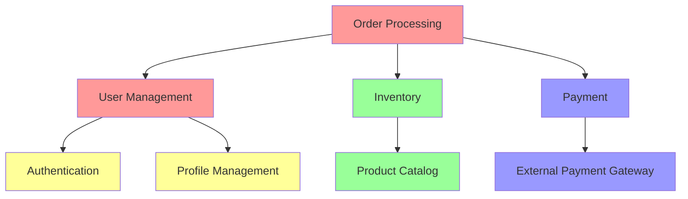

# Parallel AI Development Guide: Expert Implementation Framework

*A collaborative implementation guide by Martin Fowler, Grady Booch, Barbara Liskov, Pamela Zave, and Andrej Karpathy*

## Table of Contents

1. [Introduction](#1-introduction)
2. [Product Analysis Framework](#2-product-analysis-framework)
3. [Module Architecture Planning](#3-module-architecture-planning)
4. [Cursor Rules Configuration](#4-cursor-rules-configuration)
5. [Parallel Development Workflow](#5-parallel-development-workflow)
6. [Integration and Testing Strategy](#6-integration-and-testing-strategy)
7. [Case Study: E-Commerce Platform](#7-case-study-e-commerce-platform)
8. [Advanced Patterns and Optimization](#8-advanced-patterns-and-optimization)
9. [Troubleshooting and Quality Assurance](#9-troubleshooting-and-quality-assurance)
10. [Evolution and Maintenance](#10-evolution-and-maintenance)

---

## 1. Introduction

This guide presents the practical implementation of parallel AI development using standardized infrastructure modules and coordinated Cursor AI agents. Building on our established framework of Principled Flexibility, we demonstrate how to transform product requirements into working software through parallel agent workflows.

### 1.1 Foundational Assumptions

**Available Infrastructure Modules** *(Grady Booch)*:
The following standardized modules are deployed, tested, and available for immediate use:

- **Orchestrator Module**: System composition and lifecycle management
- **Logging & Observability Module**: Structured logging, metrics, and tracing
- **Testing & QA Module**: Automated testing and quality assurance
- **Configuration Module**: Environment management and feature flags
- **Security Module**: Authentication, authorization, and validation
- **Data Access Module**: Database and caching patterns
- **Communication Module**: External API and messaging integration
- **Validation Module**: Data integrity and serialization

**Development Environment** *(Andrej Karpathy)*:
- Multiple Cursor windows with dedicated Git branches
- Standardized prompt templates for consistent AI behavior
- Automated integration testing pipeline
- Contract-based module interface validation
- Real-time collaboration and conflict resolution

### 1.2 Core Philosophy

**Martin Fowler**: "The goal isn't to eliminate human judgment but to amplify it. By standardizing infrastructure concerns, we free cognitive resources to focus on domain complexity and business value creation."

**Barbara Liskov**: "Each module must maintain clear contracts that enable independent development while guaranteeing correct composition. The quality of these contracts determines the success of parallel development."

**Pamela Zave**: "Distributed development requires the same rigor as distributed systems - clear protocols, fault tolerance, and systematic testing of interaction patterns."

---

## 2. Product Analysis Framework

### 2.1 Domain Decomposition Strategy

**Initial Product Analysis** *(Grady Booch)*:

The first phase involves architectural analysis to identify natural module boundaries based on domain concepts, data flows, and organizational structure. This analysis determines how many parallel agents can work effectively and what their responsibilities should be.

#### Domain Boundary Identification Process:

```
1. Business Capability Mapping
   ├── Core Business Functions
   ├── Supporting Business Functions  
   ├── Technical Capabilities
   └── Integration Requirements

2. Data Flow Analysis
   ├── Primary Data Entities
   ├── Entity Relationships
   ├── Data Transformation Points
   └── External Data Dependencies

3. User Journey Mapping
   ├── Primary User Paths
   ├── Decision Points
   ├── Integration Touch Points
   └── Error Recovery Paths

4. Organizational Alignment
   ├── Team Boundaries
   ├── Expertise Areas
   ├── Ownership Models
   └── Compliance Requirements
```

#### Module Classification Framework:

**CORE Domain Modules** - Competitive differentiation, complex business rules
- Require domain expert validation
- Custom algorithms and decision logic
- Frequent evolution based on business needs
- High documentation requirements for business context

**SUPPORTING Domain Modules** - Standard business functions with customization
- Well-understood patterns with business-specific rules
- Moderate complexity, stable interfaces
- Integration with core modules
- Standard documentation sufficient

**INTEGRATION Modules** - External system boundaries
- Protocol and contract focused
- High reliability and fault tolerance requirements
- Monitoring and alerting critical
- External dependency documentation essential

**TECHNICAL Modules** - Infrastructure and utilities
- Use standardized infrastructure modules where possible
- Focus on performance and reliability
- Minimal business logic
- Technical documentation only

### 2.2 Product Analysis Template

**Barbara Liskov**: "Before any code is written, we must clearly specify what each module is responsible for and how modules interact. Ambiguous specifications lead to integration failures."

#### Comprehensive Product Analysis Document:

```markdown
# Product: {Product Name}
# Analysis Date: {Date}
# Analysts: {Team Members}

## Executive Summary
**Business Objective**: {Primary business goal}
**User Personas**: {Target users and their needs}
**Success Metrics**: {Measurable success criteria}
**Technical Constraints**: {Performance, security, compliance requirements}

## Domain Model

### Core Entities
Entity: {EntityName}
- Attributes: {Key data fields}
- Behaviors: {Operations and rules}
- Lifecycle: {Creation, modification, deletion rules}
- Relationships: {Connections to other entities}
- Invariants: {Business rules that must always hold}

### Business Processes
Process: {ProcessName}
- Trigger: {What initiates this process}
- Steps: {Ordered sequence of operations}
- Decision Points: {Where business rules apply}
- Error Conditions: {What can go wrong and recovery}
- Integration Points: {External system interactions}

## Module Architecture

### Module: {ModuleName}
**Type**: CORE|SUPPORTING|INTEGRATION|TECHNICAL
**Responsibility**: {Single, clear responsibility statement}
**Key Operations**: {Primary functions this module provides}
**Data Dependencies**: {What data this module needs}
**Integration Points**: {Other modules this connects to}
**External Dependencies**: {External systems or services}
**Performance Requirements**: {Response time, throughput, availability}
**Security Requirements**: {Authentication, authorization, data protection}
**Compliance Requirements**: {Regulatory or business policy constraints}

### Interface Contracts
```python
class {ModuleName}Interface:
    def {operation_name}(self, {parameters}) -> {return_type}:
        """
        Purpose: {What this operation accomplishes}
        Preconditions: {What must be true before calling}
        Postconditions: {What will be true after successful execution}
        Error Conditions: {Specific failures and their meanings}
        Performance: {Expected response time characteristics}
        """
```

## Integration Architecture
**Message Flow**: {How data moves between modules}
**Event Patterns**: {Asynchronous communication patterns}
**Error Propagation**: {How errors flow through the system}
**Transaction Boundaries**: {Where consistency is required}
**Caching Strategy**: {What data is cached and where}

## Quality Requirements
**Availability**: {Uptime requirements}
**Performance**: {Response time and throughput requirements}
**Security**: {Authentication, authorization, data protection}
**Scalability**: {Expected load and growth patterns}
**Maintainability**: {Evolution and change requirements}
```

### 2.3 Module Dependency Analysis

**Pamela Zave**: "Module dependencies determine the critical path for parallel development. Understanding these dependencies enables optimal scheduling of agent work and identifies potential bottlenecks."

#### Dependency Analysis Process:

1. **Direct Dependencies**: Modules that directly call each other
2. **Data Dependencies**: Modules that share data or state
3. **Temporal Dependencies**: Modules that must be developed in sequence
4. **Integration Dependencies**: Modules that share external systems
5. **Business Logic Dependencies**: Modules that implement related business rules

#### Dependency Visualization:



#### Parallel Development Scheduling:

Based on dependency analysis, determine optimal parallel development schedule:

**Wave 1 (No Dependencies)**:
- Authentication Module
- Product Catalog Module
- External Integration Modules

**Wave 2 (Depends on Wave 1)**:
- User Management Module
- Inventory Module
- Payment Module

**Wave 3 (Depends on Wave 2)**:
- Order Processing Module
- Recommendation Engine
- Analytics Module

---

## 3. Module Architecture Planning

### 3.1 Interface-First Design Process

**Barbara Liskov**: "Interface design is the most critical phase. Poor interfaces lead to tight coupling, difficult testing, and integration failures. We must design interfaces that are complete, minimal, and stable."

#### Interface Design Methodology:

1. **Operation Identification**: What operations does this module provide?
2. **Parameter Definition**: What data is needed for each operation?
3. **Return Value Specification**: What data is returned?
4. **Error Condition Enumeration**: What can go wrong and how is it communicated?
5. **Performance Characteristics**: What are the timing and resource requirements?
6. **State Management**: How does the module manage internal state?
7. **Concurrency Considerations**: How does the module handle concurrent access?

#### Standard Interface Template:

```python
"""
Module: {ModuleName}
Type: {CORE|SUPPORTING|INTEGRATION|TECHNICAL}
Domain: {Business Domain}
Version: {Semantic Version}
Authors: {Agent/Human Authors}
Last Updated: {Date}

Purpose:
{Detailed description of what this module accomplishes and why it exists}

Business Context:
{How this module fits into the overall business processes and value chain}

Key Abstractions:
{The main concepts and entities this module works with}

Quality Attributes:
- Performance: {Response time and throughput characteristics}
- Reliability: {Availability and fault tolerance requirements}
- Security: {Authentication, authorization, and data protection}
- Scalability: {Expected load and growth characteristics}
"""

from abc import ABC, abstractmethod
from typing import List, Dict, Optional, Union
from dataclasses import dataclass
from enum import Enum

# Standard result pattern for all operations
@dataclass
class OperationResult:
    success: bool
    data: Optional[Any] = None
    error: Optional[str] = None
    error_code: Optional[str] = None
    warnings: List[str] = None
    metadata: Dict[str, Any] = None

class {ModuleName}Interface(ABC):
    """
    Primary interface for {ModuleName} module
    
    This interface defines the complete contract for {module_purpose}.
    All implementations must guarantee the specified behavior.
    """
    
    @abstractmethod
    def initialize(self, config: {ModuleName}Config) -> OperationResult:
        """
        Initialize the module with provided configuration
        
        Args:
            config: Module-specific configuration parameters
            
        Returns:
            OperationResult with success/failure status
            
        Postconditions:
            - Module is ready to handle operations
            - All required resources are allocated
            - Health monitoring is active
            
        Raises:
            ConfigurationError: If configuration is invalid
            ResourceError: If required resources cannot be allocated
        """
        pass
    
    @abstractmethod
    def {primary_operation}(self, {parameters}) -> OperationResult:
        """
        {Operation description and business purpose}
        
        Business Rules:
        - {Rule 1}
        - {Rule 2}
        
        Args:
            {parameter_name}: {Parameter description and constraints}
            
        Returns:
            OperationResult containing:
            - data: {Description of returned data structure}
            - metadata: {Additional information about operation}
            
        Preconditions:
            - {Condition 1}
            - {Condition 2}
            
        Postconditions:
            - {Result 1}
            - {Result 2}
            
        Error Conditions:
            - {ErrorCode}: {When this occurs and how to handle}
            
        Performance:
            - Expected response time: {timing}
            - Memory usage: {memory characteristics}
            - Concurrency: {thread safety characteristics}
        """
        pass
    
    @abstractmethod
    def get_health_status(self) -> HealthStatus:
        """
        Report current health and operational status
        
        Returns comprehensive health information including:
        - Operational status (healthy/degraded/failed)
        - Performance metrics
        - Resource utilization
        - Recent error rates
        - Dependency status
        """
        pass
    
    @abstractmethod
    def shutdown(self) -> OperationResult:
        """
        Gracefully shutdown the module
        
        Ensures all resources are properly released and any pending
        operations are completed or safely aborted.
        """
        pass

# Configuration data structures
@dataclass
class {ModuleName}Config:
    """Configuration parameters for {ModuleName}"""
    {configuration_fields}
    
    def validate(self) -> ValidationResult:
        """Validate configuration parameters"""
        pass

# Domain-specific data structures
@dataclass
class {DomainEntity}:
    """Primary entity managed by this module"""
    {entity_fields}
    
    def validate(self) -> ValidationResult:
        """Validate entity data integrity"""
        pass

# Error definitions
class {ModuleName}Error(Exception):
    """Base exception for {ModuleName} operations"""
    def __init__(self, message: str, error_code: str, context: Dict = None):
        super().__init__(message)
        self.error_code = error_code
        self.context = context or {}

class {SpecificError}({ModuleName}Error):
    """Specific error condition"""
    pass
```

### 3.2 Contract-Based Testing Framework

**Barbara Liskov**: "Contracts aren't just documentation - they're executable specifications. Every interface must include tests that verify contract compliance."

#### Contract Test Template:

```python
"""
Contract tests for {ModuleName}Interface

These tests verify that any implementation of {ModuleName}Interface
correctly implements the behavioral contracts specified in the interface.
"""

import pytest
from abc import ABC
from typing import Type

class {ModuleName}ContractTests(ABC):
    """
    Abstract base class for contract testing {ModuleName} implementations
    
    Any implementation of {ModuleName}Interface should inherit from this
    class and implement the create_instance method to run the full
    contract test suite.
    """
    
    @pytest.fixture
    def module_instance(self):
        """Create a configured instance for testing"""
        return self.create_instance()
    
    @abstractmethod
    def create_instance(self) -> {ModuleName}Interface:
        """Create a configured instance of the module for testing"""
        pass
    
    def test_initialization_success(self, module_instance):
        """Test successful initialization with valid configuration"""
        config = self.create_valid_config()
        result = module_instance.initialize(config)
        
        assert result.success
        assert result.error is None
        assert module_instance.get_health_status().status == "healthy"
    
    def test_initialization_invalid_config(self, module_instance):
        """Test initialization fails gracefully with invalid configuration"""
        config = self.create_invalid_config()
        result = module_instance.initialize(config)
        
        assert not result.success
        assert result.error is not None
        assert result.error_code is not None
    
    def test_{primary_operation}_success(self, module_instance):
        """Test {primary_operation} with valid inputs"""
        # Arrange
        module_instance.initialize(self.create_valid_config())
        test_input = self.create_valid_{operation}_input()
        
        # Act
        result = module_instance.{primary_operation}(test_input)
        
        # Assert
        assert result.success
        assert result.data is not None
        self.verify_{operation}_postconditions(result.data)
    
    def test_{primary_operation}_invalid_input(self, module_instance):
        """Test {primary_operation} handles invalid input gracefully"""
        module_instance.initialize(self.create_valid_config())
        invalid_input = self.create_invalid_{operation}_input()
        
        result = module_instance.{primary_operation}(invalid_input)
        
        assert not result.success
        assert result.error_code in ["INVALID_INPUT", "VALIDATION_ERROR"]
    
    def test_health_status_reporting(self, module_instance):
        """Test health status reporting"""
        module_instance.initialize(self.create_valid_config())
        
        status = module_instance.get_health_status()
        
        assert status.status in ["healthy", "degraded", "failed"]
        assert status.timestamp is not None
        assert status.metrics is not None
    
    def test_graceful_shutdown(self, module_instance):
        """Test graceful shutdown"""
        module_instance.initialize(self.create_valid_config())
        
        result = module_instance.shutdown()
        
        assert result.success
        # Verify cleanup occurred
        self.verify_cleanup_completed()
    
    # Helper methods for test data creation
    def create_valid_config(self) -> {ModuleName}Config:
        """Create valid configuration for testing"""
        pass
    
    def create_invalid_config(self) -> {ModuleName}Config:
        """Create invalid configuration for testing"""
        pass
    
    def create_valid_{operation}_input(self):
        """Create valid input for {primary_operation}"""
        pass
    
    def create_invalid_{operation}_input(self):
        """Create invalid input for {primary_operation}"""
        pass
    
    def verify_{operation}_postconditions(self, result_data):
        """Verify that operation postconditions are satisfied"""
        pass
    
    def verify_cleanup_completed(self):
        """Verify that shutdown properly cleaned up resources"""
        pass
```

### 3.3 Module Communication Patterns

**Pamela Zave**: "The communication patterns between modules determine system reliability and performance characteristics. We must design for failure and plan for evolution."

#### Standard Communication Patterns:

**Synchronous Request-Response** (For immediate consistency):
```python
class SynchronousModuleCommunication:
    """Direct synchronous communication between modules"""
    
    def call_module_operation(self, module_name: str, operation: str, 
                            params: dict, timeout: float = 5.0) -> OperationResult:
        """
        Synchronous call to another module with timeout and error handling
        
        Use when:
        - Immediate response required
        - Strong consistency needed
        - Low latency requirements
        """
        try:
            module = self.orchestrator.get_module(module_name)
            with timeout_context(timeout):
                return module.execute_operation(operation, params)
        except TimeoutError:
            return OperationResult(
                success=False,
                error_code="TIMEOUT",
                error=f"Module {module_name} timed out"
            )
        except ModuleNotFoundError:
            return OperationResult(
                success=False,
                error_code="MODULE_NOT_FOUND",
                error=f"Module {module_name} not available"
            )
```

**Asynchronous Event-Driven** (For loose coupling):
```python
class EventDrivenCommunication:
    """Asynchronous event-based communication between modules"""
    
    def publish_event(self, event_type: str, data: dict, 
                     correlation_id: str = None) -> None:
        """
        Publish event for asynchronous processing
        
        Use when:
        - Loose coupling preferred
        - Eventually consistent acceptable
        - Multiple consumers possible
        """
        event = ModuleEvent(
            type=event_type,
            data=data,
            correlation_id=correlation_id or generate_correlation_id(),
            timestamp=datetime.utcnow(),
            source_module=self.module_name
        )
        
        self.event_bus.publish(event)
    
    def subscribe_to_events(self, event_pattern: str, 
                          handler: Callable[[ModuleEvent], None]) -> None:
        """Subscribe to events matching pattern"""
        self.event_bus.subscribe(event_pattern, handler)
```

**Saga Pattern** (For distributed transactions):
```python
class SagaOrchestrator:
    """Coordinate multi-module transactions with compensation"""
    
    def execute_saga(self, saga_definition: SagaDefinition) -> SagaResult:
        """
        Execute multi-step saga with automatic compensation on failure
        
        Use when:
        - Multiple modules must be updated atomically
        - Distributed transaction required
        - Compensation logic can handle partial failures
        """
        executed_steps = []
        
        try:
            for step in saga_definition.steps:
                result = self.execute_saga_step(step)
                if not result.success:
                    # Compensate executed steps in reverse order
                    self.compensate_saga(executed_steps)
                    return SagaResult(success=False, failed_step=step)
                executed_steps.append(step)
            
            return SagaResult(success=True)
        
        except Exception as e:
            self.compensate_saga(executed_steps)
            return SagaResult(success=False, error=str(e))
```

---

## 4. Cursor Rules Configuration

### 4.1 Cursor Rules Framework

**Andrej Karpathy**: "Cursor rules must provide enough context and constraints to ensure consistent, high-quality code generation while preserving the flexibility needed for domain-specific requirements."

#### Master Cursor Rules Configuration:

```yaml
# .cursorrules - Master configuration for parallel AI development

# CONTEXT MANAGEMENT
context_budget: 60000  # Total tokens per module
context_allocation:
  standards_document: 8000  # This ruleset
  interface_contracts: 15000  # Module interfaces and contracts
  domain_context: 20000  # Business domain information
  implementation_space: 17000  # Available for implementation

# MODULE CLASSIFICATION
module_types:
  CORE:
    description: "Business logic with competitive differentiation"
    patterns: ["domain_model", "business_rules", "workflows"]
    documentation: "comprehensive"
    testing: "behavior_driven"
    
  SUPPORTING:
    description: "Standard business functions with customization"
    patterns: ["crud_operations", "data_processing", "reporting"]
    documentation: "standard"
    testing: "contract_based"
    
  INTEGRATION:
    description: "External system boundaries and protocols"
    patterns: ["api_client", "event_handler", "adapter"]
    documentation: "interface_focused"
    testing: "fault_tolerance"
    
  TECHNICAL:
    description: "Infrastructure and utility functions"
    patterns: ["utility", "helper", "infrastructure"]
    documentation: "minimal"
    testing: "unit_focused"

# DEVELOPMENT STANDARDS
code_standards:
  language: "python"
  style_guide: "black + pep8"
  max_function_length: 30  # lines
  max_class_length: 200   # lines
  max_file_length: 500    # lines
  type_hints: "required"
  docstring_style: "google"

# QUALITY REQUIREMENTS
quality_gates:
  test_coverage: 90  # minimum percentage
  complexity_threshold: 10  # cyclomatic complexity
  security_scan: "required"
  performance_test: "for_critical_paths"
  contract_validation: "required"

# STANDARDIZED INFRASTRUCTURE
available_modules:
  orchestrator:
    interface: "OrchestratorInterface"
    import: "from infrastructure.orchestrator import OrchestratorInterface"
    capabilities: ["module_management", "communication", "health_monitoring"]
    
  logging:
    interface: "LoggingInterface"
    import: "from infrastructure.logging import LoggingInterface"
    capabilities: ["structured_logging", "metrics", "tracing"]
    
  testing:
    interface: "TestingInterface"
    import: "from infrastructure.testing import TestingInterface"
    capabilities: ["test_execution", "contract_validation", "integration_testing"]
    
  configuration:
    interface: "ConfigurationInterface"
    import: "from infrastructure.config import ConfigurationInterface"
    capabilities: ["environment_config", "feature_flags", "secrets"]
    
  security:
    interface: "SecurityInterface"
    import: "from infrastructure.security import SecurityInterface"
    capabilities: ["authentication", "authorization", "validation"]

# ERROR HANDLING PATTERNS
error_handling:
  result_pattern: "required"
  exception_types:
    - "ValidationError: Invalid input data"
    - "BusinessRuleError: Business logic violation"
    - "IntegrationError: External system failure"
    - "SystemError: Infrastructure failure"
  
  logging_requirements:
    - "Log all errors with context"
    - "Include correlation IDs"
    - "Structure for automated analysis"

# TESTING STRATEGY
testing_approach:
  unit_tests: "test individual functions and methods"
  integration_tests: "test module interactions"
  contract_tests: "verify interface compliance"
  performance_tests: "validate response times"
  security_tests: "check for vulnerabilities"

# DOCUMENTATION REQUIREMENTS
documentation:
  module_header: "required"
  function_docstrings: "required"
  interface_contracts: "comprehensive"
  business_rules: "for_domain_modules"
  api_examples: "for_integration_modules"
```

### 4.2 Module-Specific Cursor Rules

**Martin Fowler**: "Each module type requires specific guidance that helps the AI agent understand not just how to write code, but what kind of code is appropriate for that domain."

#### CORE Domain Module Rules:

```yaml
# .cursorrules.core - Rules for core business logic modules

module_type: "CORE"
focus: "Business logic and domain modeling"

# DOMAIN MODELING
domain_guidelines:
  - "Model business concepts as first-class entities"
  - "Express business rules clearly in code"
  - "Use domain-specific language in naming"
  - "Separate business logic from technical concerns"
  - "Document business rules and their rationale"

# IMPLEMENTATION PATTERNS
patterns:
  domain_entity:
    template: |
      @dataclass
      class {EntityName}:
          """
          {Business_description}
          
          Business Rules:
          - {Rule_1}
          - {Rule_2}
          
          Invariants:
          - {Invariant_1}
          - {Invariant_2}
          """
          {attributes}
          
          def validate(self) -> ValidationResult:
              """Validate business rules and invariants"""
              pass
          
          def {business_operation}(self, {params}) -> OperationResult:
              """
              {Business_operation_description}
              
              Business Rule: {Which_rule_this_implements}
              """
              pass

  business_service:
    template: |
      class {ServiceName}:
          """
          {Service_purpose_and_business_context}
          
          Business Capabilities:
          - {Capability_1}
          - {Capability_2}
          """
          
          def __init__(self, dependencies: {ServiceName}Dependencies):
              self._dependencies = dependencies
              self._logger = dependencies.logger
          
          def {business_operation}(self, {params}) -> OperationResult:
              """
              {Business_operation_description}
              
              Business Process:
              1. {Step_1}
              2. {Step_2}
              3. {Step_3}
              
              Business Rules Applied:
              - {Rule_1}: {Rule_description}
              - {Rule_2}: {Rule_description}
              """
              try:
                  self._logger.info(f"Starting {business_operation}", {context})
                  
                  # Step 1: {Step_description}
                  step1_result = self._execute_step1({params})
                  if not step1_result.success:
                      return step1_result
                  
                  # Continue with business process...
                  
                  self._logger.info(f"Completed {business_operation}", {result_context})
                  return OperationResult(success=True, data=final_result)
                  
              except BusinessRuleViolation as e:
                  self._logger.warning(f"Business rule violation in {business_operation}: {e}")
                  return OperationResult(success=False, error_code="BUSINESS_RULE_VIOLATION")

# TESTING APPROACH
testing_guidelines:
  - "Test business scenarios, not just code paths"
  - "Use business language in test names"
  - "Test business rules explicitly"
  - "Include edge cases and boundary conditions"
  - "Validate business invariants"

test_template: |
  def test_{business_scenario}(self):
      """Test {business_scenario_description}"""
      # Given: {Initial_business_state}
      given_state = {setup_business_state}
      
      # When: {Business_action_taken}
      result = service.{business_operation}(given_state)
      
      # Then: {Expected_business_outcome}
      assert result.success
      assert {business_rule_satisfied}
      assert {business_invariant_maintained}

# DOCUMENTATION REQUIREMENTS
documentation:
  business_context: "required"
  business_rules: "comprehensive"
  domain_model: "visual_diagram_recommended"
  use_cases: "detailed_scenarios"
```

#### INTEGRATION Module Rules:

```yaml
# .cursorrules.integration - Rules for external integration modules

module_type: "INTEGRATION"
focus: "External system integration and fault tolerance"

# INTEGRATION PATTERNS
patterns:
  external_api_client:
    template: |
      class {ServiceName}Client:
          """
          Client for {External_service_name}
          
          External API: {API_documentation_url}
          Rate Limits: {Rate_limit_information}
          SLA: {Service_level_agreement}
          """
          
          def __init__(self, config: {ServiceName}Config):
              self._client = create_http_client(config)
              self._circuit_breaker = CircuitBreaker(config.circuit_breaker_config)
              self._retry_policy = RetryPolicy(config.retry_config)
              self._logger = get_logger(f"{__name__}.{ServiceName}Client")
          
          @circuit_breaker_protected
          @retry_on_failure
          def {api_operation}(self, request: {RequestType}) -> OperationResult[{ResponseType}]:
              """
              {API_operation_description}
              
              External API: {HTTP_method} {endpoint_url}
              Rate Limit: {rate_limit}
              Timeout: {timeout_value}
              
              Error Handling:
              - Network timeouts: Retry with exponential backoff
              - Rate limiting: Exponential backoff with jitter
              - Service errors: Circuit breaker protection
              - Invalid responses: Immediate failure with detailed logging
              """
              try:
                  self._logger.info(f"Calling {External_service_name} {api_operation}", 
                                   {"request_id": request.id})
                  
                  response = self._client.{http_method}(
                      url=self._build_url(request),
                      headers=self._build_headers(request),
                      json=request.to_dict(),
                      timeout=self._config.timeout
                  )
                  
                  if response.status_code == 200:
                      result = {ResponseType}.from_dict(response.json())
                      self._logger.info(f"Successful {api_operation} call")
                      return OperationResult(success=True, data=result)
                  
                  elif response.status_code == 429:  # Rate limited
                      self._logger.warning(f"Rate limited by {External_service_name}")
                      raise RateLimitError("Service rate limit exceeded")
                  
                  else:
                      self._logger.error(f"API error: {response.status_code} - {response.text}")
                      return OperationResult(
                          success=False,
                          error_code="API_ERROR",
                          error=f"API returned {response.status_code}"
                      )
                      
              except requests.exceptions.Timeout:
                  self._logger.error(f"Timeout calling {External_service_name}")
                  raise TimeoutError(f"{External_service_name} request timed out")
              
              except requests.exceptions.ConnectionError:
                  self._logger.error(f"Connection error to {External_service_name}")
                  raise ConnectionError(f"Cannot connect to {External_service_name}")

# FAULT TOLERANCE REQUIREMENTS
fault_tolerance:
  - "Implement circuit breaker pattern"
  - "Use exponential backoff for retries"
  - "Add jitter to prevent thundering herd"
  - "Implement proper timeout handling"
  - "Log all external service interactions"
  - "Provide fallback mechanisms where possible"

# TESTING APPROACH
testing_guidelines:
  - "Mock external services for unit tests"
  - "Test fault tolerance scenarios"
  - "Verify retry behavior"
  - "Test circuit breaker functionality"
  - "Include contract tests with external services"

test_template: |
  def test_{integration_scenario}_success(self):
      """Test successful {external_service} integration"""
      with mock_external_service(success_response):
          result = client.{api_operation}(valid_request)
          assert result.success
          assert result.data.{expected_field} == expected_value
  
  def test_{integration_scenario}_timeout(self):
      """Test timeout handling for {external_service}"""
      with mock_external_service(timeout_after=5.0):
          with pytest.raises(TimeoutError):
              client.{api_operation}(valid_request)
  
  def test_{integration_scenario}_circuit_breaker(self):
      """Test circuit breaker protection"""
      # Trigger multiple failures to open circuit breaker
      for _ in range(5):
          with mock_external_service(server_error):
              client.{api_operation}(valid_request)
      
      # Verify circuit breaker is open
      assert client._circuit_breaker.is_open()
      
      # Next call should fail fast
      with pytest.raises(CircuitBreakerOpenError):
          client.{api_operation}(valid_request)
```

### 4.3 Git Branch Strategy for Parallel Development

**Grady Booch**: "Parallel development requires a disciplined approach to version control that enables independent work while maintaining system integrity."

#### Branch Strategy:

```bash
# Repository structure for parallel development
main
├── develop
├── infrastructure/
│   ├── orchestrator-module
│   ├── logging-module
│   ├── testing-module
│   └── config-module
└── features/
    ├── feature/user-management-module
    ├── feature/product-catalog-module
    ├── feature/order-processing-module
    ├── feature/payment-processing-module
    └── feature/inventory-management-module

# Git workflow for parallel development
# 1. Create feature branch for each module
git checkout -b feature/user-management-module

# 2. Set up Cursor window with module-specific rules
cp .cursorrules.core .cursorrules  # For domain modules
# or
cp .cursorrules.integration .cursorrules  # For integration modules

# 3. Implement module following interface contracts
# (AI agent implementation happens here)

# 4. Run module-specific tests
python -m pytest tests/user_management/ --cov=user_management

# 5. Validate interface contracts
python -m contract_validator user_management_module

# 6. Commit and push for integration testing
git add .
git commit -m "Implement user management module - closes #123"
git push origin feature/user-management-module

# 7. Create pull request with automated integration tests
# Integration pipeline will test module compatibility
```

#### Automated Integration Workflow:

```yaml
# .github/workflows/parallel-integration.yml
name: Parallel Module Integration

on:
  pull_request:
    paths:
      - 'features/**'

jobs:
  contract-validation:
    runs-on: ubuntu-latest
    steps:
      - uses: actions/checkout@v3
      - name: Validate Interface Contracts
        run: |
          python -m contract_validator ${{ github.head_ref }}
          
  module-testing:
    runs-on: ubuntu-latest
    steps:
      - uses: actions/checkout@v3
      - name: Run Module Tests
        run: |
          python -m pytest tests/${{ github.head_ref }}/ --cov
          
  integration-testing:
    needs: [contract-validation, module-testing]
    runs-on: ubuntu-latest
    steps:
      - uses: actions/checkout@v3
      - name: Merge with develop branch
        run: |
          git checkout develop
          git merge ${{ github.head_ref }}
      - name: Run Integration Tests
        run: |
          python -m pytest tests/integration/ --timeout=300
      - name: Performance Testing
        run: |
          python -m performance_tests --baseline=main
```

---

## 5. Parallel Development Workflow

### 5.1 Agent Coordination Strategy

**Andrej Karpathy**: "Successful parallel AI development requires clear coordination protocols that prevent conflicts while enabling independent progress. Each agent must understand its boundaries and responsibilities."

#### Agent Assignment Protocol:

```python
# Agent coordination configuration
class AgentAssignment:
    """Configuration for parallel agent development"""
    
    def __init__(self, product_spec: ProductSpecification):
        self.agents = self._assign_agents(product_spec)
        self.dependencies = self._analyze_dependencies(product_spec)
        self.integration_schedule = self._plan_integration(self.dependencies)
    
    def _assign_agents(self, spec: ProductSpecification) -> List[AgentConfig]:
        """Assign agents based on module complexity and dependencies"""
        agents = []
        
        for module in spec.modules:
            agent_config = AgentConfig(
                agent_id=f"agent-{module.name}",
                module_name=module.name,
                module_type=module.type,
                branch_name=f"feature/{module.name}-module",
                cursor_rules=f".cursorrules.{module.type.lower()}",
                context_budget=60000,
                dependencies=module.dependencies,
                estimated_complexity=module.complexity_score
            )
            agents.append(agent_config)
        
        return agents
    
    def _analyze_dependencies(self, spec: ProductSpecification) -> DependencyGraph:
        """Create dependency graph for scheduling"""
        graph = DependencyGraph()
        
        for module in spec.modules:
            graph.add_node(module.name, module)
            for dependency in module.dependencies:
                graph.add_edge(dependency, module.name)
        
        return graph
    
    def _plan_integration(self, dependencies: DependencyGraph) -> IntegrationSchedule:
        """Plan integration timeline based on dependencies"""
        schedule = IntegrationSchedule()
        
        # Topological sort to determine development waves
        waves = dependencies.topological_sort_by_waves()
        
        for wave_number, modules in enumerate(waves):
            wave = IntegrationWave(
                wave_number=wave_number,
                modules=modules,
                start_after=wave_number * 4,  # hours
                integration_tests=self._generate_integration_tests(modules)
            )
            schedule.add_wave(wave)
        
        return schedule
```

#### Agent Context Management:

```python
class AgentContext:
    """Manages context for individual AI agents"""
    
    def __init__(self, agent_config: AgentConfig, global_context: GlobalContext):
        self.agent_id = agent_config.agent_id
        self.module_name = agent_config.module_name
        self.context_budget = agent_config.context_budget
        self.global_context = global_context
        
    def build_agent_context(self) -> str:
        """Build complete context for agent within token budget"""
        context_parts = []
        remaining_budget = self.context_budget
        
        # 1. Essential standards (always included)
        standards = self.global_context.get_coding_standards()
        context_parts.append(standards)
        remaining_budget -= len(standards.split())
        
        # 2. Module interface contracts (high priority)
        interfaces = self.global_context.get_interface_contracts(
            self.module_name,
            include_dependencies=True
        )
        if len(interfaces.split()) <= remaining_budget * 0.3:
            context_parts.append(interfaces)
            remaining_budget -= len(interfaces.split())
        
        # 3. Domain context (module-specific)
        domain_context = self.global_context.get_domain_context(self.module_name)
        if len(domain_context.split()) <= remaining_budget * 0.4:
            context_parts.append(domain_context)
            remaining_budget -= len(domain_context.split())
        
        # 4. Implementation examples (if space available)
        if remaining_budget > 5000:
            examples = self.global_context.get_implementation_examples(
                self.module_name,
                max_tokens=remaining_budget
            )
            context_parts.append(examples)
        
        return "\n\n".join(context_parts)
    
    def update_context_with_progress(self, implementation_progress: Dict):
        """Update context based on implementation progress"""
        # Update global context with completed interfaces
        # This helps other agents understand what's available
        pass
```

### 5.2 Cursor Window Management

**Martin Fowler**: "Each Cursor window becomes a specialized development environment tailored for its specific module. The key is providing just enough context without overwhelming the AI."

#### Window Setup Protocol:

```bash
#!/bin/bash
# setup_agent_window.sh - Initialize Cursor window for module development

MODULE_NAME=$1
MODULE_TYPE=$2
AGENT_ID=$3

# 1. Create and switch to feature branch
git checkout -b feature/${MODULE_NAME}-module

# 2. Set up module-specific cursor rules
cp .cursorrules.${MODULE_TYPE} .cursorrules

# 3. Create module directory structure
mkdir -p modules/${MODULE_NAME}/{src,tests,docs}

# 4. Generate module template based on interface contracts
python scripts/generate_module_template.py \
    --module-name=${MODULE_NAME} \
    --module-type=${MODULE_TYPE} \
    --output-dir=modules/${MODULE_NAME}

# 5. Set up development environment
python -m venv .venv-${MODULE_NAME}
source .venv-${MODULE_NAME}/bin/activate
pip install -r requirements.dev.txt

# 6. Initialize testing framework
python -m pytest --collect-only modules/${MODULE_NAME}/tests/

# 7. Start development session with context
echo "Agent ${AGENT_ID} environment ready for ${MODULE_NAME} development"
echo "Module type: ${MODULE_TYPE}"
echo "Context budget: 60k tokens"
echo "Ready for parallel development!"
```

#### Context-Aware Prompt Templates:

```python
# Module development prompt templates
class ModuleDevelopmentPrompts:
    """Standardized prompts for module development"""
    
    @staticmethod
    def generate_core_module_prompt(module_spec: ModuleSpec) -> str:
        return f"""
Create a CORE domain module: {module_spec.name}

BUSINESS CONTEXT:
{module_spec.business_context}

INTERFACE CONTRACT:
{module_spec.interface_definition}

BUSINESS RULES:
{module_spec.business_rules}

IMPLEMENTATION REQUIREMENTS:
1. Follow the standardized CORE module pattern
2. Implement all interface methods with proper error handling
3. Include comprehensive business logic documentation
4. Create thorough test suite covering business scenarios
5. Use dependency injection for infrastructure services
6. Ensure all business rules are explicitly tested

AVAILABLE INFRASTRUCTURE:
- Orchestrator: {orchestrator_interface}
- Logging: {logging_interface}
- Configuration: {config_interface}

QUALITY GATES:
- Test coverage > 90%
- All business rules documented and tested
- Interface contract compliance verified
- Performance within specified limits

Generate:
1. Complete module implementation
2. Comprehensive test suite
3. Documentation including business rules
4. Integration points with infrastructure modules

Focus on business value and domain modeling excellence.
"""
    
    @staticmethod
    def generate_integration_module_prompt(module_spec: ModuleSpec) -> str:
        return f"""
Create an INTEGRATION module: {module_spec.name}

EXTERNAL SERVICE:
{module_spec.external_service_spec}

INTERFACE CONTRACT:
{module_spec.interface_definition}

FAULT TOLERANCE REQUIREMENTS:
{module_spec.fault_tolerance_requirements}

IMPLEMENTATION REQUIREMENTS:
1. Follow the standardized INTEGRATION module pattern
2. Implement circuit breaker and retry patterns
3. Include comprehensive error handling for external failures
4. Create fault tolerance test suite
5. Monitor and log all external interactions
6. Provide fallback mechanisms where possible

EXTERNAL API SPECIFICATION:
{module_spec.external_api_spec}

QUALITY GATES:
- All fault scenarios tested
- Circuit breaker functionality verified
- Retry behavior validated
- Monitoring and alerting implemented

Generate:
1. Robust external service client
2. Comprehensive fault tolerance testing
3. Monitoring and observability integration
4. Documentation of failure modes and recovery

Focus on reliability and fault tolerance excellence.
"""
```

### 5.3 Real-Time Progress Monitoring

**Pamela Zave**: "Parallel development requires real-time visibility into progress and potential conflicts. We need automated monitoring that can detect integration issues before they become blocking problems."

#### Development Progress Tracking:

```python
class ParallelDevelopmentMonitor:
    """Monitor progress across parallel development agents"""
    
    def __init__(self, project_config: ProjectConfig):
        self.project_config = project_config
        self.agent_statuses = {}
        self.integration_status = IntegrationStatus()
        self.conflict_detector = ConflictDetector()
    
    def track_agent_progress(self, agent_id: str, progress_update: ProgressUpdate):
        """Track individual agent development progress"""
        self.agent_statuses[agent_id] = AgentStatus(
            agent_id=agent_id,
            module_name=progress_update.module_name,
            completion_percentage=progress_update.completion_percentage,
            current_phase=progress_update.current_phase,
            tests_passing=progress_update.tests_passing,
            contract_compliance=progress_update.contract_compliance,
            estimated_completion=progress_update.estimated_completion,
            blockers=progress_update.blockers,
            last_update=datetime.utcnow()
        )
        
        # Check for potential conflicts
        conflicts = self.conflict_detector.detect_conflicts(
            agent_id, progress_update, self.agent_statuses
        )
        
        if conflicts:
            self.handle_conflicts(conflicts)
    
    def check_integration_readiness(self) -> IntegrationReadinessReport:
        """Determine if modules are ready for integration"""
        ready_modules = []
        blocked_modules = []
        
        for agent_id, status in self.agent_statuses.items():
            if status.is_ready_for_integration():
                ready_modules.append(status.module_name)
            elif status.has_blockers():
                blocked_modules.append({
                    'module': status.module_name,
                    'blockers': status.blockers
                })
        
        return IntegrationReadinessReport(
            ready_modules=ready_modules,
            blocked_modules=blocked_modules,
            integration_wave_ready=len(ready_modules) >= self._get_current_wave_size(),
            recommended_actions=self._generate_recommendations()
        )
    
    def generate_progress_dashboard(self) -> ProgressDashboard:
        """Generate real-time progress dashboard"""
        return ProgressDashboard(
            overall_completion=self._calculate_overall_progress(),
            agent_progress=self.agent_statuses,
            integration_status=self.integration_status,
            timeline_status=self._analyze_timeline_status(),
            quality_metrics=self._collect_quality_metrics(),
            recommendations=self._generate_recommendations()
        )
```

#### Automated Conflict Detection:

```python
class ConflictDetector:
    """Detect potential conflicts in parallel development"""
    
    def detect_conflicts(self, agent_id: str, progress: ProgressUpdate, 
                        all_statuses: Dict[str, AgentStatus]) -> List[Conflict]:
        """Detect various types of conflicts"""
        conflicts = []
        
        # Interface conflicts
        interface_conflicts = self._detect_interface_conflicts(progress, all_statuses)
        conflicts.extend(interface_conflicts)
        
        # Dependency conflicts
        dependency_conflicts = self._detect_dependency_conflicts(progress, all_statuses)
        conflicts.extend(dependency_conflicts)
        
        # Timeline conflicts
        timeline_conflicts = self._detect_timeline_conflicts(progress, all_statuses)
        conflicts.extend(timeline_conflicts)
        
        # Resource conflicts
        resource_conflicts = self._detect_resource_conflicts(progress, all_statuses)
        conflicts.extend(resource_conflicts)
        
        return conflicts
    
    def _detect_interface_conflicts(self, progress: ProgressUpdate, 
                                  all_statuses: Dict[str, AgentStatus]) -> List[Conflict]:
        """Detect conflicts in interface definitions"""
        conflicts = []
        
        # Check if multiple agents are modifying the same interface
        current_interfaces = progress.modified_interfaces
        
        for other_agent_id, other_status in all_statuses.items():
            if other_agent_id == progress.agent_id:
                continue
                
            other_interfaces = other_status.progress_update.modified_interfaces
            
            # Check for overlapping interface modifications
            overlap = set(current_interfaces) & set(other_interfaces)
            if overlap:
                conflicts.append(InterfaceConflict(
                    type="interface_overlap",
                    agents=[progress.agent_id, other_agent_id],
                    interfaces=list(overlap),
                    severity="high",
                    recommendation="Coordinate interface changes or redesign boundaries"
                ))
        
        return conflicts
    
    def _detect_dependency_conflicts(self, progress: ProgressUpdate,
                                   all_statuses: Dict[str, AgentStatus]) -> List[Conflict]:
        """Detect conflicts in module dependencies"""
        conflicts = []
        
        # Check if agent is waiting for dependency that's blocked
        for dependency in progress.dependencies:
            dependency_agent = self._find_agent_for_module(dependency, all_statuses)
            
            if dependency_agent and dependency_agent.has_blockers():
                conflicts.append(DependencyConflict(
                    type="blocked_dependency",
                    waiting_agent=progress.agent_id,
                    blocking_agent=dependency_agent.agent_id,
                    blocked_module=dependency,
                    estimated_delay=dependency_agent.estimated_delay,
                    recommendation="Consider mocking dependency or adjusting timeline"
                ))
        
        return conflicts
```

---

## 6. Integration and Testing Strategy

### 6.1 Automated Integration Pipeline

**Barbara Liskov**: "Integration testing in parallel development must be automated, comprehensive, and fast. Manual integration processes cannot keep pace with parallel development speeds."

#### Integration Test Framework:

```python
class AutomatedIntegrationFramework:
    """Comprehensive integration testing for parallel development"""
    
    def __init__(self, project_config: ProjectConfig):
        self.project_config = project_config
        self.test_orchestrator = TestOrchestrator()
        self.contract_validator = ContractValidator()
        self.performance_tester = PerformanceTester()
        
    def execute_integration_wave(self, wave: IntegrationWave) -> IntegrationResult:
        """Execute comprehensive integration testing for a development wave"""
        results = IntegrationResult(wave_id=wave.wave_id)
        
        # Phase 1: Contract Validation
        contract_results = self._validate_contracts(wave.modules)
        results.add_phase_result("contract_validation", contract_results)
        
        if not contract_results.success:
            return results  # Stop on contract failures
        
        # Phase 2: Module Integration
        integration_results = self._test_module_integration(wave.modules)
        results.add_phase_result("module_integration", integration_results)
        
        # Phase 3: System Integration
        if integration_results.success:
            system_results = self._test_system_integration(wave.modules)
            results.add_phase_result("system_integration", system_results)
        
        # Phase 4: Performance Testing
        if integration_results.success:
            performance_results = self._test_performance(wave.modules)
            results.add_phase_result("performance_testing", performance_results)
        
        # Phase 5: Security Testing
        security_results = self._test_security(wave.modules)
        results.add_phase_result("security_testing", security_results)
        
        return results
    
    def _validate_contracts(self, modules: List[Module]) -> ValidationResult:
        """Validate that modules implement their interface contracts correctly"""
        validation_results = []
        
        for module in modules:
            # Load module implementation
            module_instance = self._load_module(module)
            
            # Get interface contract
            contract = self._get_interface_contract(module.interface_name)
            
            # Run contract validation tests
            contract_result = self.contract_validator.validate(
                module_instance=module_instance,
                contract=contract
            )
            
            validation_results.append(contract_result)
        
        return ValidationResult(
            success=all(r.success for r in validation_results),
            results=validation_results
        )
    
    def _test_module_integration(self, modules: List[Module]) -> IntegrationTestResult:
        """Test integration between modules in this wave"""
        test_scenarios = self._generate_integration_scenarios(modules)
        scenario_results = []
        
        for scenario in test_scenarios:
            # Set up test environment
            test_env = self._create_integration_test_environment(scenario.required_modules)
            
            try:
                # Execute integration scenario
                scenario_result = self._execute_integration_scenario(scenario, test_env)
                scenario_results.append(scenario_result)
                
            finally:
                # Clean up test environment
                self._cleanup_test_environment(test_env)
        
        return IntegrationTestResult(
            success=all(r.success for r in scenario_results),
            scenario_results=scenario_results
        )
    
    def _generate_integration_scenarios(self, modules: List[Module]) -> List[IntegrationScenario]:
        """Generate integration test scenarios based on module interactions"""
        scenarios = []
        
        # Generate scenarios for each module interaction
        for i, module_a in enumerate(modules):
            for j, module_b in enumerate(modules[i+1:], i+1):
                interactions = self._identify_interactions(module_a, module_b)
                
                for interaction in interactions:
                    scenario = IntegrationScenario(
                        name=f"test_{module_a.name}_to_{module_b.name}_{interaction.name}",
                        description=f"Test {interaction.description}",
                        modules=[module_a, module_b],
                        interaction=interaction,
                        test_steps=self._generate_test_steps(interaction)
                    )
                    scenarios.append(scenario)
        
        # Generate end-to-end scenarios
        e2e_scenarios = self._generate_e2e_scenarios(modules)
        scenarios.extend(e2e_scenarios)
        
        return scenarios
```

#### Contract Validation System:

```python
class ContractValidator:
    """Validate that module implementations conform to their interface contracts"""
    
    def validate(self, module_instance: Any, contract: InterfaceContract) -> ContractValidationResult:
        """Comprehensive contract validation"""
        results = []
        
        # Test 1: Interface Completeness
        completeness_result = self._test_interface_completeness(module_instance, contract)
        results.append(completeness_result)
        
        # Test 2: Method Signatures
        signature_result = self._test_method_signatures(module_instance, contract)
        results.append(signature_result)
        
        # Test 3: Behavioral Contracts
        behavior_result = self._test_behavioral_contracts(module_instance, contract)
        results.append(behavior_result)
        
        # Test 4: Error Handling Contracts
        error_result = self._test_error_handling_contracts(module_instance, contract)
        results.append(error_result)
        
        # Test 5: Performance Contracts
        performance_result = self._test_performance_contracts(module_instance, contract)
        results.append(performance_result)
        
        return ContractValidationResult(
            success=all(r.success for r in results),
            validation_results=results
        )
    
    def _test_behavioral_contracts(self, module_instance: Any, 
                                 contract: InterfaceContract) -> ValidationTest:
        """Test that module behavior matches contract specifications"""
        test_results = []
        
        for operation in contract.operations:
            # Test preconditions
            precondition_tests = self._test_preconditions(module_instance, operation)
            test_results.extend(precondition_tests)
            
            # Test postconditions
            postcondition_tests = self._test_postconditions(module_instance, operation)
            test_results.extend(postcondition_tests)
            
            # Test invariants
            invariant_tests = self._test_invariants(module_instance, operation)
            test_results.extend(invariant_tests)
        
        return ValidationTest(
            name="behavioral_contracts",
            success=all(t.success for t in test_results),
            test_results=test_results
        )
    
    def _test_preconditions(self, module_instance: Any, 
                          operation: OperationContract) -> List[TestResult]:
        """Test that operation preconditions are properly enforced"""
        results = []
        
        for precondition in operation.preconditions:
            # Create test data that violates precondition
            invalid_input = self._create_precondition_violation(precondition)
            
            try:
                # Call operation with invalid input
                result = getattr(module_instance, operation.name)(invalid_input)
                
                # Should either return error result or raise exception
                if hasattr(result, 'success') and not result.success:
                    # Error result pattern - check error type
                    if result.error_code in precondition.expected_error_codes:
                        results.append(TestResult(
                            name=f"precondition_{precondition.name}",
                            success=True,
                            message="Precondition properly enforced via error result"
                        ))
                    else:
                        results.append(TestResult(
                            name=f"precondition_{precondition.name}",
                            success=False,
                            message=f"Wrong error code: {result.error_code}"
                        ))
                else:
                    results.append(TestResult(
                        name=f"precondition_{precondition.name}",
                        success=False,
                        message="Precondition not enforced - operation succeeded with invalid input"
                    ))
                    
            except Exception as e:
                # Exception pattern - check exception type
                if type(e).__name__ in precondition.expected_exceptions:
                    results.append(TestResult(
                        name=f"precondition_{precondition.name}",
                        success=True,
                        message="Precondition properly enforced via exception"
                    ))
                else:
                    results.append(TestResult(
                        name=f"precondition_{precondition.name}",
                        success=False,
                        message=f"Wrong exception type: {type(e).__name__}"
                    ))
        
        return results
```

### 6.2 Performance and Load Testing

**Pamela Zave**: "Performance testing in parallel development must validate not just individual module performance, but system-wide performance characteristics as modules are integrated."

#### Performance Testing Framework:

```python
class PerformanceTester:
    """Comprehensive performance testing for parallel development"""
    
    def __init__(self, performance_config: PerformanceConfig):
        self.config = performance_config
        self.metrics_collector = MetricsCollector()
        self.load_generator = LoadGenerator()
        
    def test_module_performance(self, module: Module) -> PerformanceTestResult:
        """Test individual module performance characteristics"""
        results = []
        
        # Test 1: Response Time Under Normal Load
        normal_load_result = self._test_response_time_normal_load(module)
        results.append(normal_load_result)
        
        # Test 2: Response Time Under Peak Load
        peak_load_result = self._test_response_time_peak_load(module)
        results.append(peak_load_result)
        
        # Test 3: Memory Usage
        memory_result = self._test_memory_usage(module)
        results.append(memory_result)
        
        # Test 4: Throughput
        throughput_result = self._test_throughput(module)
        results.append(throughput_result)
        
        # Test 5: Resource Cleanup
        cleanup_result = self._test_resource_cleanup(module)
        results.append(cleanup_result)
        
        return PerformanceTestResult(
            module_name=module.name,
            success=all(r.success for r in results),
            performance_metrics=self._aggregate_metrics(results),
            recommendations=self._generate_performance_recommendations(results)
        )
    
    def test_system_performance(self, modules: List[Module]) -> SystemPerformanceResult:
        """Test system-wide performance with integrated modules"""
        # Create integrated test environment
        test_env = self._create_integrated_environment(modules)
        
        try:
            # Test end-to-end user scenarios under load
            e2e_results = self._test_e2e_scenarios_under_load(test_env)
            
            # Test system scalability
            scalability_results = self._test_system_scalability(test_env)
            
            # Test system resilience under stress
            stress_results = self._test_system_stress(test_env)
            
            return SystemPerformanceResult(
                e2e_performance=e2e_results,
                scalability=scalability_results,
                stress_resilience=stress_results,
                overall_success=all([
                    e2e_results.success,
                    scalability_results.success,
                    stress_results.success
                ])
            )
            
        finally:
            self._cleanup_test_environment(test_env)
    
    def _test_e2e_scenarios_under_load(self, test_env: TestEnvironment) -> E2EPerformanceResult:
        """Test end-to-end scenarios under realistic load"""
        scenarios = self._get_critical_user_scenarios()
        scenario_results = []
        
        for scenario in scenarios:
            # Generate realistic load for this scenario
            load_profile = self._create_load_profile(scenario)
            
            # Execute scenario under load
            with self.load_generator.generate_load(load_profile):
                scenario_result = self._execute_performance_scenario(scenario, test_env)
                scenario_results.append(scenario_result)
        
        return E2EPerformanceResult(
            scenario_results=scenario_results,
            success=all(r.meets_sla() for r in scenario_results)
        )
    
    def _execute_performance_scenario(self, scenario: PerformanceScenario, 
                                    test_env: TestEnvironment) -> ScenarioPerformanceResult:
        """Execute a performance scenario and collect detailed metrics"""
        metrics = []
        
        # Start metrics collection
        self.metrics_collector.start_collection()
        
        try:
            start_time = time.time()
            
            # Execute scenario steps
            for step in scenario.steps:
                step_start = time.time()
                
                # Execute step
                step_result = self._execute_step(step, test_env)
                
                step_duration = time.time() - step_start
                
                # Collect step metrics
                step_metrics = StepMetrics(
                    step_name=step.name,
                    duration=step_duration,
                    success=step_result.success,
                    response_size=step_result.response_size,
                    error_count=step_result.error_count
                )
                metrics.append(step_metrics)
                
                # Check if step meets performance requirements
                if not step.performance_requirement.is_met(step_metrics):
                    return ScenarioPerformanceResult(
                        scenario_name=scenario.name,
                        success=False,
                        failed_step=step.name,
                        metrics=metrics
                    )
            
            total_duration = time.time() - start_time
            
            return ScenarioPerformanceResult(
                scenario_name=scenario.name,
                success=True,
                total_duration=total_duration,
                metrics=metrics
            )
            
        finally:
            # Stop metrics collection
            system_metrics = self.metrics_collector.stop_collection()
            metrics.extend(system_metrics)
```

### 6.3 Security and Compliance Testing

**Barbara Liskov**: "Security testing must be integrated into the parallel development process, not added as an afterthought. Each module must be validated for security compliance before integration."

#### Security Testing Framework:

```python
class SecurityTester:
    """Comprehensive security testing for parallel development"""
    
    def __init__(self, security_config: SecurityConfig):
        self.config = security_config
        self.vulnerability_scanner = VulnerabilityScanner()
        self.penetration_tester = PenetrationTester()
        self.compliance_checker = ComplianceChecker()
    
    def test_module_security(self, module: Module) -> SecurityTestResult:
        """Comprehensive security testing for individual modules"""
        results = []
        
        # Test 1: Input Validation
        input_validation_result = self._test_input_validation(module)
        results.append(input_validation_result)
        
        # Test 2: Authentication and Authorization
        auth_result = self._test_authentication_authorization(module)
        results.append(auth_result)
        
        # Test 3: Data Protection
        data_protection_result = self._test_data_protection(module)
        results.append(data_protection_result)
        
        # Test 4: Vulnerability Scanning
        vulnerability_result = self._scan_vulnerabilities(module)
        results.append(vulnerability_result)
        
        # Test 5: Compliance Checking
        compliance_result = self._check_compliance(module)
        results.append(compliance_result)
        
        return SecurityTestResult(
            module_name=module.name,
            security_level=self._calculate_security_level(results),
            test_results=results,
            vulnerabilities=self._aggregate_vulnerabilities(results),
            compliance_status=compliance_result.status
        )
    
    def _test_input_validation(self, module: Module) -> SecurityTest:
        """Test input validation and injection attack prevention"""
        test_cases = []
        
        # SQL Injection Tests
        sql_injection_tests = self._generate_sql_injection_tests(module)
        test_cases.extend(sql_injection_tests)
        
        # XSS Tests
        xss_tests = self._generate_xss_tests(module)
        test_cases.extend(xss_tests)
        
        # Buffer Overflow Tests
        buffer_overflow_tests = self._generate_buffer_overflow_tests(module)
        test_cases.extend(buffer_overflow_tests)
        
        # Command Injection Tests
        command_injection_tests = self._generate_command_injection_tests(module)
        test_cases.extend(command_injection_tests)
        
        # Execute all test cases
        results = []
        for test_case in test_cases:
            result = self._execute_security_test_case(test_case, module)
            results.append(result)
        
        return SecurityTest(
            name="input_validation",
            success=all(r.success for r in results),
            test_results=results,
            severity=self._calculate_max_severity(results)
        )
    
    def _generate_sql_injection_tests(self, module: Module) -> List[SecurityTestCase]:
        """Generate SQL injection test cases for module operations"""
        test_cases = []
        
        # Get operations that interact with databases
        db_operations = self._identify_database_operations(module)
        
        for operation in db_operations:
            # Generate various SQL injection payloads
            payloads = [
                "'; DROP TABLE users; --",
                "' OR '1'='1",
                "' UNION SELECT * FROM users --",
                "'; INSERT INTO users VALUES ('hacker', 'password'); --"
            ]
            
            for payload in payloads:
                # Create test case for each parameter
                for param in operation.parameters:
                    if param.type in ['string', 'text']:
                        test_case = SecurityTestCase(
                            name=f"sql_injection_{operation.name}_{param.name}",
                            attack_type="sql_injection",
                            payload=payload,
                            target_operation=operation.name,
                            target_parameter=param.name,
                            expected_result="blocked_or_sanitized"
                        )
                        test_cases.append(test_case)
        
        return test_cases
    
    def _execute_security_test_case(self, test_case: SecurityTestCase, 
                                  module: Module) -> SecurityTestResult:
        """Execute individual security test case"""
        try:
            # Prepare test input with malicious payload
            test_input = self._prepare_test_input(test_case, module)
            
            # Execute operation with malicious input
            result = self._execute_module_operation(
                module, 
                test_case.target_operation, 
                test_input
            )
            
            # Analyze result for security violations
            security_violation = self._analyze_for_security_violation(result, test_case)
            
            if security_violation:
                return SecurityTestResult(
                    test_name=test_case.name,
                    success=False,
                    vulnerability=security_violation,
                    severity="high",
                    description=f"Security vulnerability detected: {security_violation.description}"
                )
            else:
                return SecurityTestResult(
                    test_name=test_case.name,
                    success=True,
                    description="Attack properly blocked or sanitized"
                )
                
        except SecurityException as e:
            # Security exception is expected for malicious input
            return SecurityTestResult(
                test_name=test_case.name,
                success=True,
                description=f"Attack properly blocked: {str(e)}"
            )
        except Exception as e:
            # Unexpected exception might indicate vulnerability
            return SecurityTestResult(
                test_name=test_case.name,
                success=False,
                vulnerability=UnexpectedBehaviorVulnerability(str(e)),
                severity="medium",
                description=f"Unexpected behavior with malicious input: {str(e)}"
            )
```

---

## 7. Case Study: E-Commerce Platform

### 7.1 Product Specification and Analysis

**Martin Fowler**: "Let's walk through a comprehensive example that demonstrates the entire parallel development process. An e-commerce platform provides sufficient complexity to showcase all aspects of our framework."

#### E-Commerce Platform Requirements:

```markdown
# E-Commerce Platform: "ShopSmart"

## Business Objective
Create a modern e-commerce platform that enables businesses to sell products online with integrated inventory management, payment processing, and customer relationship management.

## Target Users
- **Business Owners**: Set up and manage online stores
- **Customers**: Browse, search, and purchase products
- **Administrators**: Manage platform operations and analytics

## Core Business Capabilities
1. **Product Management**: Catalog management, pricing, inventory tracking
2. **Customer Management**: Registration, profiles, order history
3. **Order Processing**: Cart management, checkout, fulfillment
4. **Payment Processing**: Multiple payment methods, secure transactions
5. **Inventory Management**: Stock tracking, automated reordering
6. **Analytics & Reporting**: Sales reports, customer insights, inventory analytics

## Quality Requirements
- **Performance**: Page loads < 2 seconds, API responses < 500ms
- **Availability**: 99.9% uptime during business hours
- **Security**: PCI DSS compliance, GDPR compliance
- **Scalability**: Support 10,000 concurrent users, 1M products
```

#### Domain Analysis and Module Identification:

```python
# E-Commerce Domain Analysis
class ECommerceDomainAnalysis:
    """Comprehensive analysis of e-commerce domain for module identification"""
    
    def analyze_domain(self) -> DomainAnalysisResult:
        """Analyze e-commerce domain and identify optimal module boundaries"""
        
        # Core Entities
        entities = [
            Entity("Product", ["id", "name", "description", "price", "category", "inventory"]),
            Entity("Customer", ["id", "name", "email", "address", "preferences"]),
            Entity("Order", ["id", "customer_id", "items", "total", "status", "payment"]),
            Entity("Payment", ["id", "order_id", "method", "amount", "status"]),
            Entity("Inventory", ["product_id", "quantity", "reserved", "reorder_level"])
        ]
        
        # Business Processes
        processes = [
            Process("Product Catalog Management", ["add_product", "update_product", "categorize_product"]),
            Process("Customer Registration", ["register", "verify_email", "create_profile"]),
            Process("Shopping Cart Management", ["add_to_cart", "update_quantity", "calculate_total"]),
            Process("Order Processing", ["create_order", "validate_inventory", "process_payment", "fulfill_order"]),
            Process("Inventory Management", ["update_stock", "check_availability", "trigger_reorder"]),
            Process("Payment Processing", ["validate_payment", "process_charge", "handle_refund"])
        ]
        
        # Module Identification
        modules = self._identify_modules(entities, processes)
        
        return DomainAnalysisResult(
            entities=entities,
            processes=processes,
            modules=modules,
            dependency_graph=self._create_dependency_graph(modules)
        )
    
    def _identify_modules(self, entities: List[Entity], 
                         processes: List[Process]) -> List[ModuleSpec]:
        """Identify optimal module boundaries based on entities and processes"""
        
        modules = []
        
        # CORE Domain Modules (Business Logic)
        modules.append(ModuleSpec(
            name="product_catalog",
            type="CORE",
            responsibility="Manage product information, categories, and search",
            entities=["Product", "Category"],
            operations=["add_product", "update_product", "search_products", "get_product_details"],
            business_rules=[
                "Products must have unique SKUs",
                "Price changes require approval for active products",
                "Discontinued products remain searchable but not purchasable"
            ],
            performance_requirements={
                "search_response_time": "< 200ms",
                "product_details_response_time": "< 100ms"
            },
            dependencies=[]
        ))
        
        modules.append(ModuleSpec(
            name="order_management",
            type="CORE",
            responsibility="Process customer orders from creation to fulfillment",
            entities=["Order", "OrderItem"],
            operations=["create_order", "update_order_status", "calculate_order_total", "apply_discounts"],
            business_rules=[
                "Orders cannot be modified once payment is confirmed",
                "Order total must equal sum of items plus tax and shipping",
                "Inventory must be reserved during checkout process"
            ],
            performance_requirements={
                "order_creation_time": "< 500ms",
                "order_update_time": "< 200ms"
            },
            dependencies=["product_catalog", "inventory_management", "payment_processing"]
        ))
        
        modules.append(ModuleSpec(
            name="inventory_management",
            type="CORE",
            responsibility="Track product inventory and manage stock levels",
            entities=["Inventory", "StockMovement"],
            operations=["check_availability", "reserve_inventory", "update_stock", "trigger_reorder"],
            business_rules=[
                "Available inventory = total_stock - reserved_quantity",
                "Cannot oversell products (negative available inventory)",
                "Automatic reorder when stock falls below reorder_level"
            ],
            performance_requirements={
                "availability_check_time": "< 50ms",
                "stock_update_time": "< 100ms"
            },
            dependencies=["product_catalog"]
        ))
        
        # SUPPORTING Domain Modules
        modules.append(ModuleSpec(
            name="customer_management",
            type="SUPPORTING",
            responsibility="Manage customer accounts and profiles",
            entities=["Customer", "CustomerProfile"],
            operations=["register_customer", "authenticate_customer", "update_profile", "get_customer_history"],
            business_rules=[
                "Email addresses must be unique",
                "Customer data must be GDPR compliant",
                "Inactive accounts are archived after 2 years"
            ],
            performance_requirements={
                "authentication_time": "< 200ms",
                "profile_update_time": "< 300ms"
            },
            dependencies=["security"]
        ))
        
        modules.append(ModuleSpec(
            name="shopping_cart",
            type="SUPPORTING",
            responsibility="Manage customer shopping cart and session state",
            entities=["Cart", "CartItem"],
            operations=["add_to_cart", "remove_from_cart", "update_quantity", "calculate_cart_total"],
            business_rules=[
                "Cart items expire after 24 hours of inactivity",
                "Quantity cannot exceed available inventory",
                "Guest carts are preserved for session duration"
            ],
            performance_requirements={
                "cart_operations_time": "< 100ms",
                "cart_calculation_time": "< 50ms"
            },
            dependencies=["product_catalog", "inventory_management"]
        ))
        
        # INTEGRATION Modules
        modules.append(ModuleSpec(
            name="payment_processing",
            type="INTEGRATION",
            responsibility="Process payments through external payment gateways",
            entities=["Payment", "PaymentMethod"],
            operations=["process_payment", "refund_payment", "validate_payment_method"],
            external_services=["Stripe API", "PayPal API"],
            fault_tolerance_requirements=[
                "Retry failed payments with exponential backoff",
                "Circuit breaker for payment gateway failures",
                "Fallback to secondary payment gateway"
            ],
            performance_requirements={
                "payment_processing_time": "< 3000ms",
                "payment_validation_time": "< 500ms"
            },
            dependencies=["order_management"]
        ))
        
        modules.append(ModuleSpec(
            name="notification_service",
            type="INTEGRATION",
            responsibility="Send notifications via email, SMS, and push notifications",
            entities=["Notification", "NotificationTemplate"],
            operations=["send_email", "send_sms", "send_push_notification"],
            external_services=["SendGrid API", "Twilio API", "Firebase Cloud Messaging"],
            fault_tolerance_requirements=[
                "Queue notifications for retry on failure",
                "Fallback to alternative notification channels",
                "Rate limiting to prevent spam"
            ],
            performance_requirements={
                "notification_queue_time": "< 100ms",
                "delivery_confirmation_time": "< 5000ms"
            },
            dependencies=["customer_management", "order_management"]
        ))
        
        # TECHNICAL Modules (use standardized infrastructure)
        modules.append(ModuleSpec(
            name="analytics_reporting",
            type="TECHNICAL",
            responsibility="Generate business analytics and reports",
            entities=["Report", "Metric"],
            operations=["generate_sales_report", "track_user_behavior", "calculate_metrics"],
            performance_requirements={
                "report_generation_time": "< 10000ms",
                "real_time_metrics_update": "< 1000ms"
            },
            dependencies=["product_catalog", "order_management", "customer_management"]
        ))
        
        return modules
```

### 7.2 Parallel Development Execution

**Andrej Karpathy**: "Now let's see how we actually execute parallel development for this e-commerce platform. We'll assign agents, set up contexts, and coordinate the development process."

#### Agent Assignment and Coordination:

```python
# E-Commerce Parallel Development Coordination
class ECommerceParallelDevelopment:
    """Coordinate parallel development of e-commerce platform"""
    
    def __init__(self):
        self.project_config = self._create_project_config()
        self.agent_coordinator = AgentCoordinator()
        self.integration_manager = IntegrationManager()
        
    def execute_parallel_development(self) -> ParallelDevelopmentResult:
        """Execute complete parallel development workflow"""
        
        # Phase 1: Setup and Planning
        setup_result = self._setup_development_environment()
        if not setup_result.success:
            return ParallelDevelopmentResult(success=False, error="Setup failed")
        
        # Phase 2: Assign Agents to Modules
        agent_assignments = self._assign_agents_to_modules()
        
        # Phase 3: Execute Development Waves
        wave_results = []
        for wave in self._plan_development_waves():
            wave_result = self._execute_development_wave(wave, agent_assignments)
            wave_results.append(wave_result)
            
            if not wave_result.success:
                return ParallelDevelopmentResult(
                    success=False, 
                    completed_waves=wave_results,
                    error=f"Wave {wave.number} failed"
                )
        
        # Phase 4: Final Integration and Testing
        final_integration = self._execute_final_integration()
        
        return ParallelDevelopmentResult(
            success=final_integration.success,
            completed_waves=wave_results,
            final_integration=final_integration
        )
    
    def _assign_agents_to_modules(self) -> Dict[str, AgentAssignment]:
        """Assign AI agents to modules based on complexity and dependencies"""
        
        modules = self.project_config.modules
        assignments = {}
        
        # Wave 1: Independent modules (no dependencies)
        independent_modules = [
            "product_catalog",     # CORE - Product management
            "customer_management"  # SUPPORTING - Customer accounts
        ]
        
        for module_name in independent_modules:
            module = self._get_module_spec(module_name)
            assignments[module_name] = AgentAssignment(
                agent_id=f"agent-{module_name}",
                module_spec=module,
                cursor_window_config=self._create_cursor_config(module),
                estimated_completion_hours=self._estimate_development_time(module),
                wave_number=1
            )
        
        # Wave 2: Modules depending on Wave 1
        dependent_modules = [
            "inventory_management", # CORE - Depends on product_catalog
            "shopping_cart",       # SUPPORTING - Depends on product_catalog
            "notification_service" # INTEGRATION - Depends on customer_management
        ]
        
        for module_name in dependent_modules:
            module = self._get_module_spec(module_name)
            assignments[module_name] = AgentAssignment(
                agent_id=f"agent-{module_name}",
                module_spec=module,
                cursor_window_config=self._create_cursor_config(module),
                estimated_completion_hours=self._estimate_development_time(module),
                wave_number=2,
                dependencies=[dep for dep in module.dependencies if dep in independent_modules]
            )
        
        # Wave 3: Complex integration modules
        integration_modules = [
            "payment_processing",  # INTEGRATION - Complex external integration
            "order_management",    # CORE - Depends on multiple modules
            "analytics_reporting"  # TECHNICAL - Depends on all data modules
        ]
        
        for module_name in integration_modules:
            module = self._get_module_spec(module_name)
            assignments[module_name] = AgentAssignment(
                agent_id=f"agent-{module_name}",
                module_spec=module,
                cursor_window_config=self._create_cursor_config(module),
                estimated_completion_hours=self._estimate_development_time(module),
                wave_number=3,
                dependencies=module.dependencies
            )
        
        return assignments
    
    def _create_cursor_config(self, module: ModuleSpec) -> CursorWindowConfig:
        """Create Cursor window configuration for specific module"""
        
        # Base configuration
        config = CursorWindowConfig(
            module_name=module.name,
            module_type=module.type,
            branch_name=f"feature/{module.name}-module",
            context_budget=60000
        )
        
        # Module-type-specific configuration
        if module.type == "CORE":
            config.cursor_rules_file = ".cursorrules.core"
            config.context_allocation = {
                "standards_document": 8000,
                "interface_contracts": 15000,
                "business_domain_context": 20000,
                "implementation_space": 17000
            }
            config.prompt_template = self._get_core_module_prompt_template()
            
        elif module.type == "INTEGRATION":
            config.cursor_rules_file = ".cursorrules.integration"
            config.context_allocation = {
                "standards_document": 8000,
                "interface_contracts": 10000,
                "external_api_specs": 15000,
                "fault_tolerance_patterns": 10000,
                "implementation_space": 17000
            }
            config.prompt_template = self._get_integration_module_prompt_template()
            
        elif module.type == "SUPPORTING":
            config.cursor_rules_file = ".cursorrules.supporting"
            config.context_allocation = {
                "standards_document": 8000,
                "interface_contracts": 12000,
                "domain_context": 15000,
                "implementation_space": 25000
            }
            config.prompt_template = self._get_supporting_module_prompt_template()
        
        # Add module-specific context
        config.module_context = self._build_module_context(module)
        
        return config
    
    def _build_module_context(self, module: ModuleSpec) -> ModuleContext:
        """Build comprehensive context for module development"""
        
        context = ModuleContext(module_name=module.name)
        
        # Interface contracts
        context.interface_contract = self._generate_interface_contract(module)
        
        # Business context (for CORE modules)
        if module.type == "CORE":
            context.business_rules = module.business_rules
            context.domain_model = self._create_domain_model(module)
            context.business_scenarios = self._generate_business_scenarios(module)
        
        # External service specs (for INTEGRATION modules)
        if module.type == "INTEGRATION":
            context.external_service_specs = self._get_external_service_specs(module)
            context.fault_tolerance_requirements = module.fault_tolerance_requirements
            context.api_documentation = self._get_api_documentation(module)
        
        # Dependency information
        context.dependency_interfaces = {}
        for dependency in module.dependencies:
            context.dependency_interfaces[dependency] = self._get_dependency_interface(dependency)
        
        # Performance requirements
        context.performance_requirements = module.performance_requirements
        
        # Test scenarios
        context.test_scenarios = self._generate_test_scenarios(module)
        
        return context
```

#### Actual Agent Execution Example:

**Agent 1: Product Catalog Module (CORE)**

```bash
# Terminal Window 1: Product Catalog Agent
# Agent ID: agent-product-catalog
# Module Type: CORE
# Branch: feature/product-catalog-module

# Setup commands executed automatically
git checkout -b feature/product-catalog-module
cp .cursorrules.core .cursorrules

# Context provided to Cursor AI:
```

```markdown
# PRODUCT CATALOG MODULE DEVELOPMENT CONTEXT

## Module Specification
- **Name**: product_catalog
- **Type**: CORE Domain Module
- **Responsibility**: Manage product information, categories, and search functionality

## Business Context
ShopSmart e-commerce platform requires comprehensive product management that enables business owners to efficiently manage their product catalog while providing customers with fast, accurate product search and browsing capabilities.

## Business Rules
1. **Product Uniqueness**: Products must have unique SKUs across the entire platform
2. **Price Change Approval**: Price changes for active products require manager approval
3. **Product Lifecycle**: Discontinued products remain searchable but not purchasable
4. **Category Management**: Products must belong to at least one category
5. **Search Optimization**: Product search must support partial matches and typo tolerance

## Interface Contract
```python
class ProductCatalogInterface:
    def add_product(self, product_data: ProductData) -> OperationResult[Product]:
        """Add new product to catalog with validation"""
        
    def update_product(self, product_id: str, updates: ProductUpdate) -> OperationResult[Product]:
        """Update existing product with business rule validation"""
        
    def search_products(self, query: SearchQuery) -> OperationResult[SearchResults]:
        """Search products with filtering and sorting"""
        
    def get_product_details(self, product_id: str) -> OperationResult[ProductDetails]:
        """Get comprehensive product information"""
        
    def categorize_product(self, product_id: str, categories: List[str]) -> OperationResult[None]:
        """Assign product to categories"""
```

## Performance Requirements
- Search response time: < 200ms for queries
- Product details retrieval: < 100ms
- Support for 1M+ products in catalog
- Search index updates in near real-time

## Implementation Instructions
1. Use the CORE module template with domain modeling patterns
2. Implement comprehensive input validation
3. Include business rule enforcement in all operations
4. Create rich domain models for Product, Category, and SearchQuery
5. Implement efficient search with proper indexing
6. Include comprehensive error handling and logging
7. Create thorough test suite covering all business scenarios

## Available Infrastructure
- Orchestrator: For module lifecycle and communication
- Logging: For structured logging and monitoring
- Configuration: For environment-specific settings
- Data Access: For database operations and caching
- Validation: For input validation and serialization

## Dependencies
- None (this is a Wave 1 independent module)

## Generate Complete Implementation
Please create the complete product catalog module following all standards and requirements.
```

**Agent 2: Customer Management Module (SUPPORTING)**

```bash
# Terminal Window 2: Customer Management Agent
# Agent ID: agent-customer-management
# Module Type: SUPPORTING
# Branch: feature/customer-management-module
```

```markdown
# CUSTOMER MANAGEMENT MODULE DEVELOPMENT CONTEXT

## Module Specification
- **Name**: customer_management
- **Type**: SUPPORTING Domain Module
- **Responsibility**: Manage customer accounts, profiles, and authentication

## Business Context
ShopSmart requires secure customer account management that supports registration, authentication, profile management, and customer history tracking while maintaining GDPR compliance.

## Business Rules
1. **Email Uniqueness**: Customer email addresses must be unique across platform
2. **GDPR Compliance**: Customer data handling must comply with GDPR requirements
3. **Account Lifecycle**: Inactive accounts are archived after 2 years of inactivity
4. **Data Privacy**: Customers can request data export or deletion
5. **Security**: Passwords must meet security requirements and be properly hashed

## Interface Contract
```python
class CustomerManagementInterface:
    def register_customer(self, registration_data: CustomerRegistration) -> OperationResult[Customer]:
        """Register new customer with validation and verification"""
        
    def authenticate_customer(self, credentials: CustomerCredentials) -> OperationResult[AuthenticationResult]:
        """Authenticate customer login attempts"""
        
    def update_customer_profile(self, customer_id: str, updates: ProfileUpdate) -> OperationResult[Customer]:
        """Update customer profile information"""
        
    def get_customer_details(self, customer_id: str) -> OperationResult[CustomerDetails]:
        """Retrieve customer information and preferences"""
        
    def get_customer_order_history(self, customer_id: str) -> OperationResult[List[OrderSummary]]:
        """Get customer's order history"""
```

## Integration Points
- **Security Module**: For authentication and authorization
- **Notification Service**: For account verification and updates
- **Order Management**: For order history retrieval

## Performance Requirements
- Authentication time: < 200ms
- Profile updates: < 300ms
- Support for 100K+ active customers
- Account lookup: < 100ms

## Implementation Instructions
1. Use SUPPORTING module template with standard business patterns
2. Integrate with Security module for authentication
3. Implement GDPR compliance features (data export, deletion)
4. Include email verification workflow
5. Create comprehensive customer profile management
6. Implement secure password handling
7. Include audit logging for account changes

Generate complete implementation following all requirements.
```

### 7.3 Integration and Quality Assurance

**Barbara Liskov**: "The true test of parallel development comes during integration. Let's examine how our e-commerce modules integrate and what quality assurance processes ensure system reliability."

#### Integration Test Scenarios:

```python
class ECommerceIntegrationTests:
    """Comprehensive integration testing for e-commerce platform"""
    
    def __init__(self):
        self.test_orchestrator = TestOrchestrator()
        self.test_data_factory = TestDataFactory()
        
    def test_complete_purchase_workflow(self):
        """Test end-to-end purchase workflow across all modules"""
        
        # Test data setup
        test_customer = self.test_data_factory.create_test_customer()
        test_product = self.test_data_factory.create_test_product()
        
        try:
            # Step 1: Customer Registration (Customer Management Module)
            registration_result = self.customer_management.register_customer(
                CustomerRegistration(
                    email="test@example.com",
                    password="SecurePassword123!",
                    first_name="John",
                    last_name="Doe"
                )
            )
            assert registration_result.success
            customer_id = registration_result.data.customer_id
            
            # Step 2: Product Search (Product Catalog Module)
            search_result = self.product_catalog.search_products(
                SearchQuery(
                    query="laptop",
                    filters={"category": "electronics", "price_range": [500, 2000]},
                    sort_by="price",
                    limit=10
                )
            )
            assert search_result.success
            assert len(search_result.data.products) > 0
            selected_product = search_result.data.products[0]
            
            # Step 3: Check Inventory (Inventory Management Module)
            inventory_check = self.inventory_management.check_availability(
                AvailabilityRequest(
                    product_id=selected_product.product_id,
                    requested_quantity=2
                )
            )
            assert inventory_check.success
            assert inventory_check.data.available_quantity >= 2
            
            # Step 4: Add to Cart (Shopping Cart Module)
            cart_result = self.shopping_cart.add_to_cart(
                AddToCartRequest(
                    customer_id=customer_id,
                    product_id=selected_product.product_id,
                    quantity=2
                )
            )
            assert cart_result.success
            
            # Step 5: Calculate Cart Total (Shopping Cart Module)
            cart_total = self.shopping_cart.calculate_cart_total(customer_id)
            assert cart_total.success
            assert cart_total.data.total > 0
            
            # Step 6: Reserve Inventory (Inventory Management Module)
            reservation_result = self.inventory_management.reserve_inventory(
                ReservationRequest(
                    product_id=selected_product.product_id,
                    quantity=2,
                    customer_id=customer_id,
                    expiration_minutes=15
                )
            )
            assert reservation_result.success
            
            # Step 7: Create Order (Order Management Module)
            order_result = self.order_management.create_order(
                CreateOrderRequest(
                    customer_id=customer_id,
                    cart_id=cart_result.data.cart_id,
                    shipping_address=test_customer.default_address,
                    billing_address=test_customer.default_address
                )
            )
            assert order_result.success
            order_id = order_result.data.order_id
            
            # Step 8: Process Payment (Payment Processing Module)
            payment_result = self.payment_processing.process_payment(
                PaymentRequest(
                    order_id=order_id,
                    payment_method={
                        "type": "credit_card",
                        "card_number": "4111111111111111",  # Test card
                        "expiry_month": "12",
                        "expiry_year": "2025",
                        "cvv": "123"
                    },
                    amount=cart_total.data.total
                )
            )
            assert payment_result.success
            assert payment_result.data.status == "completed"
            
            # Step 9: Update Order Status (Order Management Module)
            status_update = self.order_management.update_order_status(
                order_id, "payment_confirmed"
            )
            assert status_update.success
            
            # Step 10: Update Inventory (Inventory Management Module)
            inventory_update = self.inventory_management.update_stock(
                StockUpdate(
                    product_id=selected_product.product_id,
                    quantity_change=-2,
                    reason="order_fulfillment",
                    order_id=order_id
                )
            )
            assert inventory_update.success
            
            # Step 11: Send Confirmation (Notification Service Module)
            notification_result = self.notification_service.send_email(
                EmailNotification(
                    recipient=test_customer.email,
                    template="order_confirmation",
                    data={
                        "order_id": order_id,
                        "customer_name": f"{test_customer.first_name} {test_customer.last_name}",
                        "order_total": cart_total.data.total
                    }
                )
            )
            assert notification_result.success
            
            # Verification: Check final state
            final_order = self.order_management.get_order_details(order_id)
            assert final_order.success
            assert final_order.data.status == "payment_confirmed"
            assert final_order.data.total == cart_total.data.total
            
            # Performance verification
            total_workflow_time = self._get_workflow_execution_time()
            assert total_workflow_time < 5.0  # Complete workflow under 5 seconds
            
        except Exception as e:
            # Cleanup and detailed error reporting
            self._cleanup_test_data()
            self._generate_integration_failure_report(e)
            raise
    
    def test_inventory_consistency_across_modules(self):
        """Test inventory consistency between modules during concurrent operations"""
        
        test_product = self.test_data_factory.create_test_product(initial_inventory=10)
        concurrent_customers = [
            self.test_data_factory.create_test_customer() for _ in range(5)
        ]
        
        # Simulate concurrent cart additions that would exceed inventory
        concurrent_requests = []
        for customer in concurrent_customers:
            request = AddToCartRequest(
                customer_id=customer.customer_id,
                product_id=test_product.product_id,
                quantity=3  # 5 customers * 3 = 15, but only 10 available
            )
            concurrent_requests.append(request)
        
        # Execute requests concurrently
        results = self._execute_concurrent_requests(concurrent_requests)
        
        # Verify inventory constraints are maintained
        successful_additions = [r for r in results if r.success]
        total_added_quantity = sum(r.data.quantity for r in successful_additions)
        
        assert total_added_quantity <= test_product.initial_inventory
        assert len(successful_additions) <= 3  # Only 3 customers should succeed
        
        # Verify inventory module consistency
        inventory_status = self.inventory_management.get_inventory_status(test_product.product_id)
        assert inventory_status.data.available_quantity >= 0
        assert inventory_status.data.available_quantity == (
            test_product.initial_inventory - total_added_quantity
        )
    
    def test_payment_failure_rollback(self):
        """Test proper rollback when payment fails during order processing"""
        
        # Setup order that will fail at payment stage
        test_customer = self.test_data_factory.create_test_customer()
        test_product = self.test_data_factory.create_test_product()
        
        # Create order up to payment stage
        order_id = self._create_test_order_ready_for_payment(test_customer, test_product)
        
        # Record initial inventory state
        initial_inventory = self.inventory_management.get_inventory_status(
            test_product.product_id
        ).data
        
        # Attempt payment with invalid card (should fail)
        payment_result = self.payment_processing.process_payment(
            PaymentRequest(
                order_id=order_id,
                payment_method={
                    "type": "credit_card",
                    "card_number": "4000000000000002",  # Card that always fails
                    "expiry_month": "12",
                    "expiry_year": "2025",
                    "cvv": "123"
                },
                amount=100.00
            )
        )
        
        # Verify payment failed
        assert not payment_result.success
        assert payment_result.error_code == "PAYMENT_DECLINED"
        
        # Verify proper rollback occurred
        # 1. Order status should be "payment_failed"
        order_status = self.order_management.get_order_details(order_id)
        assert order_status.data.status == "payment_failed"
        
        # 2. Inventory reservation should be released
        final_inventory = self.inventory_management.get_inventory_status(
            test_product.product_id
        ).data
        assert final_inventory.available_quantity == initial_inventory.available_quantity
        assert final_inventory.reserved_quantity <= initial_inventory.reserved_quantity
        
        # 3. Customer should be notified of failure
        notifications = self.notification_service.get_notifications_for_customer(
            test_customer.customer_id
        )
        payment_failure_notifications = [
            n for n in notifications.data 
            if n.template == "payment_failed" and n.order_id == order_id
        ]
        assert len(payment_failure_notifications) > 0
    
    def test_module_fault_tolerance(self):
        """Test system behavior when individual modules fail"""
        
        # Test with Payment Processing module failure
        with self._simulate_module_failure("payment_processing"):
            # Order creation should still work
            order_result = self._attempt_order_creation()
            assert order_result.success
            
            # Payment should fail gracefully
            payment_result = self._attempt_payment(order_result.data.order_id)
            assert not payment_result.success
            assert payment_result.error_code == "SERVICE_UNAVAILABLE"
            
            # System should remain stable
            health_check = self.orchestrator.get_system_health()
            assert health_check.overall_status in ["healthy", "degraded"]
        
        # Test with Notification Service failure
        with self._simulate_module_failure("notification_service"):
            # Complete order workflow should still succeed
            workflow_result = self._execute_complete_order_workflow()
            assert workflow_result.success
            
            # Notifications should be queued for retry
            queued_notifications = self.notification_service.get_queued_notifications()
            assert len(queued_notifications.data) > 0
    
    def _execute_concurrent_requests(self, requests: List[Any]) -> List[OperationResult]:
        """Execute multiple requests concurrently and return results"""
        import concurrent.futures
        
        results = []
        with concurrent.futures.ThreadPoolExecutor(max_workers=len(requests)) as executor:
            futures = []
            for request in requests:
                future = executor.submit(self._execute_request, request)
                futures.append(future)
            
            for future in concurrent.futures.as_completed(futures):
                results.append(future.result())
        
        return results
    
    def _generate_integration_failure_report(self, error: Exception) -> IntegrationFailureReport:
        """Generate detailed failure report for integration issues"""
        
        return IntegrationFailureReport(
            error_type=type(error).__name__,
            error_message=str(error),
            affected_modules=self._identify_affected_modules(error),
            system_state=self._capture_system_state(),
            recommendation=self._generate_failure_recommendation(error),
            timestamp=datetime.utcnow()
        )
```

#### Performance Validation Results:

```python
class ECommercePerformanceValidation:
    """Validate performance characteristics of integrated e-commerce system"""
    
    def validate_system_performance(self) -> SystemPerformanceReport:
        """Comprehensive performance validation across all modules"""
        
        results = []
        
        # Test 1: Individual Module Performance
        for module_name in self.get_all_modules():
            module_result = self._test_module_performance(module_name)
            results.append(module_result)
        
        # Test 2: End-to-End Transaction Performance
        e2e_result = self._test_e2e_transaction_performance()
        results.append(e2e_result)
        
        # Test 3: Concurrent Load Performance
        load_result = self._test_concurrent_load_performance()
        results.append(load_result)
        
        # Test 4: Database Performance Under Load
        db_result = self._test_database_performance()
        results.append(db_result)
        
        return SystemPerformanceReport(
            individual_modules=results[:len(self.get_all_modules())],
            e2e_performance=e2e_result,
            load_performance=load_result,
            database_performance=db_result,
            overall_grade=self._calculate_performance_grade(results)
        )
    
    def _test_e2e_transaction_performance(self) -> PerformanceTestResult:
        """Test complete purchase transaction performance"""
        
        transaction_times = []
        
        # Execute 100 complete purchase transactions
        for i in range(100):
            start_time = time.time()
            
            # Execute complete purchase workflow
            result = self._execute_purchase_transaction(
                customer_id=f"test_customer_{i}",
                product_id="test_product_laptop",
                quantity=1
            )
            
            transaction_time = time.time() - start_time
            transaction_times.append(transaction_time)
            
            assert result.success, f"Transaction {i} failed: {result.error}"
        
        # Analyze performance metrics
        avg_time = sum(transaction_times) / len(transaction_times)
        p95_time = sorted(transaction_times)[int(0.95 * len(transaction_times))]
        p99_time = sorted(transaction_times)[int(0.99 * len(transaction_times))]
        
        # Validate against requirements
        performance_requirements = {
            "average_transaction_time": 3.0,  # seconds
            "p95_transaction_time": 5.0,
            "p99_transaction_time": 8.0
        }
        
        meets_requirements = (
            avg_time <= performance_requirements["average_transaction_time"] and
            p95_time <= performance_requirements["p95_transaction_time"] and
            p99_time <= performance_requirements["p99_transaction_time"]
        )
        
        return PerformanceTestResult(
            test_name="e2e_transaction_performance",
            success=meets_requirements,
            metrics={
                "average_time": avg_time,
                "p95_time": p95_time,
                "p99_time": p99_time,
                "total_transactions": len(transaction_times)
            },
            requirements=performance_requirements
        )
```

---

## 8. Advanced Patterns and Optimization

### 8.1 Dynamic Agent Specialization

**Andrej Karpathy**: "As AI capabilities evolve, we can implement dynamic agent specialization where agents adapt their approach based on the specific challenges they encounter during development."

#### Adaptive Agent Behavior:

```python
class AdaptiveAgentController:
    """Controls adaptive behavior of AI agents during development"""
    
    def __init__(self):
        self.agent_performance_tracker = AgentPerformanceTracker()
        self.specialization_engine = SpecializationEngine()
        self.context_optimizer = ContextOptimizer()
    
    def optimize_agent_for_task(self, agent_id: str, current_task: DevelopmentTask) -> AgentOptimization:
        """Optimize agent configuration based on task characteristics and past performance"""
        
        # Analyze agent's historical performance
        performance_history = self.agent_performance_tracker.get_performance_history(agent_id)
        
        # Identify task complexity and type
        task_analysis = self._analyze_task_complexity(current_task)
        
        # Determine optimal specialization
        specialization = self.specialization_engine.recommend_specialization(
            agent_id=agent_id,
            task_analysis=task_analysis,
            performance_history=performance_history
        )
        
        # Optimize context allocation
        optimized_context = self.context_optimizer.optimize_context(
            base_context=current_task.base_context,
            specialization=specialization,
            available_tokens=60000
        )
        
        return AgentOptimization(
            specialization=specialization,
            context_allocation=optimized_context,
            prompt_template=specialization.prompt_template,
            quality_thresholds=specialization.quality_thresholds
        )
    
    def _analyze_task_complexity(self, task: DevelopmentTask) -> TaskComplexityAnalysis:
        """Analyze task complexity across multiple dimensions"""
        
        complexity_factors = {
            "business_logic_complexity": self._assess_business_logic_complexity(task),
            "integration_complexity": self._assess_integration_complexity(task),
            "performance_requirements": self._assess_performance_complexity(task),
            "security_requirements": self._assess_security_complexity(task),
            "data_modeling_complexity": self._assess_data_modeling_complexity(task)
        }
        
        overall_complexity = self._calculate_overall_complexity(complexity_factors)
        
        return TaskComplexityAnalysis(
            complexity_factors=complexity_factors,
            overall_complexity=overall_complexity,
            recommended_approach=self._recommend_development_approach(complexity_factors),
            estimated_effort=self._estimate_development_effort(complexity_factors)
        )
    
    def _assess_business_logic_complexity(self, task: DevelopmentTask) -> ComplexityScore:
        """Assess complexity of business logic in the task"""
        
        factors = {
            "number_of_business_rules": len(task.business_rules),
            "rule_interdependencies": self._count_rule_interdependencies(task.business_rules),
            "exception_handling_scenarios": len(task.exception_scenarios),
            "state_management_complexity": self._assess_state_complexity(task),
            "domain_expertise_required": self._assess_domain_expertise_requirement(task)
        }
        
        # Calculate weighted complexity score
        weights = {
            "number_of_business_rules": 0.2,
            "rule_interdependencies": 0.3,
            "exception_handling_scenarios": 0.2,
            "state_management_complexity": 0.2,
            "domain_expertise_required": 0.1
        }
        
        complexity_score = sum(
            factors[factor] * weights[factor] 
            for factor in factors
        )
        
        return ComplexityScore(
            score=complexity_score,
            factors=factors,
            category="business_logic"
        )
```

#### Specialized Agent Configurations:

```python
class AgentSpecializations:
    """Defines specialized agent configurations for different development scenarios"""
    
    @staticmethod
    def get_domain_modeling_specialist() -> AgentSpecialization:
        """Agent specialized in complex domain modeling and business rules"""
        
        return AgentSpecialization(
            name="domain_modeling_specialist",
            description="Specialized in complex business logic and domain modeling",
            
            context_priorities={
                "business_rules": 0.4,
                "domain_model": 0.3,
                "use_cases": 0.2,
                "implementation_patterns": 0.1
            },
            
            prompt_template="""
You are a domain modeling specialist with expertise in complex business logic.

FOCUS AREAS:
- Rich domain models that capture business concepts accurately
- Complex business rule implementation with clear validation
- State management for entities with complex lifecycles
- Domain-specific language in code that matches business terminology

BUSINESS CONTEXT:
{business_context}

DOMAIN MODEL:
{domain_model}

BUSINESS RULES (Priority: Critical):
{business_rules}

IMPLEMENTATION APPROACH:
1. Model business concepts as first-class entities
2. Implement business rules as explicit, testable methods
3. Use domain events for complex business process coordination
4. Create rich value objects for business data
5. Ensure business invariants are maintained

Generate implementation that prioritizes business accuracy over technical simplicity.
            """,
            
            quality_thresholds={
                "business_rule_coverage": 100,  # All business rules must be implemented
                "domain_concept_alignment": 95,  # Code must closely match domain concepts
                "test_coverage": 95,
                "documentation_completeness": 90
            },
            
            validation_criteria=[
                "All business rules explicitly implemented and tested",
                "Domain terminology used consistently in code",
                "Business invariants maintained across all operations",
                "Complex business scenarios properly handled"
            ]
        )
    
    @staticmethod
    def get_integration_specialist() -> AgentSpecialization:
        """Agent specialized in external integrations and fault tolerance"""
        
        return AgentSpecialization(
            name="integration_specialist",
            description="Specialized in external system integration and fault tolerance",
            
            context_priorities={
                "external_api_specs": 0.35,
                "fault_tolerance_patterns": 0.3,
                "integration_contracts": 0.25,
                "monitoring_requirements": 0.1
            },
            
            prompt_template="""
You are an integration specialist with expertise in building resilient external integrations.

FOCUS AREAS:
- Robust error handling and retry mechanisms
- Circuit breaker patterns for fault tolerance
- Comprehensive monitoring and alerting
- API contract validation and compatibility

EXTERNAL SERVICES:
{external_service_specs}

FAULT TOLERANCE REQUIREMENTS:
{fault_tolerance_requirements}

SLA REQUIREMENTS:
{sla_requirements}

IMPLEMENTATION APPROACH:
1. Implement circuit breaker for each external service
2. Use exponential backoff with jitter for retries
3. Comprehensive error categorization and handling
4. Monitoring and alerting for all external calls
5. Graceful degradation when services are unavailable
6. Contract testing for API compatibility

Generate implementation that prioritizes reliability and observability.
            """,
            
            quality_thresholds={
                "fault_tolerance_coverage": 100,  # All failure modes must be handled
                "monitoring_completeness": 95,    # All external calls monitored
                "test_coverage": 90,
                "circuit_breaker_implementation": 100
            },
            
            validation_criteria=[
                "Circuit breaker implemented for all external services",
                "Comprehensive retry logic with exponential backoff",
                "All failure scenarios tested and handled",
                "Monitoring and alerting configured for all integrations"
            ]
        )
    
    @staticmethod
    def get_performance_specialist() -> AgentSpecialization:
        """Agent specialized in high-performance system components"""
        
        return AgentSpecialization(
            name="performance_specialist",
            description="Specialized in high-performance, scalable system components",
            
            context_priorities={
                "performance_requirements": 0.4,
                "scalability_patterns": 0.3,
                "optimization_techniques": 0.2,
                "monitoring_metrics": 0.1
            },
            
            prompt_template="""
You are a performance specialist with expertise in building high-performance, scalable systems.

FOCUS AREAS:
- Algorithm optimization and efficient data structures
- Caching strategies and performance optimization
- Concurrent processing and resource management
- Performance monitoring and profiling

PERFORMANCE REQUIREMENTS:
{performance_requirements}

SCALABILITY REQUIREMENTS:
{scalability_requirements}

RESOURCE CONSTRAINTS:
{resource_constraints}

IMPLEMENTATION APPROACH:
1. Use efficient algorithms and data structures
2. Implement appropriate caching strategies
3. Optimize for concurrent access patterns
4. Include performance monitoring and metrics
5. Design for horizontal scalability
6. Minimize resource usage and latency

Generate implementation that prioritizes performance and scalability.
            """,
            
            quality_thresholds={
                "performance_requirements_met": 100,  # All performance targets must be met
                "scalability_design": 95,            # Must support required scale
                "resource_efficiency": 90,           # Efficient resource usage
                "monitoring_coverage": 85
            },
            
            validation_criteria=[
                "All performance requirements validated with benchmarks",
                "Scalability tested under expected load",
                "Resource usage optimized and monitored",
                "Concurrent access patterns properly handled"
            ]
        )
```

### 8.2 Intelligent Context Management

**Barbara Liskov**: "Effective context management becomes critical as systems grow in complexity. We need intelligent systems that can dynamically determine what information is most relevant for each development task."

#### Dynamic Context Optimization:

```python
class IntelligentContextManager:
    """Manages and optimizes context allocation for AI agents"""
    
    def __init__(self):
        self.context_analyzer = ContextAnalyzer()
        self.relevance_engine = RelevanceEngine()
        self.compression_engine = CompressionEngine()
        
    def optimize_context_for_task(self, task: DevelopmentTask, 
                                 available_context: AvailableContext,
                                 token_budget: int) -> OptimizedContext:
        """Optimize context allocation based on task requirements and available budget"""
        
        # Analyze task to understand context requirements
        task_analysis = self.context_analyzer.analyze_task_context_needs(task)
        
        # Score relevance of all available context elements
        relevance_scores = self.relevance_engine.score_context_relevance(
            task_analysis, available_context
        )
        
        # Select optimal context within token budget
        selected_context = self._select_optimal_context(
            relevance_scores, token_budget
        )
        
        # Compress context if necessary to fit budget
        if self._calculate_context_size(selected_context) > token_budget:
            selected_context = self.compression_engine.compress_context(
                selected_context, token_budget
            )
        
        return OptimizedContext(
            selected_elements=selected_context,
            token_usage=self._calculate_context_size(selected_context),
            optimization_strategy=self._get_optimization_strategy(task_analysis),
            relevance_justification=self._generate_relevance_justification(relevance_scores)
        )
    
    def _select_optimal_context(self, relevance_scores: Dict[str, float], 
                               token_budget: int) -> SelectedContext:
        """Select optimal combination of context elements within budget"""
        
        # Sort context elements by relevance score
        sorted_elements = sorted(
            relevance_scores.items(), 
            key=lambda x: x[1], 
            reverse=True
        )
        
        selected_elements = {}
        remaining_budget = token_budget
        
        # Greedy selection based on relevance score and token cost
        for element_id, relevance_score in sorted_elements:
            element = self._get_context_element(element_id)
            element_cost = element.token_count
            
            # Calculate value density (relevance per token)
            value_density = relevance_score / element_cost
            
            # Include if it fits and has good value density
            if element_cost <= remaining_budget and value_density > 0.1:
                selected_elements[element_id] = element
                remaining_budget -= element_cost
        
        # Optimize selection with dynamic programming for better packing
        optimized_selection = self._optimize_context_packing(
            selected_elements, token_budget
        )
        
        return SelectedContext(
            elements=optimized_selection,
            total_tokens=sum(e.token_count for e in optimized_selection.values()),
            selection_efficiency=self._calculate_selection_efficiency(optimized_selection)
        )
    
    def create_adaptive_context_template(self, module_type: str, 
                                       complexity_level: str) -> ContextTemplate:
        """Create adaptive context template based on module type and complexity"""
        
        if module_type == "CORE" and complexity_level == "high":
            return ContextTemplate(
                name="high_complexity_domain_template",
                allocation={
                    "standards_document": 6000,      # Reduced for more domain focus
                    "interface_contracts": 12000,
                    "business_domain_context": 25000,  # Increased for complex domain
                    "domain_examples": 10000,         # Added examples section
                    "implementation_space": 7000      # Reduced, rely more on examples
                },
                priority_order=[
                    "business_rules",
                    "domain_model", 
                    "complex_scenarios",
                    "edge_cases",
                    "integration_contracts"
                ],
                compression_strategies=[
                    "summarize_less_relevant_examples",
                    "abbreviate_standard_patterns",
                    "focus_on_critical_business_rules"
                ]
            )
        
        elif module_type == "INTEGRATION" and complexity_level == "high":
            return ContextTemplate(
                name="complex_integration_template",
                allocation={
                    "standards_document": 6000,
                    "interface_contracts": 8000,
                    "external_api_specs": 20000,      # Increased for complex APIs
                    "fault_tolerance_patterns": 15000, # Increased for reliability
                    "implementation_space": 11000
                },
                priority_order=[
                    "external_service_contracts",
                    "error_handling_patterns",
                    "retry_mechanisms",
                    "monitoring_requirements",
                    "fallback_strategies"
                ],
                compression_strategies=[
                    "summarize_api_documentation",
                    "focus_on_critical_error_scenarios",
                    "abbreviate_standard_patterns"
                ]
            )
        
        # Default template for standard complexity
        return ContextTemplate(
            name="standard_template",
            allocation={
                "standards_document": 8000,
                "interface_contracts": 15000,
                "domain_context": 20000,
                "implementation_space": 17000
            },
            priority_order=[
                "interface_contracts",
                "core_requirements",
                "standard_patterns",
                "test_requirements"
            ],
            compression_strategies=[
                "remove_redundant_examples",
                "summarize_non_critical_details"
            ]
        )
```

### 8.3 Automated Quality Optimization

**Pamela Zave**: "Quality optimization must be continuous and automated. As modules are developed in parallel, we need systems that can automatically detect quality issues and suggest improvements."

#### Continuous Quality Monitoring:

```python
class AutomatedQualityOptimizer:
    """Continuously monitors and optimizes code quality across parallel development"""
    
    def __init__(self):
        self.quality_analyzer = QualityAnalyzer()
        self.pattern_detector = PatternDetector()
        self.improvement_engine = ImprovementEngine()
        self.learning_system = LearningSystem()
    
    def analyze_module_quality(self, module: Module) -> QualityAnalysisResult:
        """Comprehensive quality analysis of a module"""
        
        analysis_results = []
        
        # Code Quality Analysis
        code_quality = self.quality_analyzer.analyze_code_quality(module)
        analysis_results.append(code_quality)
        
        # Architecture Quality Analysis
        architecture_quality = self.quality_analyzer.analyze_architecture_quality(module)
        analysis_results.append(architecture_quality)
        
        # Test Quality Analysis
        test_quality = self.quality_analyzer.analyze_test_quality(module)
        analysis_results.append(test_quality)
        
        # Documentation Quality Analysis
        documentation_quality = self.quality_analyzer.analyze_documentation_quality(module)
        analysis_results.append(documentation_quality)
        
        # Performance Quality Analysis
        performance_quality = self.quality_analyzer.analyze_performance_quality(module)
        analysis_results.append(performance_quality)
        
        # Generate overall quality score and recommendations
        overall_score = self._calculate_overall_quality_score(analysis_results)
        recommendations = self._generate_quality_recommendations(analysis_results)
        
        return QualityAnalysisResult(
            module_name=module.name,
            overall_score=overall_score,
            detailed_analysis=analysis_results,
            recommendations=recommendations,
            priority_improvements=self._identify_priority_improvements(analysis_results)
        )
    
    def detect_quality_patterns_across_modules(self, modules: List[Module]) -> PatternAnalysisResult:
        """Detect quality patterns and anti-patterns across multiple modules"""
        
        patterns = {
            "positive_patterns": [],
            "anti_patterns": [],
            "inconsistencies": [],
            "improvement_opportunities": []
        }
        
        # Detect positive patterns
        positive_patterns = self.pattern_detector.detect_positive_patterns(modules)
        patterns["positive_patterns"] = positive_patterns
        
        # Detect anti-patterns
        anti_patterns = self.pattern_detector.detect_anti_patterns(modules)
        patterns["anti_patterns"] = anti_patterns
        
        # Detect inconsistencies across modules
        inconsistencies = self.pattern_detector.detect_inconsistencies(modules)
        patterns["inconsistencies"] = inconsistencies
        
        # Identify improvement opportunities
        improvements = self.improvement_engine.identify_improvements(modules, patterns)
        patterns["improvement_opportunities"] = improvements
        
        return PatternAnalysisResult(
            analyzed_modules=[m.name for m in modules],
            detected_patterns=patterns,
            system_wide_recommendations=self._generate_system_recommendations(patterns),
            standardization_opportunities=self._identify_standardization_opportunities(patterns)
        )
    
    def generate_automated_improvements(self, module: Module, 
                                      quality_analysis: QualityAnalysisResult) -> List[AutomatedImprovement]:
        """Generate automated code improvements based on quality analysis"""
        
        improvements = []
        
        # Code structure improvements
        if quality_analysis.has_issues("code_structure"):
            structure_improvements = self._generate_structure_improvements(module, quality_analysis)
            improvements.extend(structure_improvements)
        
        # Performance improvements
        if quality_analysis.has_issues("performance"):
            performance_improvements = self._generate_performance_improvements(module, quality_analysis)
            improvements.extend(performance_improvements)
        
        # Test coverage improvements
        if quality_analysis.has_issues("test_coverage"):
            test_improvements = self._generate_test_improvements(module, quality_analysis)
            improvements.extend(test_improvements)
        
        # Documentation improvements
        if quality_analysis.has_issues("documentation"):
            doc_improvements = self._generate_documentation_improvements(module, quality_analysis)
            improvements.extend(doc_improvements)
        
        # Security improvements
        if quality_analysis.has_issues("security"):
            security_improvements = self._generate_security_improvements(module, quality_analysis)
            improvements.extend(security_improvements)
        
        return improvements
    
    def _generate_structure_improvements(self, module: Module, 
                                       analysis: QualityAnalysisResult) -> List[AutomatedImprovement]:
        """Generate code structure improvements"""
        
        improvements = []
        
        # Extract long methods
        long_methods = analysis.get_violations("long_methods")
        for method in long_methods:
            improvement = AutomatedImprovement(
                type="extract_method",
                description=f"Extract {method.name} into smaller, focused methods",
                target_file=method.file_path,
                target_lines=method.line_range,
                suggested_refactoring=self._generate_method_extraction_refactoring(method),
                confidence_score=0.85,
                estimated_effort="low"
            )
            improvements.append(improvement)
        
        # Extract complex conditionals
        complex_conditionals = analysis.get_violations("complex_conditionals")
        for conditional in complex_conditionals:
            improvement = AutomatedImprovement(
                type="extract_conditional",
                description=f"Extract complex conditional into well-named method",
                target_file=conditional.file_path,
                target_lines=conditional.line_range,
                suggested_refactoring=self._generate_conditional_extraction(conditional),
                confidence_score=0.9,
                estimated_effort="low"
            )
            improvements.append(improvement)
        
        return improvements
    
    def learn_from_development_patterns(self, development_session: DevelopmentSession):
        """Learn from development patterns to improve future recommendations"""
        
        # Collect data about what worked well
        successful_patterns = self._identify_successful_patterns(development_session)
        
        # Collect data about what caused problems
        problematic_patterns = self._identify_problematic_patterns(development_session)
        
        # Update learning models
        self.learning_system.update_models(
            successful_patterns=successful_patterns,
            problematic_patterns=problematic_patterns,
            context=development_session.context
        )
        
        # Update quality thresholds based on learnings
        updated_thresholds = self.learning_system.suggest_threshold_updates()
        
        # Update improvement recommendations
        self.improvement_engine.update_recommendation_weights(
            self.learning_system.get_pattern_weights()
        )
```

---

## 9. Troubleshooting and Quality Assurance

### 9.1 Common Integration Issues and Solutions

**Martin Fowler**: "Even with the best planning, integration issues will occur. Having systematic approaches to identify and resolve these issues is crucial for maintaining development velocity."

#### Integration Issue Classification and Resolution:

```python
class IntegrationTroubleshooter:
    """Systematic troubleshooting for integration issues in parallel development"""
    
    def __init__(self):
        self.issue_classifier = IssueClassifier()
        self.dependency_analyzer = DependencyAnalyzer()
        self.contract_validator = ContractValidator()
        self.performance_analyzer = PerformanceAnalyzer()
    
    def diagnose_integration_failure(self, failure_report: IntegrationFailureReport) -> DiagnosisResult:
        """Systematic diagnosis of integration failures"""
        
        # Classify the type of integration issue
        issue_classification = self.issue_classifier.classify_issue(failure_report)
        
        # Perform targeted diagnosis based on issue type
        if issue_classification.category == "CONTRACT_MISMATCH":
            diagnosis = self._diagnose_contract_mismatch(failure_report)
        elif issue_classification.category == "DEPENDENCY_CONFLICT":
            diagnosis = self._diagnose_dependency_conflict(failure_report)
        elif issue_classification.category == "PERFORMANCE_DEGRADATION":
            diagnosis = self._diagnose_performance_issues(failure_report)
        elif issue_classification.category == "DATA_CONSISTENCY":
            diagnosis = self._diagnose_data_consistency_issues(failure_report)
        elif issue_classification.category == "SECURITY_VIOLATION":
            diagnosis = self._diagnose_security_issues(failure_report)
        else:
            diagnosis = self._diagnose_general_integration_issue(failure_report)
        
        return DiagnosisResult(
            issue_classification=issue_classification,
            root_cause_analysis=diagnosis.root_cause,
            resolution_steps=diagnosis.resolution_steps,
            prevention_recommendations=diagnosis.prevention_measures,
            estimated_resolution_time=diagnosis.estimated_time
        )
    
    def _diagnose_contract_mismatch(self, failure_report: IntegrationFailureReport) -> ContractDiagnosis:
        """Diagnose contract mismatch issues between modules"""
        
        affected_modules = failure_report.affected_modules
        contract_violations = []
        
        for module_a, module_b in self._get_module_pairs(affected_modules):
            # Check interface compatibility
            interface_issues = self.contract_validator.validate_interface_compatibility(
                module_a.interface, module_b.expected_dependencies
            )
            
            if interface_issues:
                contract_violations.extend(interface_issues)
        
        # Analyze specific contract violations
        root_causes = []
        resolution_steps = []
        
        for violation in contract_violations:
            if violation.type == "MISSING_METHOD":
                root_causes.append(f"Module {violation.module} missing required method {violation.method}")
                resolution_steps.append(f"Implement missing method {violation.method} in {violation.module}")
                
            elif violation.type == "SIGNATURE_MISMATCH":
                root_causes.append(f"Method {violation.method} signature mismatch between modules")
                resolution_steps.append(f"Update method signature to match interface contract")
                
            elif violation.type == "RETURN_TYPE_MISMATCH":
                root_causes.append(f"Return type mismatch for {violation.method}")
                resolution_steps.append(f"Update return type to match interface specification")
        
        return ContractDiagnosis(
            root_cause=root_causes,
            resolution_steps=resolution_steps,
            prevention_measures=[
                "Implement automated contract testing in CI pipeline",
                "Use interface-first development approach",
                "Regular contract validation during development"
            ],
            estimated_time="2-4 hours"
        )
    
    def _diagnose_performance_issues(self, failure_report: IntegrationFailureReport) -> PerformanceDiagnosis:
        """Diagnose performance degradation in integrated system"""
        
        # Analyze performance metrics across modules
        performance_metrics = self.performance_analyzer.analyze_system_performance(
            failure_report.system_state
        )
        
        bottlenecks = []
        optimization_opportunities = []
        
        # Identify performance bottlenecks
        for module_name, metrics in performance_metrics.module_metrics.items():
            if metrics.average_response_time > metrics.sla_threshold:
                bottlenecks.append(PerformanceBottleneck(
                    module=module_name,
                    metric="response_time",
                    actual_value=metrics.average_response_time,
                    threshold=metrics.sla_threshold,
                    severity="high" if metrics.average_response_time > metrics.sla_threshold * 2 else "medium"
                ))
            
            if metrics.memory_usage > metrics.memory_threshold:
                bottlenecks.append(PerformanceBottleneck(
                    module=module_name,
                    metric="memory_usage",
                    actual_value=metrics.memory_usage,
                    threshold=metrics.memory_threshold,
                    severity="high"
                ))
        
        # Identify optimization opportunities
        for bottleneck in bottlenecks:
            if bottleneck.metric == "response_time":
                optimization_opportunities.extend([
                    "Implement caching for frequently accessed data",
                    "Optimize database queries",
                    "Add connection pooling",
                    "Implement asynchronous processing where appropriate"
                ])
            elif bottleneck.metric == "memory_usage":
                optimization_opportunities.extend([
                    "Implement object pooling",
                    "Review data structures for memory efficiency",
                    "Add garbage collection optimization",
                    "Implement lazy loading"
                ])
        
        return PerformanceDiagnosis(
            bottlenecks=bottlenecks,
            optimization_opportunities=optimization_opportunities,
            resolution_steps=self._generate_performance_resolution_steps(bottlenecks),
            estimated_time="4-8 hours"
        )
    
    def generate_resolution_plan(self, diagnosis: DiagnosisResult) -> ResolutionPlan:
        """Generate comprehensive resolution plan for integration issues"""
        
        plan_steps = []
        
        # Immediate actions
        immediate_actions = self._identify_immediate_actions(diagnosis)
        for action in immediate_actions:
            plan_steps.append(ResolutionStep(
                phase="immediate",
                description=action.description,
                responsible_agent=action.responsible_agent,
                estimated_time=action.estimated_time,
                dependencies=[],
                validation_criteria=action.validation_criteria
            ))
        
        # Short-term fixes
        short_term_fixes = self._identify_short_term_fixes(diagnosis)
        for fix in short_term_fixes:
            plan_steps.append(ResolutionStep(
                phase="short_term",
                description=fix.description,
                responsible_agent=fix.responsible_agent,
                estimated_time=fix.estimated_time,
                dependencies=fix.dependencies,
                validation_criteria=fix.validation_criteria
            ))
        
        # Long-term improvements
        long_term_improvements = self._identify_long_term_improvements(diagnosis)
        for improvement in long_term_improvements:
            plan_steps.append(ResolutionStep(
                phase="long_term",
                description=improvement.description,
                responsible_agent=improvement.responsible_agent,
                estimated_time=improvement.estimated_time,
                dependencies=improvement.dependencies,
                validation_criteria=improvement.validation_criteria
            ))
        
        return ResolutionPlan(
            issue_summary=diagnosis.issue_classification.description,
            resolution_steps=plan_steps,
            total_estimated_time=sum(step.estimated_time for step in plan_steps),
            success_criteria=self._define_success_criteria(diagnosis),
            rollback_plan=self._create_rollback_plan(diagnosis)
        )
```

### 9.2 Quality Assurance Automation

**Barbara Liskov**: "Quality assurance must be automated and integrated into every step of the parallel development process. Manual QA cannot keep pace with AI-generated code."

#### Automated QA Pipeline:

```python
class AutomatedQAPipeline:
    """Comprehensive automated quality assurance for parallel development"""
    
    def __init__(self):
        self.static_analyzer = StaticCodeAnalyzer()
        self.dynamic_analyzer = DynamicCodeAnalyzer()
        self.security_scanner = SecurityScanner()
        self.performance_tester = PerformanceTester()
        self.contract_validator = ContractValidator()
    
    def execute_comprehensive_qa(self, module: Module) -> QAResult:
        """Execute comprehensive QA pipeline for a module"""
        
        qa_results = []
        
        # Phase 1: Static Analysis
        static_result = self._execute_static_analysis(module)
        qa_results.append(static_result)
        
        if not static_result.passes_quality_gate:
            return QAResult(
                module_name=module.name,
                overall_status="failed",
                failed_phase="static_analysis",
                results=qa_results
            )
        
        # Phase 2: Contract Validation
        contract_result = self._execute_contract_validation(module)
        qa_results.append(contract_result)
        
        if not contract_result.passes_quality_gate:
            return QAResult(
                module_name=module.name,
                overall_status="failed",
                failed_phase="contract_validation",
                results=qa_results
            )
        
        # Phase 3: Security Scanning
        security_result = self._execute_security_scanning(module)
        qa_results.append(security_result)
        
        if not security_result.passes_quality_gate:
            return QAResult(
                module_name=module.name,
                overall_status="failed",
                failed_phase="security_scanning",
                results=qa_results
            )
        
        # Phase 4: Dynamic Testing
        dynamic_result = self._execute_dynamic_testing(module)
        qa_results.append(dynamic_result)
        
        if not dynamic_result.passes_quality_gate:
            return QAResult(
                module_name=module.name,
                overall_status="failed",
                failed_phase="dynamic_testing",
                results=qa_results
            )
        
        # Phase 5: Performance Testing
        performance_result = self._execute_performance_testing(module)
        qa_results.append(performance_result)
        
        # Calculate overall quality score
        overall_score = self._calculate_overall_quality_score(qa_results)
        
        return QAResult(
            module_name=module.name,
            overall_status="passed" if overall_score >= 85 else "warning",
            overall_score=overall_score,
            results=qa_results,
            recommendations=self._generate_quality_recommendations(qa_results)
        )
    
    def _execute_static_analysis(self, module: Module) -> StaticAnalysisResult:
        """Execute comprehensive static code analysis"""
        
        analysis_checks = [
            self._check_code_complexity,
            self._check_naming_conventions,
            self._check_code_duplication,
            self._check_design_patterns,
            self._check_documentation_completeness,
            self._check_error_handling_consistency
        ]
        
        check_results = []
        for check_func in analysis_checks:
            result = check_func(module)
            check_results.append(result)
        
        # Calculate static analysis score
        total_score = sum(result.score for result in check_results)
        average_score = total_score / len(check_results)
        
        return StaticAnalysisResult(
            module_name=module.name,
            overall_score=average_score,
            check_results=check_results,
            passes_quality_gate=average_score >= 80,
            critical_issues=[r for r in check_results if r.severity == "critical"],
            recommendations=self._generate_static_analysis_recommendations(check_results)
        )
    
    def _check_code_complexity(self, module: Module) -> AnalysisCheck:
        """Check code complexity metrics"""
        
        complexity_metrics = self.static_analyzer.calculate_complexity_metrics(module)
        
        issues = []
        score = 100
        
        # Check cyclomatic complexity
        for function in complexity_metrics.functions:
            if function.cyclomatic_complexity > 10:
                issues.append(ComplexityIssue(
                    type="high_cyclomatic_complexity",
                    function=function.name,
                    value=function.cyclomatic_complexity,
                    threshold=10,
                    severity="high" if function.cyclomatic_complexity > 15 else "medium"
                ))
                score -= 5 if function.cyclomatic_complexity > 15 else 2
        
        # Check nesting depth
        for function in complexity_metrics.functions:
            if function.nesting_depth > 4:
                issues.append(ComplexityIssue(
                    type="deep_nesting",
                    function=function.name,
                    value=function.nesting_depth,
                    threshold=4,
                    severity="medium"
                ))
                score -= 3
        
        return AnalysisCheck(
            name="code_complexity",
            score=max(0, score),
            issues=issues,
            recommendations=self._generate_complexity_recommendations(issues)
        )
    
    def _execute_performance_testing(self, module: Module) -> PerformanceTestResult:
        """Execute performance testing for the module"""
        
        performance_tests = [
            self._test_response_time_requirements,
            self._test_memory_usage_limits,
            self._test_concurrent_access_performance,
            self._test_scalability_characteristics
        ]
        
        test_results = []
        for test_func in performance_tests:
            result = test_func(module)
            test_results.append(result)
        
        # Analyze results
        passed_tests = [r for r in test_results if r.passed]
        failed_tests = [r for r in test_results if not r.passed]
        
        overall_performance_score = (len(passed_tests) / len(test_results)) * 100
        
        return PerformanceTestResult(
            module_name=module.name,
            overall_score=overall_performance_score,
            test_results=test_results,
            passed_tests=len(passed_tests),
            failed_tests=len(failed_tests),
            passes_quality_gate=overall_performance_score >= 90,
            performance_recommendations=self._generate_performance_recommendations(failed_tests)
        )
```

---

## 10. Evolution and Maintenance

### 10.1 Continuous Improvement Framework

**Grady Booch**: "Software systems must evolve continuously. Our parallel development framework must include mechanisms for learning from experience and improving over time."

#### Continuous Learning System:

```python
class ContinuousImprovementFramework:
    """Framework for continuous improvement of parallel development processes"""
    
    def __init__(self):
        self.metrics_collector = MetricsCollector()
        self.pattern_analyzer = PatternAnalyzer()
        self.feedback_processor = FeedbackProcessor()
        self.improvement_engine = ImprovementEngine()
        
    def analyze_development_cycle(self, cycle: DevelopmentCycle) -> CycleAnalysisResult:
        """Analyze a complete development cycle for improvement opportunities"""
        
        # Collect quantitative metrics
        metrics = self.metrics_collector.collect_cycle_metrics(cycle)
        
        # Analyze patterns and trends
        patterns = self.pattern_analyzer.analyze_development_patterns(cycle)
        
        # Process qualitative feedback
        feedback = self.feedback_processor.process_developer_feedback(cycle)
        
        # Identify improvement opportunities
        improvements = self.improvement_engine.identify_improvements(
            metrics, patterns, feedback
        )
        
        return CycleAnalysisResult(
            cycle_id=cycle.id,
            quantitative_metrics=metrics,
            pattern_analysis=patterns,
            qualitative_feedback=feedback,
            improvement_opportunities=improvements,
            overall_assessment=self._assess_cycle_performance(metrics, patterns, feedback)
        )
    
    def generate_process_improvements(self, historical_cycles: List[DevelopmentCycle]) -> ProcessImprovements:
        """Generate process improvements based on historical analysis"""
        
        improvements = ProcessImprovements()
        
        # Analyze trends across cycles
        trends = self._analyze_historical_trends(historical_cycles)
        
        # Standards improvements
        if trends.shows_pattern("inconsistent_code_quality"):
            improvements.add_standards_improvement(
                StandardsImprovement(
                    type="enhanced_quality_gates",
                    description="Implement stricter quality gates based on observed issues",
                    expected_impact="20% reduction in post-integration defects",
                    implementation_effort="medium"
                )
            )
        
        # Workflow improvements
        if trends.shows_pattern("integration_bottlenecks"):
            improvements.add_workflow_improvement(
                WorkflowImprovement(
                    type="parallel_integration_testing",
                    description="Implement continuous integration testing during development",
                    expected_impact="50% reduction in integration time",
                    implementation_effort="high"
                )
            )
        
        # Tool improvements
        if trends.shows_pattern("context_management_issues"):
            improvements.add_tool_improvement(
                ToolImprovement(
                    type="intelligent_context_management",
                    description="Implement AI-driven context optimization",
                    expected_impact="30% improvement in code generation accuracy",
                    implementation_effort="high"
                )
            )
        
        return improvements
    
    def update_development_standards(self, improvements: ProcessImprovements) -> StandardsUpdateResult:
        """Update development standards based on improvement recommendations"""
        
        updated_standards = []
        
        for improvement in improvements.standards_improvements:
            if improvement.type == "enhanced_quality_gates":
                updated_standards.append(self._update_quality_gates(improvement))
            elif improvement.type == "improved_testing_requirements":
                updated_standards.append(self._update_testing_standards(improvement))
            elif improvement.type == "enhanced_documentation_requirements":
                updated_standards.append(self._update_documentation_standards(improvement))
        
        # Validate updated standards
        validation_result = self._validate_updated_standards(updated_standards)
        
        if validation_result.valid:
            self._deploy_updated_standards(updated_standards)
            return StandardsUpdateResult(
                success=True,
                updated_standards=updated_standards,
                deployment_status="deployed"
            )
        else:
            return StandardsUpdateResult(
                success=False,
                validation_errors=validation_result.errors,
                deployment_status="failed"
            )
```

### 10.2 Knowledge Base Evolution

**Martin Fowler**: "The knowledge base that supports our AI agents must evolve based on real-world experience. We need systematic approaches for capturing and integrating new knowledge."

#### Knowledge Base Management:

```python
class EvolutionaryKnowledgeBase:
    """Self-evolving knowledge base for AI-assisted development"""
    
    def __init__(self):
        self.pattern_extractor = PatternExtractor()
        self.knowledge_validator = KnowledgeValidator()
        self.relevance_scorer = RelevanceScorer()
        self.knowledge_integrator = KnowledgeIntegrator()
    
    def extract_knowledge_from_successful_implementations(self, 
                                                        implementations: List[SuccessfulImplementation]) -> ExtractedKnowledge:
        """Extract reusable knowledge from successful implementations"""
        
        extracted_patterns = []
        best_practices = []
        anti_patterns = []
        
        for implementation in implementations:
            # Extract successful patterns
            patterns = self.pattern_extractor.extract_patterns(implementation)
            for pattern in patterns:
                if pattern.success_rate > 0.8:
                    extracted_patterns.append(SuccessfulPattern(
                        pattern=pattern,
                        context=implementation.context,
                        success_metrics=pattern.success_metrics,
                        applicability_conditions=pattern.applicability_conditions
                    ))
            
            # Extract best practices
            practices = self.pattern_extractor.extract_best_practices(implementation)
            best_practices.extend(practices)
            
            # Identify anti-patterns to avoid
            anti_patterns_found = self.pattern_extractor.identify_anti_patterns(implementation)
            anti_patterns.extend(anti_patterns_found)
        
        return ExtractedKnowledge(
            successful_patterns=extracted_patterns,
            best_practices=best_practices,
            anti_patterns_to_avoid=anti_patterns,
            extraction_confidence=self._calculate_extraction_confidence(extracted_patterns)
        )
    
    def integrate_new_knowledge(self, new_knowledge: ExtractedKnowledge) -> KnowledgeIntegrationResult:
        """Integrate new knowledge into the existing knowledge base"""
        
        integration_results = []
        
        # Validate new knowledge
        validation_result = self.knowledge_validator.validate_knowledge(new_knowledge)
        if not validation_result.valid:
            return KnowledgeIntegrationResult(
                success=False,
                validation_errors=validation_result.errors
            )
        
        # Integrate successful patterns
        for pattern in new_knowledge.successful_patterns:
            integration_result = self._integrate_pattern(pattern)
            integration_results.append(integration_result)
        
        # Integrate best practices
        for practice in new_knowledge.best_practices:
            integration_result = self._integrate_best_practice(practice)
            integration_results.append(integration_result)
        
        # Update anti-pattern detection
        for anti_pattern in new_knowledge.anti_patterns_to_avoid:
            self._update_anti_pattern_detection(anti_pattern)
        
        # Update knowledge base indices
        self._update_knowledge_indices()
        
        return KnowledgeIntegrationResult(
            success=True,
            integration_results=integration_results,
            knowledge_base_version=self._increment_version()
        )
    
    def optimize_knowledge_for_context(self, context: DevelopmentContext) -> OptimizedKnowledge:
        """Optimize knowledge base content for specific development context"""
        
        # Score relevance of all knowledge items for this context
        relevance_scores = {}
        
        for knowledge_item in self.get_all_knowledge_items():
            score = self.relevance_scorer.score_relevance(knowledge_item, context)
            relevance_scores[knowledge_item.id] = score
        
        # Select most relevant knowledge items
        relevant_items = self._select_relevant_items(relevance_scores, context.token_budget)
        
        # Optimize presentation for AI consumption
        optimized_presentation = self._optimize_for_ai_consumption(relevant_items, context)
        
        return OptimizedKnowledge(
            context=context,
            relevant_items=relevant_items,
            optimized_presentation=optimized_presentation,
            confidence_score=self._calculate_optimization_confidence(relevant_items, context)
        )
```

### 10.3 Framework Evolution Strategy

**Andrej Karpathy**: "As AI capabilities improve, our framework must evolve to take advantage of new possibilities while maintaining backward compatibility with existing implementations."

#### Framework Evolution Planning:

```python
class FrameworkEvolutionPlanner:
    """Plans and manages evolution of the parallel development framework"""
    
    def __init__(self):
        self.capability_monitor = AICapabilityMonitor()
        self.compatibility_analyzer = CompatibilityAnalyzer()
        self.migration_planner = MigrationPlanner()
        
    def assess_evolution_opportunities(self, current_ai_capabilities: AICapabilities) -> EvolutionOpportunities:
        """Assess opportunities for framework evolution based on AI capability advances"""
        
        opportunities = EvolutionOpportunities()
        
        # Context window improvements
        if current_ai_capabilities.context_window > 200000:  # Current frameworks assume ~60k
            opportunities.add_opportunity(EvolutionOpportunity(
                type="context_expansion",
                description="Leverage larger context windows for richer module development",
                potential_benefits=[
                    "Include more comprehensive examples in development context",
                    "Reduce need for context compression and optimization",
                    "Enable more complex module development in single sessions"
                ],
                implementation_complexity="medium",
                backward_compatibility="high"
            ))
        
        # Reasoning capability improvements
        if current_ai_capabilities.reasoning_score > 0.9:  # Significant reasoning improvement
            opportunities.add_opportunity(EvolutionOpportunity(
                type="autonomous_architecture",
                description="Enable AI agents to make architectural decisions autonomously",
                potential_benefits=[
                    "Reduce need for detailed architectural specifications",
                    "Enable dynamic system restructuring based on requirements",
                    "Improve system design quality through AI reasoning"
                ],
                implementation_complexity="high",
                backward_compatibility="medium"
            ))
        
        # Code generation accuracy improvements
        if current_ai_capabilities.code_generation_accuracy > 0.95:
            opportunities.add_opportunity(EvolutionOpportunity(
                type="reduced_human_oversight",
                description="Reduce human oversight requirements for code generation",
                potential_benefits=[
                    "Increase development velocity",
                    "Reduce human bottlenecks in parallel development",
                    "Enable fully autonomous development cycles"
                ],
                implementation_complexity="medium",
                backward_compatibility="high"
            ))
        
        return opportunities
    
    def plan_framework_evolution(self, opportunities: EvolutionOpportunities) -> EvolutionPlan:
        """Plan the evolution of the framework to capitalize on opportunities"""
        
        evolution_phases = []
        
        # Phase 1: Low-risk, high-compatibility improvements
        phase1_opportunities = opportunities.filter_by_criteria(
            implementation_complexity="low",
            backward_compatibility="high"
        )
        
        if phase1_opportunities:
            evolution_phases.append(EvolutionPhase(
                phase_number=1,
                description="Low-risk framework enhancements",
                opportunities=phase1_opportunities,
                estimated_duration="2-3 months",
                risk_level="low"
            ))
        
        # Phase 2: Medium-risk improvements with good compatibility
        phase2_opportunities = opportunities.filter_by_criteria(
            implementation_complexity="medium",
            backward_compatibility="high"
        )
        
        if phase2_opportunities:
            evolution_phases.append(EvolutionPhase(
                phase_number=2,
                description="Enhanced capabilities with maintained compatibility",
                opportunities=phase2_opportunities,
                estimated_duration="4-6 months",
                risk_level="medium"
            ))
        
        # Phase 3: High-impact changes requiring migration support
        phase3_opportunities = opportunities.filter_by_criteria(
            backward_compatibility="medium"
        )
        
        if phase3_opportunities:
            evolution_phases.append(EvolutionPhase(
                phase_number=3,
                description="Transformative improvements with migration support",
                opportunities=phase3_opportunities,
                estimated_duration="6-12 months",
                risk_level="high",
                migration_strategy=self.migration_planner.plan_migration(phase3_opportunities)
            ))
        
        return EvolutionPlan(
            phases=evolution_phases,
            total_duration=sum(phase.estimated_duration_months for phase in evolution_phases),
            success_metrics=self._define_evolution_success_metrics(opportunities),
            rollback_strategies=self._define_rollback_strategies(evolution_phases)
        )
    
    def implement_evolution_phase(self, phase: EvolutionPhase) -> EvolutionImplementationResult:
        """Implement a specific evolution phase"""
        
        implementation_results = []
        
        # Implement each opportunity in the phase
        for opportunity in phase.opportunities:
            result = self._implement_opportunity(opportunity)
            implementation_results.append(result)
            
            # Stop if critical failure occurs
            if result.status == "critical_failure":
                return EvolutionImplementationResult(
                    phase=phase,
                    status="failed",
                    completed_opportunities=implementation_results[:-1],
                    failed_opportunity=opportunity,
                    rollback_required=True
                )
        
        # Validate phase implementation
        validation_result = self._validate_phase_implementation(phase, implementation_results)
        
        if validation_result.valid:
            return EvolutionImplementationResult(
                phase=phase,
                status="success",
                completed_opportunities=implementation_results,
                validation_result=validation_result
            )
        else:
            return EvolutionImplementationResult(
                phase=phase,
                status="validation_failed",
                completed_opportunities=implementation_results,
                validation_errors=validation_result.errors,
                rollback_required=True
            )
```

---

## Conclusion

This comprehensive guide demonstrates how expert knowledge can be systematically applied to create effective parallel AI development workflows. The integration of standardized infrastructure modules, intelligent context management, and automated quality assurance creates a framework that maximizes both AI capabilities and human expertise.

### Key Success Factors

**Technical Excellence**: The framework balances standardization with flexibility, enabling AI agents to work effectively while preserving the ability to customize for domain-specific needs.

**Process Rigor**: Systematic approaches to module design, integration testing, and quality assurance ensure that parallel development maintains high standards despite increased complexity.

**Continuous Evolution**: Built-in mechanisms for learning and improvement ensure the framework adapts to advancing AI capabilities and accumulating experience.

**Human-AI Collaboration**: Rather than replacing human expertise, the framework amplifies it, allowing developers to focus on high-value architectural and domain-specific decisions while AI handles routine implementation tasks.

### Future Directions

As AI capabilities continue to advance, this framework provides a foundation for even more sophisticated development workflows. The principles of Principled Flexibility, standardized infrastructure, and systematic quality assurance will remain relevant even as the specific techniques and tools evolve.

The ultimate goal is not just faster software development, but better software development - creating systems that are more reliable, maintainable, and valuable while reducing the cognitive burden on human developers. This guide provides the roadmap for achieving that vision through thoughtful integration of human expertise and AI capabilities.

---

*This guide represents the collective wisdom of experts in software architecture, formal methods, distributed systems, and AI research. It provides a practical framework for implementing parallel AI development while maintaining the quality and reliability standards essential for production software systems.*